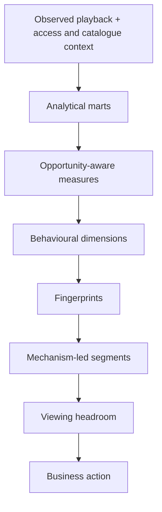
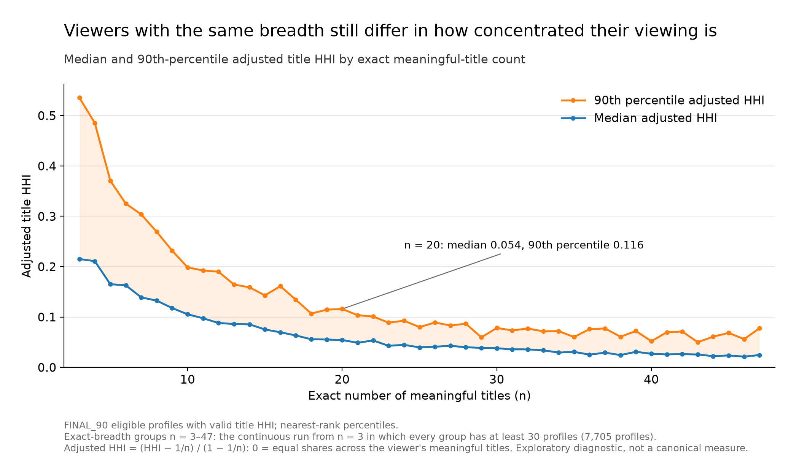

# OTT Catalogue Viewership Diagnosis

An OTT platform can look healthy on total viewing while most attention sits on a small part of its catalogue. The important question is not only *how* concentrated viewing is, but *why* it is concentrated — and where genuine room for people to watch more remains.

**Concentration → mechanism → opportunity**

## Business Problem

Narrow or concentrated viewing looks like a problem, but it can arise in very different ways. A viewer might be loyal to a few programmes they genuinely enjoy. They might not have had access to much else. They might engage only weakly with what they start. Or they might sample titles briefly without settling into any, leaving their sustained viewing in one or two places.

These situations are not equivalent, and only some of them will represent actionable viewing headroom. Treating them all as the same "under-utilisation" would push the business toward the wrong action — or toward action where none is needed. The mechanism has to be distinguished before any intervention is recommended. [The business problem](docs/business_problem.md) sets out the decision this analysis has to support, and its limits.

## Analytical Reframing

> What explains concentrated catalogue consumption among active viewers, and which patterns represent genuine unrealised viewing opportunity rather than healthy preference-driven behaviour?

The obvious starting point — *which titles are under-watched?* — skips the middle of the argument. A title with low viewing is not automatically a failure, and a viewer with narrow viewing is not automatically disengaged. So the question moved from ranking titles to explaining behaviour under realistic access.

## Questions This Analysis Must Answer

- Where does attention concentrate across parent titles, genres and profiles?
- Is that concentration accompanied by depth, repeat engagement and sustained activity — or by shallow sampling?
- What could each profile realistically have watched, given when it existed, what it was entitled to, and what was available?
- Which patterns are explained by preference, weak engagement or constrained opportunity?
- Where might additional viewing be achievable, and what evidence would justify acting on it?

These are open questions, not findings already established.

## Analytical Approach

The business question decided what evidence was needed. That evidence needed consistent grains, historically correct access, legitimate denominators and observable follow-up. Only once those foundations hold can behavioural measures be compared fairly — and only then can they support interpretable viewer patterns.

The analysis is iterative: each result either strengthens an interpretation, weakens it, or changes the next question worth asking.

Segmentation serves the diagnosis; it is not the goal in itself. The [analytical framework](docs/analytical_framework.md) makes the reasoning explicit.

## Data Model

Seven operational tables connect accounts, profiles, access intervals, playable catalogue assets, audio options, sessions and playback events.

**Account ≠ profile. Session ≠ event. Asset ≠ parent title.**

Each of those distinctions exists because ignoring it produces a plausible but wrong answer. Commercial state belongs to the account; viewing identity is observed through the profile. An episode is a playable asset; a series is one parent title. A language a title *offers* is not a language anyone *watched*. [The data model](docs/data_model.md) documents these relationships and the date-aware joins they require.

## Why Analytical Marts Were Required

Raw playback is recorded at **session → event → asset** grain. The business question is about **viewer → parent title → behavioural pattern → realistic opportunity**. Those are different units, and the gap between them is where analytical mistakes happen.

Working directly from events would count ten episodes of one series as ten explored titles, blur an account's commercial and access context into a profile's behavioural identity, apply today's subscription plan to last month's viewing, and compare rates built on different denominators. Each of those errors can distort whether concentration appears healthy, constrained or recoverable.

The marts are a **measurement bridge**. They establish the right units, keep behavioural evidence and opportunity as separate quantities, preserve outcomes with their follow-up conditions, and keep every future segment traceable back to observed playback. Analytical validity is their primary purpose, not query speed.

## Analytical Mart Architecture

| Mart | Grain | Analytical role |
| --- | --- | --- |
| `profile_title_window` | Profile × parent title × window | How a viewer's attention is allocated across titles, with episodic depth kept separate from breadth |
| `profile_genre_window` | Profile × genre × window | How attention is allocated across genres |
| `profile_viewership_window` | Profile × window | The central measurement base: activity, breadth, concentration, outcomes and opportunity |
| `account_viewership_window` | Account × window | Account-level viewing context, pooled appropriately across profiles |
| `account_subscription_window` | Account × context window | Historical access, continuity and gaps |
| `account_plan_transition_features` | Account × transition date | Commercial plan changes with viewing strictly before and after |

[Mart architecture](docs/mart_architecture.md) explains what each mart is for, the mistake it prevents and how it will be used downstream.

## From Playback Data to Viewer Segments



Access and catalogue context enter at the start, not after the marts. Constraints and opportunity condition how behaviour is measured and *interpreted fairly*; they are not behavioural identity. A profile created two weeks before the window closed has short tenure — that limits what its viewing can tell us, but it is not a personality trait.

Candidate behavioural dimensions include activity, breadth, concentration, stickiness, exploration, persistence, language openness and observable responsiveness to prominent titles. Each still needs to earn its place on evidence, stability and non-redundancy. There are no segment names, thresholds or prevalence estimates here yet.

## Measurement Principles

- Concentration is not automatically failure; its explanation matters.
- Under-utilisation is relative to realistic opportunity, never to the whole catalogue.
- Episodic depth and parent-title breadth are different measurements.
- A profile's opportunity starts when the profile exists and depends on the access its account held on each day.
- A later plan never explains earlier viewing.
- Original, available and consumed audio languages are separate concepts.
- Every metric carries its own legitimate denominator; there is no universal normalisation.
- Completion, abandonment and continuation need qualified starts, observable follow-up and explicit handling of unknown outcomes.
- Recommendation effects are out of scope: there are no impression, ranking, search or carousel logs.

[Measurement methodology](docs/measurement_methodology.md) defines each rule and where it is implemented.

## Selected Analytical Figures

These figures are drawn directly from the current marts. The first three show why three of the principles above are needed: they document the conditions viewing has to be measured under. The last two show how concentration has to be read once breadth is taken into account. None of them is a finding about what concentration means.

### Episodic depth should not be mistaken for catalogue breadth


A movie or documentary special is a single asset, so depth within the title is exactly one. A meaningful web series or TV catch-up title averages close to four distinct assets, and a reality title about two. If assets were counted as titles, someone following one series would look almost four times as exploratory as someone who watched one film. Breadth is therefore counted in parent titles, with depth recorded beside it.

### Title opportunity varies materially within the same 90-day window


Sharing a window does not mean sharing the same opportunity. In each window roughly a quarter of profile-title rows had fewer than the full 90 days, and around 6% had fewer than 30 — because a title arrived or left mid-window, a profile was created late, or access did not reach the title on every day. Viewing on a title reachable for three weeks cannot fairly be read against viewing on one reachable all quarter, so opportunity is measured day by day rather than assumed.

### Unknown continuation outcomes must remain separate from observed non-continuation


Every continuation opportunity ends in exactly one state: the viewer went on to the next episode, was observed for the full seven days without doing so, or could not be followed long enough to know. The unknown share is small — 0.8% in the baseline window and 3.3% in the final window, which runs up to the end of the observable period. Folding it into non-continuation would read limited observation as disengagement, and unevenly across windows. Continuation rates are built from known outcomes only.

### Raw HHI cannot be read independently of breadth


HHI sums a viewer's squared shares of qualified viewing across meaningful titles, so it sees the whole allocation rather than just the top title. But equal shares across `n` titles still produce an HHI of `1/n`, so a viewer with three titles cannot score as low as one with thirty. Much of the fall in raw HHI as breadth grows follows that floor: it is arithmetic, not a change in behaviour.

### Viewers with the same breadth still differ in how concentrated their viewing is



Once HHI is rescaled to remove the floor, viewers with exactly the same number of meaningful titles still spread their viewing very differently. At twenty titles, the median viewer's adjusted HHI is 0.054 while the 90th percentile is 0.116. Breadth and concentration are therefore separate signals, and broad-but-concentrated viewing is a real configuration worth carrying forward — as a candidate to explain, not a segment and not evidence of headroom. The adjustment is an exploratory diagnostic, not yet an approved measure.

## Current Analytical Position

The business framing, data model, raw schema understanding and six-mart architecture are in place. The title-level mart has been audited by hand, including the measurement semantics it depends on — qualified starts, meaningful titles, title opportunity and continuation outcomes. The viewer-level base, `profile_viewership_window`, has passed its first three audit blocks: grain, coverage and row semantics; activity, volume and session measures, which reconcile to raw playback; and breadth and concentration, with one bounded caveat on genre concentration. Automated contract checks on the marts all pass ([evidence](evidence/mart_audit/README.md)).

The work now is the post-start engagement and stickiness audit of the viewer-level base, followed by realistic opportunity. No normalised atomic measurement layer, fingerprints, segments or business findings have yet been produced.

## Project Roadmap

| State | Work |
| --- | --- |
| Completed | Business framing · data-model reasoning · raw schema understanding · analytical mart architecture · title-level mart audit · core measurement semantics for that mart · viewer-level grain, coverage, activity and session audit · viewer-level breadth and concentration audit |
| Current | Viewer-level post-start engagement and stickiness audit |
| Next | Remaining `profile_viewership_window` audit · normalised atomic measures · behavioural fingerprints · segmentation · headroom diagnosis · commercial context · visual analysis and Power BI |

The [analysis journal](docs/analysis_journal.md) records the reasoning behind each decision so far.

## Repository Structure

```text
README.md
docs/
  business_problem.md          the decision this analysis supports
  analytical_framework.md      concentration → mechanism → opportunity
  data_model.md                grains, identity, access and time
  mart_architecture.md         why each mart exists
  measurement_methodology.md   definitions, denominators and implementation
  analysis_journal.md          how the reasoning developed
sql/
  schema_understanding/        grain and relationship checks on the raw model
  mart_audit/                  measurement contract checks on the marts
  diagnostics/                 reserved for diagnostic queries as analysis proceeds
src/
  analytical_transforms/       opportunity, qualification, continuation and eligibility logic
  validation/                  independent checks and small boundary fixtures
evidence/
  mart_audit/                  compact check outcomes supporting the mart audit
figures/                       measurement figures: title depth, title opportunity, continuation outcomes, HHI and breadth
data/README.md                 what is and is not stored here
```

## Tools

**Python and pandas** implement the opportunity, qualification and continuation logic and the independent checks that test it. **MySQL and SQL** hold the relational model and the mart audit. **Git** tracks analytical decisions. **Power BI** is planned for communicating results.

The boundary fixtures run without the full tables:

```bash
python -m pip install -r requirements.txt
python -B -m unittest discover -s src/validation -p "test_*.py" -v
```
