# Analysis journal

This journal records the reasoning behind consequential measurement decisions — the question that forced each one, what the evidence showed, and what it made us ask next. It is not a log of every query.

---

## 1. Ranking titles was the wrong question

**Question:** which titles are under-watched?

**Why it matters:** that is where catalogue-utilisation work usually starts, and it leads straight to a leaderboard.

**Evidence:** a low watch total is consistent with a title nobody could reach, a title reachable only by a small audience, a title people tried and dropped, and a title that simply suits few viewers. The number alone cannot separate them.

**Interpretation:** concentration is an outcome, not a diagnosis. Without knowing why it happens, any intervention is a guess.

**What this changed:** the question became *concentration → mechanism → opportunity* — explain the allocation of attention before asking whether more viewing is achievable. See [business problem](business_problem.md) and [analytical framework](analytical_framework.md).

**What it made us ask next:** what evidence could actually tell those explanations apart?

---

## 2. An account is not a viewer

**Question:** when an account shows broad viewing, is one person exploring widely?

**Why it matters:** a subscription can support several profiles with entirely different habits.

**Evidence:** accounts regularly hold more than one profile ([`account_profile_grain.sql`](../sql/schema_understanding/account_profile_grain.sql)). Summing each profile's distinct titles counts any title two of them watched twice.

**Interpretation:** an account's breadth describes combined viewing across its profiles, not one viewer's exploration.

**What this changed:** the profile became the behavioural unit and the account became context. Account-level breadth is rebuilt as a distinct union across events; pooled rates are rebuilt from numerators and denominators. A commercial plan change is never attributed to a single profile. See [account-level aggregation](measurement_methodology.md#account-level-aggregation).

**What it made us ask next:** if the profile is the unit, what exactly is it choosing between?

---

## 3. Ten episodes are not ten titles

**Question:** what counts as catalogue breadth?

**Why it matters:** the playable catalogue is made of assets, and an episodic series contributes many of them.

**Evidence:** parent-title identifiers repeat across assets, heavily for episodic programme types ([`asset_vs_parent_title.sql`](../sql/schema_understanding/asset_vs_parent_title.sql)). Counting assets would turn one binge-watched series into apparent exploration.

**Interpretation:** depth within a title and breadth across titles are two different behaviours. A viewer who watches ten episodes of one programme and a viewer who samples ten programmes should not score the same.

**What this changed:** attention is measured at parent-title grain, with asset and episode depth kept alongside it. See [mart architecture](mart_architecture.md).

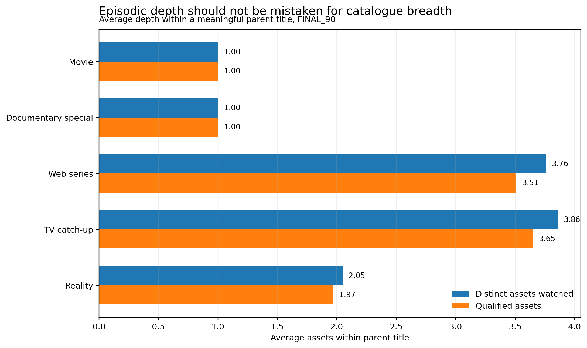

*How to read it:* each row is a programme type, covering titles a profile engaged with meaningfully in the final 90-day window. The blue bar is the average number of distinct assets watched **inside one parent title**; the orange bar counts only assets that passed the qualified-start rule. A movie sits at one asset by construction, while web series and TV catch-up average close to four. Both bars measure depth within a title — never how many titles were reached.

**What it made us ask next:** when does touching a title count as engaging with it?

---

## 4. Offered is not watched

**Question:** is a viewer who could watch in several languages actually open to them?

**Why it matters:** titles offer multiple audio tracks, and it is tempting to treat that supply as evidence of language behaviour.

**Evidence:** original language, offered audio languages and the language recorded on each playback event are three separate facts. Joining every offered language to playback also multiplies watch time.

**Interpretation:** only consumed audio describes behaviour. Offered audio languages describe a title's language supply; whether that supply was realistically reachable also depends on access and catalogue availability.

**What this changed:** the three stay separate in every join and denominator. A title's language supply is relevant to eligibility: regional plans reach a title only through the languages it offers, and only while access and availability hold. See [access.py](../src/analytical_transforms/access.py).

**What it made us ask next:** language availability is recorded as an inventory, not a timeline — so how far can a language-openness measure be trusted over time?

---

## 5. A metric without a period has no denominator

**Question:** how much did a profile watch?

**Why it matters:** "how much" over an unspecified span cannot be compared with anything, and a later plan could quietly explain earlier viewing.

**Evidence:** accounts move between plans and through gaps, and profiles are created throughout the observation period.

**Interpretation:** every measure needs a declared window, and equal calendar length does not mean equal observable tenure.

**What this changed:** viewership is measured in named 90-day windows (`BASELINE_90`, `FINAL_90`), subscription context across the full 180 days, and every row carries its window dates. Event boundaries are half-open so windows never overlap. See [data model](data_model.md#time-windows).

**What it made us ask next:** inside a window, what could each profile actually reach?

---

## 6. Narrow viewing can be narrow access

**Question:** is a profile that watched few titles disengaged?

**Why it matters:** this is the exact confusion the business question warns against.

**Evidence:** a profile created late in a window, an account between subscriptions, and a regional plan reaching part of the catalogue all shrink the real choice set — to a materially narrower reachable catalogue.

**Interpretation:** under-utilisation only means something relative to what was reachable.

**What this changed:** opportunity is computed day by day as profile existence, historical access, and released, available, plan-eligible catalogue. Access an account held before a profile existed belongs to the account, not the profile. An independent check rebuilds the same quantities from source tables without reusing the implementation's logic. See [opportunity.py](../src/analytical_transforms/opportunity.py) and [opportunity_checks.py](../src/validation/opportunity_checks.py).

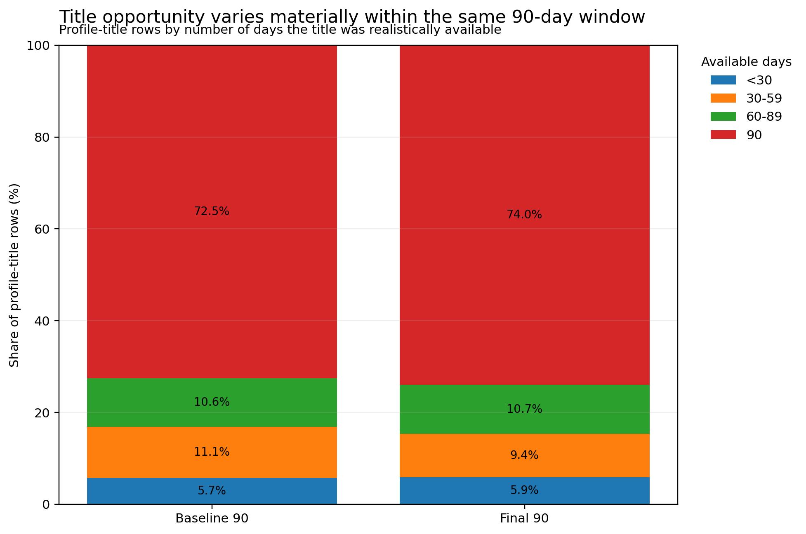

*How to read it:* each bar is one 90-day window and totals 100% of profile-title rows. The four bands split those rows by how many days the title was genuinely available to that profile: under 30, 30–59, 60–89, or the full 90. Roughly a quarter of rows fall short of the full window, which is the point — sharing a window does not mean sharing an opportunity.

**What it made us ask next:** which profiles have enough evidence and access to be compared at all?

---

## 7. Eligibility is a guardrail, not a segment

**Question:** which profiles belong in the main comparison?

**Why it matters:** comparing a profile with three days of access against one with ninety produces differences that are about observation, not behaviour.

**Evidence:** profiles vary widely in entitled days, active days and qualified viewing within the same window.

**Interpretation:** a minimum evidence threshold makes comparison fair — but it must not quietly remove the concentrated viewers the question is about.

**What this changed:** eligibility requires 30 entitled days, 3 active days and 120 qualified watch minutes, with no minimum breadth. Ineligible profiles remain in the mart with every component visible. See [eligibility.py](../src/analytical_transforms/eligibility.py).

**What it made us ask next:** among eligible profiles, which outcome measures are trustworthy?

---

## 8. "Didn't continue" and "not yet known" are different

**Question:** after finishing an episode, did the viewer go on to the next?

**Why it matters:** continuation is one of the strongest signals of stickiness — and one of the easiest to measure unfairly.

**Evidence:** a next episode may not have been released yet, access may lapse inside the follow-up period, and viewing near the end of the data simply has less time to be observed.

**Interpretation:** only an opportunity that was genuinely open, and fully observed, can produce a negative outcome.

**What this changed:** each continuation opportunity opens only when the next episode is reachable and has exactly one outcome — known positive, known negative or unknown. Rates pool known outcomes only; unknown outcomes are never counted as failures. See [continuation.py](../src/analytical_transforms/continuation.py) and [`continuation_state_integrity.sql`](../sql/mart_audit/continuation_state_integrity.sql).

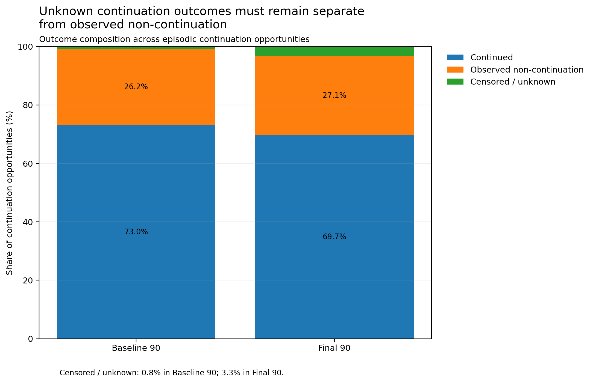

*How to read it:* each bar is one window and totals 100% of episodic continuation opportunities. Blue is continued; orange is observed non-continuation, where the full seven days passed with no start on the next episode; the hatched grey slice is censored, meaning follow-up ended before the outcome could be seen. The unknown slice is larger in the final window, which is exactly why it is kept separate instead of being counted as a failure.

**What it made us ask next:** do the other outcome measures hold themselves to the same standard?

---

## 9. The title-level mart has been audited

**Question:** does `profile_title_window` measure what the architecture says it measures?

**Why it matters:** it is the foundation for breadth, concentration, depth and stickiness. Anything wrong here propagates into every later measure.

**Evidence:** the mart was reviewed by hand against its measurement semantics — qualified starts, meaningful titles, title opportunity and continuation outcomes — and its automated grain, opportunity and continuation contracts all pass ([evidence](../evidence/mart_audit/README.md)).

**Interpretation:** title-level evidence is fit to support downstream measurement at its intended grain. That is not the same as every derived field being fit to become a fingerprint input.

**What this changed:** attention moves from title-level evidence to the viewer-level measurement base.

**What it made us ask next:** does `profile_viewership_window` hold each outcome to a legitimate denominator? Abandonment is the first case to settle — the mart carries both an all-qualified-starts denominator and a known-outcomes denominator, and the behavioural measure should use whichever the review supports. After that: which candidate measures are stable, sufficiently evidenced and non-redundant enough to define fingerprints?

---

## 10. Making the measurement logic visible

**Date:** 2026-09-11

**Question:** can a reviewer see why the grain, opportunity and continuation rules exist, rather than take them on trust?

**Why it matters:** measurement rules read as technicalities until their scale is visible — and a rule whose purpose is not visible is easily dropped later.

**Evidence:** three figures drawn directly from the current marts ([`figures/`](../figures)): depth within a parent title by programme type, days of title opportunity within each 90-day window, and the composition of continuation outcomes.

**Interpretation:** each shows a simplification that would distort measurement — episodes counted as titles, unequal availability treated as equal, unknown outcomes treated as failure. They document measurement conditions; they are not behavioural findings.

**What this changed:** the figures sit beside the rules they support, in the [README](../README.md#selected-analytical-figures), [mart architecture](mart_architecture.md#profile_title_window) and [measurement methodology](measurement_methodology.md#opportunity).

**What it made us ask next:** nothing new — the `profile_viewership_window` audit remains the next step.

---

## 11. Watching nothing, touching something and watching longer are different facts

**Date:** 2026-09-13

**Question:** before `profile_viewership_window` is used to describe anyone's viewing, does each row mean what it claims — one profile, in one window — and can its activity and session measures be rebuilt from raw playback?

**Why it matters:** every later statement about depth, habit, concentration or headroom will stand on this table. If it quietly dropped profiles that watched nothing, blurred shallow sampling into engagement, or aggregated sessions differently from how they happened, those statements would inherit the error and still look precise.

**Evidence:** two audit blocks, both passed ([audit evidence](../evidence/mart_audit/README.md#human-semantic-audit-profile_viewership_window)).

The first tested grain, coverage and row meaning. The mart holds exactly one row per profile per window, and all 13,037 profiles appear in both windows — including those that played nothing.

| Profiles | BASELINE_90 | FINAL_90 |
| --- | ---: | ---: |
| No playback | 1,841 | 976 |
| Playback but no qualified start | 30 | 34 |
| At least one qualified start | 11,166 | 12,027 |
| Main-analysis eligible | 8,761 | 9,762 |

No row contradicts itself: qualified minutes never exceed total minutes, meaningful titles never exceed titles touched, the meaningful-title fields agree, and rows without playback carry no viewing, sessions or meaningful titles. Inactive, unqualified, ineligible and eligible profiles were also read by hand to check that each state looks like what it claims to be.

The second tested activity, volume and sessions. Every internal relationship held, and when the measures were rebuilt from raw sessions and events, event counts, autoplay counts, active days, first and last event timestamps and session counts matched exactly. Watch minutes and session durations matched to within numerical precision. Descriptively, for profiles with any playback, the two windows look like this:

| Per active profile | BASELINE_90 | FINAL_90 |
| --- | ---: | ---: |
| Active profiles | 11,196 | 12,061 |
| Watch minutes | 1,799.98 | 1,940.29 |
| Active days | 22.27 | 21.70 |
| Sessions | 25.93 | 25.00 |
| Mean session length, minutes | 50.35 | 57.49 |
| Median session length, minutes | 38.79 | 45.48 |
| Sessions per active day | 1.13 | 1.13 |

Qualified viewing accounts for 99.56% of watch minutes in the baseline window and 99.66% in the final window.

**Interpretation:** keeping profiles that watched nothing is deliberate, and it turned out to be one of the more important properties of the table. A profile that existed and had access during the window but played nothing is an observation, not missing data. In a streaming service, entitlement can sit next to a large reachable catalogue and still produce no viewing at all — availability is supply, not demand. Remove those rows and the viewer base is biased toward people who already engaged, and the contrast between what could have been watched and what was watched, which any later diagnosis of unrealised viewing depends on, disappears before it can be examined.

The 30 and 34 profiles with playback but no qualified start are few, but they make a distinction visible that matters well beyond their number: touching content is not the same as taking part in the catalogue. The qualified-watch share shows that qualification removes almost no viewing *time*, and it would be easy to conclude the rule is cosmetic. It is not. A shallow sample adds almost nothing to hours but can add a title to a viewer's apparent range, so qualification may matter far more to breadth than to volume. A platform that counted every brief play as consumption could report wide library reach that viewers never meaningfully engaged with — exactly the misreading a catalogue-utilisation question cannot afford. How much it changes breadth here is a question for the next audit, not something these totals show.

Eligibility settled into its proper role: a statement about evidence, not about people. An ineligible profile stays in the mart with every component visible; it simply has too little access or activity to be compared fairly. That distinction has commercial weight. A profile with one isolated viewing occasion should not become a loyalist, a sampler or an under-utiliser because a segmentation needs every row to belong somewhere. "We have evidence of a stable behaviour" and "we have too little evidence to say" are different findings, and the pathway keeps them in order: first whether there is enough evidence, then under what conditions the viewing happened, then fair measurement, and only then behavioural pattern and segment identity.

The activity shape is the first place a behavioural story could be told too early. The final window has more active profiles and more viewing per active profile, but slightly fewer active days and sessions, materially longer sessions, and the same number of sessions per active day. Descriptively, that could be consistent with deeper viewing occasions rather than more frequent ones. It does not yet distinguish between explanations. Programme mix, title concentration, device context and stickiness may all matter, but their relationship to this activity pattern has not yet been tested, and the remaining viewer-level behavioural blocks still require their own semantic review. What it does establish is that volume and frequency are separate dimensions. Two viewers can reach similar hours through frequent short returns or through a few long sittings, and those patterns can carry different implications for habit, the kind of content that suits them, retention, and how much room for more viewing realistically exists.

Two results are hygiene rather than insight, but they protect what comes next. `first_event_ts` and `last_event_ts` are the earliest and latest event *start* times, not the end of the last playback. Viewing span, recency and persistence will all be derived from these fields, and each needs to know which anchor it inherits, or it will quietly mix two definitions of "when". Similarly, session minutes measure elapsed session time while watch minutes sum playback across events; they are different constructs and are kept apart.

The reconciliation also produced a useful false alarm. Under a one-millionth-of-a-minute tolerance, thousands of profiles showed differences between stored and rebuilt minutes. None exceeded 0.001 minute; the largest watch-time gap was about 0.002 seconds, with no systematic direction, and session durations behaved the same way. Given the exact count and timestamp reconciliation around them, those differences are numerical residue rather than disagreement about what was watched. The lesson is not that databases round numbers. It is that a reconciliation threshold has to be chosen to separate a semantic difference from machine-level noise — otherwise a correct table gets investigated as a broken one, or, worse, a real discrepancy hides among thousands of meaningless ones.

**What this changed:** the viewer-level base is now trusted for grain, coverage, activity, volume and sessions. Reproducing raw playback is not a finding about viewers; its value is that later claims about depth, habit, concentration or opportunity will not rest on a grain error, an aggregation mistake, an ambiguous time anchor or a mismatched denominator. None of this answers the business question. Concentration, the mechanism behind it and any genuine viewing headroom all remain open.

**What it made us ask next:** if activity is measured faithfully, is breadth — and the concentration built on it? The longer sessions in the final window could be spread across many titles or given almost entirely to one, and this table's activity fields cannot say which. The next audit asks whether distinct and meaningful titles, genres, top-title qualified share, title HHI and genre concentration in the viewer base agree with `profile_title_window` and `profile_genre_window` — and how much qualification changes apparent breadth, given how little it changes hours.

---

## 12. Breadth and concentration describe different parts of catalogue use

**Date:** 2026-09-15

**Question:** when two viewers reach a similar number of meaningful titles, are they necessarily using the catalogue in a similar way?

**Why it matters:** breadth is an obvious place to start when the business concern is catalogue utilisation. If one viewer watches three parent titles and another watches twenty, it is tempting to describe the second as a much broader catalogue user. But breadth only tells us how far viewing reached. It says nothing about how attention was distributed across what was reached.

That distinction matters directly to the project question. Concentrated viewing is not automatically under-utilisation, and broad viewing is not automatically healthy distribution. A profile can reach twenty titles while still directing a large share of its viewing to one anchor programme. Another profile with the same twenty meaningful titles may distribute viewing much more evenly. If those profiles are collapsed into the same "breadth" description, the behaviour we are trying to diagnose disappears.

Before treating breadth and concentration as separate behavioural dimensions, however, both first had to survive semantic reconciliation. Otherwise we would be building sophisticated interpretations on top of aggregation artefacts, a cherished tradition in analytics that this project can live without.

**Evidence — meaningful breadth survives qualification:** the first question was whether the viewer-level breadth measures reproduce what exists in playback and the lower-grain marts ([audit evidence](../evidence/mart_audit/README.md#test-3--breadth-and-concentration)).

They did. Raw playback, `profile_title_window`, `profile_genre_window` and `profile_viewership_window` reconciled exactly for distinct assets, parent titles, genres, consumed audio languages, meaningful titles and meaningful genres. No mismatches were found.

That matters because title breadth in this project is deliberately parent-title breadth, not asset breadth. Ten episodes of one series are depth within one programme, not ten explored titles. The reconciliation confirms that this distinction survives aggregation into the viewer-level mart.

The next issue was qualification. A playback touch does not automatically mean meaningful catalogue use, and very short starts can inflate the apparent number of titles reached.

Qualification does change breadth, but much less than might have been expected:

| Active profiles | BASELINE_90 | FINAL_90 |
| --- | ---: | ---: |
| Profiles losing at least one title to qualification | 21.0% | 19.3% |
| Average raw titles → meaningful titles | 13.10 → 12.80 | 16.40 → 16.12 |
| Average meaningful-title retention | 97.5% | 98.2% |
| Profiles losing at least one genre | 6.1% | 4.8% |

Most affected profiles lose a single title: 1,710 of 2,351 in the baseline window and 1,685 of 2,324 in the final window.

**Interpretation:** shallow playback can exaggerate catalogue reach for some viewers, so qualification is necessary. But it is not driving the overall breadth structure. The broader title usage visible in the mart is not simply a mass of accidental or trivial touches.

The genre result needs more restraint. A genre contains many titles, and viewers do not face equal realistic title supply inside every genre. That genre counts rarely change after qualification tells us only that the number of genres touched usually survives the removal of shallow interactions. It does not establish stable genre openness or exploration.

**Analyst choice — why HHI:** if breadth tells us how many meaningful titles were reached, what measure best describes how viewing was distributed across them?

The simplest concentration measure already available is top-title share. It is useful and intuitive: if 40% of a viewer's qualified minutes belong to one parent title, that title clearly dominates the viewing pattern. But top-title share only sees the largest title.

Two viewers can have the same top-title share while distributing the rest of their viewing very differently. One might devote 30% to the top title and spread the remaining 70% almost evenly across nineteen others. Another might devote 30% to the top title, 25% to a second and 20% to a third, leaving little for everything else. Top-title share treats those patterns as identical.

For that reason, I chose to carry the Herfindahl-Hirschman Index, or HHI, alongside top-title share. For a viewer whose qualified watch minutes are split across meaningful titles in shares s₁, s₂, …, sₙ:

```text
HHI = Σ sᵢ²
```

Squaring the shares gives progressively more weight to large allocations. HHI therefore summarises concentration across the whole distribution of qualified viewing, rather than asking only how large the single biggest title is. In this project that is the point: the business problem is about how attention is allocated across catalogue choice. Top-title share identifies the strongest anchor; HHI tells us whether the rest of viewing is broadly dispersed or gathered into a small set of titles.

It is also important to be clear about what kind of statistical instrument HHI is. Here it is a descriptive concentration index, not an inferential statistic. It does not test a hypothesis, estimate causality or tell us whether concentration is desirable. It compresses the shape of a distribution into a comparable summary measure. The interpretation still belongs to the wider behavioural context.

HHI also has a structural limitation that matters considerably here. Its minimum depends on how many titles viewing is distributed across. A viewer who watches `n` titles in exactly equal shares has the lowest possible HHI:

```text
minimum HHI = 1 / n
```

A viewer with three meaningful titles therefore cannot reach the same low HHI as a viewer with thirty, even if both distribute attention perfectly evenly across their own titles. Part of the relationship between breadth and raw HHI is mathematical rather than behavioural, which rules out simply reading "lower HHI" as "more distributed viewer" without also considering how many titles the viewer had.

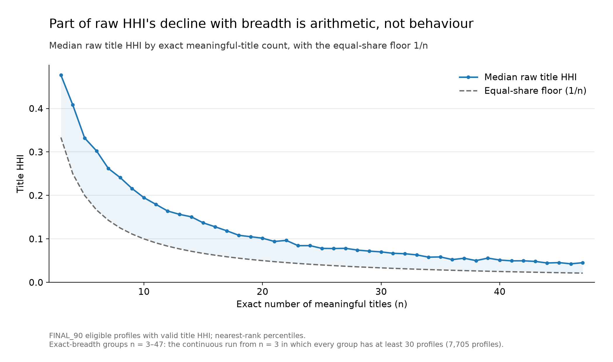

*How to read it:* the x-axis is the exact number of meaningful titles a profile reached. The solid blue line is the median raw title HHI at each breadth; the dashed grey line is the lowest HHI arithmetically possible there, `1/n`. The shaded gap between them is the part of concentration that reflects how attention was allocated rather than how many titles there were.

To investigate that problem, I used an exploratory breadth-adjusted form:

```text
adjusted HHI = (HHI − 1/n) / (1 − 1/n)
```

An equal allocation across the viewer's observed `n` meaningful titles gives 0, and increasingly concentrated allocation approaches 1. The adjustment is useful for diagnosis because it removes the equal-share floor imposed by breadth. It is not yet an approved measure: this audit establishes that the adjustment is analytically useful, and the behavioural measurement layer still has to establish whether it is stable and appropriate enough to be adopted.

The same caution applies to HHI itself. HHI describes how concentrated viewing is; it does not explain why. High HHI could reflect strong satisfaction with a favourite programme, weak catalogue exploration, limited access, low realistic opportunity, or some combination of those.

**Evidence — breadth and concentration are not interchangeable:** among analytically eligible profiles with valid title HHI:

| Eligible profiles with valid title HHI | BASELINE_90 | FINAL_90 |
| --- | ---: | ---: |
| Profiles | 7,897 | 8,698 |
| Average meaningful titles | 17.31 | 21.67 |
| Average top-title share | 0.3727 | 0.3304 |
| Average adjusted top-title dominance | 0.2849 | 0.2519 |
| Average raw HHI | 0.2649 | 0.2213 |
| Average adjusted HHI | 0.1555 | 0.1241 |

Final-window eligible viewers were broader and descriptively less concentrated. The raw changes alone would not be enough, because greater breadth mechanically lowers the minimum possible concentration — but the breadth-adjusted measures moved in the same direction, so the lower concentration is not explained purely by greater breadth. This is descriptive only. The eligible populations are not identical across the two windows, so it is not evidence that individual viewers became more distributed over time.

The more consequential result came from comparing viewers at the same breadth. In `FINAL_90`, viewers with exactly 20 meaningful titles had a median top-title share of 19.3% but a 90th-percentile share of 35.2%, and a median adjusted HHI of 0.054 against a 90th percentile of 0.116. Every one of those viewers reached exactly twenty meaningful titles, so the difference cannot be dismissed as one group simply having broader catalogue reach.

| `FINAL_90`, exact meaningful titles | Profiles | Median top-title share | 90th-percentile top-title share | Median adjusted HHI | 90th-percentile adjusted HHI |
| ---: | ---: | ---: | ---: | ---: | ---: |
| 15 | 154 | 24.6% | 37.7% | 0.075 | 0.143 |
| 20 | 129 | 19.3% | 35.2% | 0.054 | 0.116 |
| 30 | 78 | 14.7% | 23.4% | 0.038 | 0.078 |

The same structure remains at higher breadth: among viewers with exactly 30 meaningful titles, median adjusted HHI was 0.038 while the 90th percentile was 0.078.

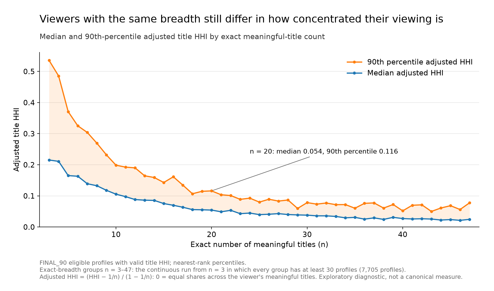

*How to read it:* both lines show adjusted HHI, which rescales HHI so that 0 means equal shares across the profile's own meaningful titles. Blue is the median profile at each exact breadth and orange the 90th percentile; the shaded band between them is the spread that remains once breadth is held constant. The band never closes, which is the finding.

**Interpretation:** breadth and concentration are genuinely distinct signals. A viewer can demonstrate substantial catalogue reach and still allocate a disproportionate share of viewing to a small part of that reached catalogue. A viewer with the same breadth can distribute attention considerably more evenly.

That gives the analysis its first credible candidate behavioural configuration: meaningful breadth accompanied by unusually concentrated attention relative to viewers with comparable breadth.

It is deliberately not being called a segment, and certainly not a headroom segment. Test 3 establishes that the configuration exists; it does not establish what causes it. Broad-but-concentrated viewing could represent perfectly healthy anchor-title loyalty. It becomes commercially interesting only if later evidence shows that concentration coexists with weak stickiness, failed exploration or substantial realistic opportunity that is not translating into sustained viewing.

**Genre concentration — context, not a new diagnosis:** is title concentration simply genre concentration measured another way? Raw title and genre HHI were moderately related, with correlations of 0.631 in the baseline window and 0.529 in the final window. Once both were adjusted for the breadth-dependent floor, the relationship weakened to 0.388 and 0.290.

Title and genre concentration overlap, but they are not redundant. Genre concentration can later help explain the shape of title concentration: a viewer may be concentrated on one title while otherwise moving across genres, or may concentrate attention inside a much narrower genre space. It cannot yet be read as narrow taste or unrealised opportunity, because realistic genre opportunity differs across viewers and plans and that denominator has not been normalised.

The audit also surfaced a small semantic imperfection: `genre_hhi` is populated for 30 baseline and 34 final-window profiles that have no meaningful genre at all. Concentration is undefined without a qualified genre allocation, so those rows are excluded from genre-concentration interpretation. The issue is bounded and does not touch the eligible concentration analysis, so it is recorded as a caveat rather than allowed to hijack the audit.

**What this changed:** Test 3 gives two separate candidate behavioural dimensions where previously there was one vague idea of "catalogue use":

- **meaningful breadth** — how far qualified viewing reached across parent titles;
- **concentration** — how qualified viewing was allocated across that reached set.

HHI earns its place alongside top-title share because it captures the full distribution rather than one dominant title, while its breadth-dependent floor means raw values must be interpreted with breadth in view. The broad-but-concentrated pattern is now established strongly enough to carry forward into the mechanism analysis, as a candidate configuration rather than a viewer segment. Concentration cannot safely be inferred from breadth, and breadth cannot safely substitute for concentration.

**Where this sits in the analytical pathway:** Test 3 is where the project begins to move from validating mart fields toward deciding which behavioural signals are credible enough to carry into the diagnosis. It does not define segments or identify viewing headroom. What it establishes is a distinction the rest of the analysis depends on: breadth describes how far meaningful viewing reaches across the catalogue; concentration describes how attention is allocated across that reach. Those two signals can now be treated separately rather than collapsed into a vague idea of "catalogue use." Test 4 will add post-start behaviour and stickiness, asking whether concentrated viewing reflects content that genuinely holds the viewer or weak engagement after selection. Test 5 will add realistic opportunity, asking whether the viewer actually had sufficient reachable alternatives for the observed pattern to be interpreted fairly. Only when those layers are combined can recurring behavioural fingerprints be interpreted as mechanisms, translated into defensible viewer segments, and then assessed for genuine viewing headroom. In that sense, Test 3 gives us a validated part of the concentration → mechanism → opportunity pathway, but deliberately stops before claiming what the concentration means.

**What it made us ask next:** the question is no longer simply whether a viewer is concentrated. It is: when viewing is concentrated, does that concentration reflect content that genuinely holds the viewer, or does it coexist with weak post-start engagement? Completion, abandonment, continuation, resumed viewing and related stickiness evidence form the next mechanism layer, and Test 4 has to establish whether those measures can be trusted before they are used to separate the broad-but-concentrated configuration into anything like healthy loyalty, weak engagement, constraint or potential unrealised viewing opportunity.

---

## 13. Post-choice response had to be rebuilt before it could explain concentration

**Date:** 2026-09-22

**Question:** once a viewer meaningfully starts content, what can we reliably learn from what happens next?

**Why it matters:** concentration tells us where attention accumulated. It does not tell us whether the concentrated choices worked. That makes post-choice response one of the first bridges from concentration toward mechanism. Two profiles can concentrate most of their viewing on a few titles and still have very different experiences after selection: one may consistently finish what it chooses; another may try several alternatives, retain many of them weakly and keep returning to a smaller core that works. Those are different explanations for the same surface pattern — but only if the measures that separate them can be trusted.

The mart already carried completion, abandonment, continuation, resumed assets and rewatch. The tempting shortcut was to treat them all as forms of "stickiness" and compare them. The audit showed that would have been wrong in several distinct ways.

**Evidence — abandonment exposed the denominator problem:** abandonment requires a complete 14-day no-resume horizon. A qualified start close to the end of the data may not have those 14 days, and its outcome is then unknown, not "not abandoned". `FINAL_90` runs up to the end of the observable period: 11,776 of its qualified asset starts, across 6,174 profiles, were still inside that censoring window.

The mart already preserved everything needed to correct this without a rebuild. Instead of dividing abandoned starts by every qualified start, the behavioural rate uses:

```text
known outcomes = qualified starts − censored abandonment starts
```

For final-window profiles with at least five qualified starts, the average abandonment rate moved from about 19.7% to 21.1%. The numerical change was modest. The conceptual change was not: a viewer cannot be credited with not abandoning content merely because the observation period ended before anyone could know.

**Evidence — completion and abandonment were one axis, not two:** once both sat on the same known-outcome denominator, the question was whether they carried different information. They did not.

| Profiles with ≥ 5 known outcomes | BASELINE_90 | FINAL_90 |
| --- | ---: | ---: |
| Profiles | 7,957 | 8,005 |
| Correlation of completion with abandonment | −1.0000 | −1.0000 |
| Mean complement gap | 0 | 0 |
| Other known-outcome share | 0 | 0 |

Every known start ended on one side of the same axis. Carrying both into later fingerprints would have double-weighted one behaviour, so completion became the primary general-retention measure and abandonment its diagnostic mirror — useful for explaining censoring and failure, but not a second dimension.

The same work separated two ways of summarising a rate. A profile-average rate gives every viewer equal weight; a pooled rate weights profiles by how many outcomes they contribute. In `FINAL_90`, known abandonment averages 20.7% across profiles but pools to 13.7% across outcomes, because profiles contributing more outcomes tend to abandon less. Neither is automatically more reliable. They answer different questions, which is why the evidence denominator stays beside every behavioural rate.

**Evidence — continuation survived only where a next step exists:** a viewer cannot fail to continue when there was no next episode, when access did not reach it, or when the seven-day follow-up could not be observed. Restricted to legitimate, observable next-episode opportunities, continuation remains a useful persistence signal — but an inherently episodic one. A movie or documentary special does not become weak because it has no second episode, and a profile with no continuation opportunity has no continuation value, not a low one. Programme mix must not decide who looks persistent simply by supplying more opportunities.

**Evidence — `resumed_assets` broke the simple return story:** the broad field counts qualified assets seen in more than one session. It looked like resume. Rebuilt from playback events — for eligible profile-windows, with each asset anchored at its first qualified start — it turned out to mix two different behaviours:

| Assets | BASELINE_90 | FINAL_90 |
| --- | ---: | ---: |
| Any cross-session return | 182,925 | 92,598 |
| Returned before completion | 56,715 | 44,561 |
| Returned after completion | 153,930 | 57,775 |
| Met the strict rewatch rule | 151,073 | 56,492 |

Some assets did both (27,720 and 9,738). A large part of what the broad field would have called resume was completed-content replay, so it could not become a behavioural measure as it stood. What mattered was the decomposition, not the exact totals.

**Evidence — the pre-completion returns behaved like genuine resumes:** returning before completion still did not prove resume. A viewer could have reopened from the beginning, skipped around, or produced a technical repeat. So each pre-completion return was checked against playback position: where the later session started, compared with where the previous one ended. Later sessions typically restarted just before the previous endpoint — a median of 43 seconds earlier in the baseline window and 52 seconds in the final window. About 85% to 87% of returns backtracked slightly, the 90th-percentile restart distance was only about three minutes, and restarting from the beginning was virtually absent (under 0.1% of returns). That earned the interpretation: pre-completion cross-session return is genuine resume-like persistence, not generic repeat playback. It matters most for long-form and movie viewing, where continuation cannot help.

**Evidence — rewatch needed equal observation time:** once replay was separated from resume, raw rewatch looked far stronger in the baseline window. But baseline completions had a median of 137 days of the observation period left to generate a replay; final-window completions had 44. Raw rewatch mixed replay tendency with the time available to show it. Fixed horizons remove that difference, at a price. A 7-day horizon keeps observability high but captures only about 22% of eventual first rewatches. At 30 days, 32% of final-window completions remain censored, and at 60 days 58%. Fourteen days captures about 38% to 40% of eventual first rewatches while about 85% of final-window completions still have a known outcome. That became the replay horizon.

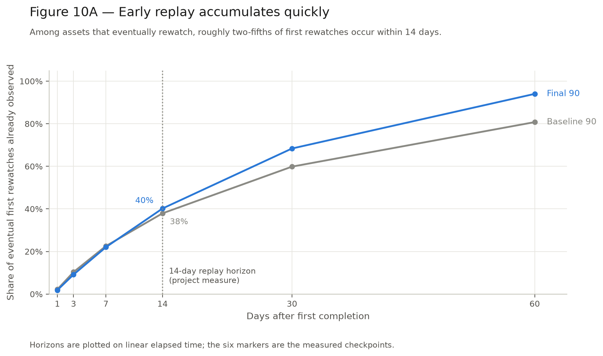

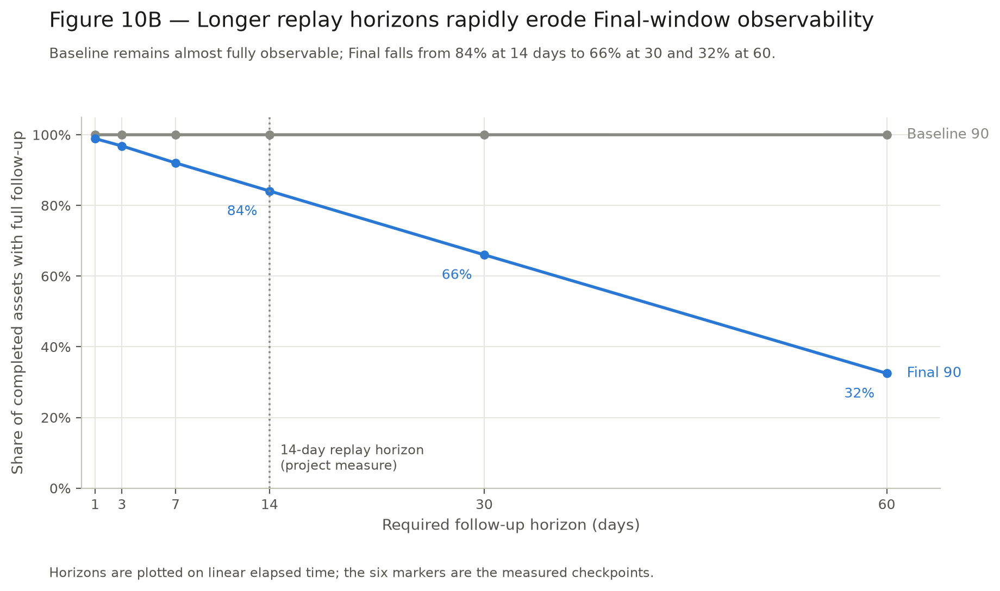

*How to read them:* the two charts share an x-axis — days after first completion, marked at the six measured checkpoints, with the chosen 14-day horizon dotted. Grey is the baseline window and blue the final window. In **10A** the y-axis is behavioural capture: the share of eventual first rewatches already visible by that horizon, so higher is better. In **10B** the y-axis is the measurement cost: the share of completed assets that could be followed for the whole horizon, so falling lines mean more censoring. Read together, they are the trade-off — 10A rises with a longer horizon while 10B collapses for the final window, which runs up against the end of the data.

**Evidence — the replay measure had to survive at profile grain:** a sound asset-level rule is useless for viewer analysis if most profiles contribute only one or two outcomes.

| Known 14-day replay outcomes per eligible profile | BASELINE_90 | FINAL_90 |
| --- | ---: | ---: |
| At least 1 | 99.2% | 96.1% |
| At least 3 | 89.6% | 80.5% |
| At least 5 | 80.2% | 68.4% |
| Median known outcomes | 17 | 10 |

Requiring five would have discarded too much of the final window; allowing one would leave rates hostage to single assets. The 14-day replay rate is retained where a profile has at least three known outcomes, with the denominator carried beside the rate.

**Evidence — the failed resume-rate branch:** the next step attempted an equivalent normalised 14-day resume rate. It was stopped when its denominator failed to reconcile with canonical abandonment — and the reason turned out to be the most important semantic finding of the return audit. The attempted measure treated resume and abandonment as alternative outcomes. They are not. Crossing validated pre-completion resume against each asset's eventual outcome closed the question:

| Assets with a pre-completion resume | BASELINE_90 | FINAL_90 |
| --- | ---: | ---: |
| Later completed | 54,016 | 42,367 |
| Later abandoned | 2,697 | 1,161 |
| Still censored | 2 | 1,033 |

A viewing journey can run start → stop unfinished → resume → complete, or → resume → remain unfinished → abandon, or → resume → unresolved at the observation boundary. **Resume is an intermediate viewing pathway, not a terminal outcome axis.**

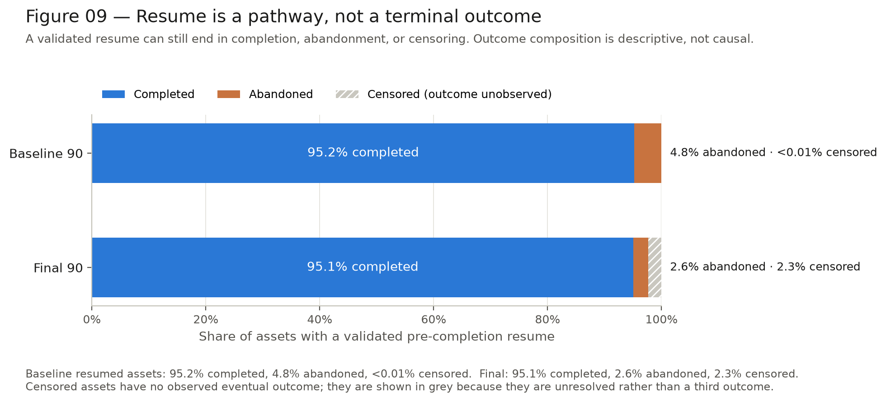

*How to read it:* each bar is one window and totals 100% of assets that had a validated pre-completion resume. Blue is eventually completed, orange eventually abandoned, and the hatched grey slice is still censored at the observation boundary. Resume sits upstream of all three outcomes, which is the point: it describes a step on the way, not where the viewing ended. Forcing it into the same rate architecture as completion merely for symmetry would have been wrong, so the attempted construction was rejected rather than forced into existence.

**Interpretation — what this changed:** five apparently comparable fields became a post-choice vocabulary in which each measure answers one question:

| Post-choice question | Measure | Validity condition |
| --- | --- | --- |
| General retention | Completion | Known outcomes only |
| Episodic persistence | Continuation | A legitimate, observable next-episode opportunity |
| Unfinished-content persistence | Validated pre-completion resume | Supporting pathway evidence, not a terminal outcome |
| Completed-content repeat value | 14-day replay | At least three known outcomes, denominator retained |

Abandonment remains the diagnostic inverse of completion on known outcomes. The broad `resumed_assets` field is excluded from downstream fingerprint use because it mixes unfinished resume with completed-content replay.

This is more than measurement hygiene. It changes what the analysis is allowed to mean by a viewer being "attached" to content: finishing it once, continuing an episodic run, returning to something unfinished and deliberately replaying something completed are related behaviours, but they are not interchangeable evidence. And they offer different explanations for the same surface concentration. High concentration with strong retention may reflect focused preference; high concentration with repeatedly weak retention despite meaningful sampling may point to a different mechanism.

**Caveat:** every one of these measures observes behaviour after selection. Whether that selection happened under broad or constrained realistic choice is not answered here. The rates describe analytically eligible profile-windows, the evidence thresholds (five known outcomes for completion, three for replay) trade coverage against stability, and resume is carried only as supporting evidence.

**What it made us ask next:** with trustworthy post-choice measures, the natural next question was whether they actually differ underneath similar concentration — at comparable breadth and concentration, what different post-choice response patterns sit underneath? That is Test 4D. It still observes behaviour after selection; whether that behaviour occurred under broad realistic choice remains unresolved and belongs to Test 5.

---

## 14. When concentration stops meaning the same thing

**Date:** 2026-09-22

**Question:** when two profiles show similarly concentrated catalogue consumption, do they exhibit the same behavioural mechanism?

**Why it matters:** concentration only describes where attention ended up. A viewer may concentrate because they barely consumed anything, because a narrow set of choices works extremely well, or because they tried several alternatives and kept returning to a smaller successful core. Treating those cases as one high-concentration group would collapse the distinction the project exists to diagnose.

**Evidence — breadth × concentration states:** eligible profile-windows were placed independently in quintiles within each window: concentration by top-title qualified share and breadth by meaningful parent titles, from Q1 (lowest) to Q5 (highest). Each cell is a behavioural state, `state(profile, window)`. Within one window each profile occupies exactly one cell, so cells are distinct groups rather than overlapping subsets. The same profile may sit in a different cell in the other window. These are behavioural states, not permanent identities.

The raw comparison already showed heterogeneity. Very narrow, highly concentrated viewers could complete strongly; moderately broader, highly concentrated viewers could complete less but replay more; broad, distributed viewers could still retain well, contradicting the idea that exploration necessarily means shallow sampling.

**Evidence — why activity context became necessary:** breadth and post-choice outcomes both rise naturally with how much a profile watches. A viewer active on 55 days with 100 qualified hours has had far more chances to accumulate titles, complete assets and generate replays than one active on eight days with five hours. A raw difference between two cells could therefore mean only "these viewers consumed more" rather than "these viewers behaved differently after selection".

Activity context separates the two:

- **above or below watch-hours context** — above or below the typical rate among profiles in the same 90-day window with similar qualified watch volume (the same watch-hours quintile);
- **above or below active-days context** — above or below the typical rate among profiles active on a similar number of days (the same active-days quintile).

A completion deviation of +0.10 against watch-hours context means completing about ten percentage points more than profiles with similar qualified watch volume. Context is a fairness benchmark, not a new behavioural score.

**Evidence — the rejected crossed benchmark:** the first adjustment crossed watch-hours quintiles with active-days quintiles into 25 reference strata. Even large breadth × concentration cells ended up compared with sparse reference groups, and too many comparisons were flagged as thin benchmarks. That design was rejected as the final robustness check rather than allowed to create false precision, and it is not published as canonical analysis.

**Evidence — what survived both controls:** the final check benchmarked every profile separately against its watch-hours quintile and against its active-days quintile. A candidate mechanism became stronger evidence only when its direction held under both. Deviations are shown as watch-hours context · active-days context:

| Candidate state | Concentration / breadth quintile | Window | Profiles | Completion vs context | 14-day replay vs context |
| --- | --- | --- | ---: | --- | --- |
| Focused successful consumption | Q5 / Q1 | BASELINE_90 | 1,111 | +0.118 · +0.097 | −0.038 · −0.019 |
| | Q5 / Q1 | FINAL_90 | 1,403 | +0.118 · +0.092 | −0.005 · −0.013 |
| Selective-core attachment | Q4 / Q3 | BASELINE_90 | 429 | −0.069 · −0.066 | +0.057 · +0.053 |
| | Q4 / Q3 | FINAL_90 | 446 | −0.053 · −0.051 | +0.034 · +0.035 |
| | Q5 / Q2 | BASELINE_90 | 505 | −0.042 · −0.040 | +0.028 · +0.038 |
| | Q5 / Q2 | FINAL_90 | 481 | −0.033 · −0.044 | +0.037 · +0.029 |
| Successful first-pass consumption | Q3 / Q2 | BASELINE_90 | 517 | +0.034 · +0.029 | −0.021 · −0.017 |
| | Q3 / Q2 | FINAL_90 | 523 | +0.041 · +0.040 | −0.025 · −0.026 |
| Broad distributed consumption | Q1 / Q5 | BASELINE_90 | 1,446 | −0.011 · −0.007 | −0.004 · −0.010 |
| | Q1 / Q5 | FINAL_90 | 1,489 | −0.026 · −0.024 | −0.004 · −0.002 |

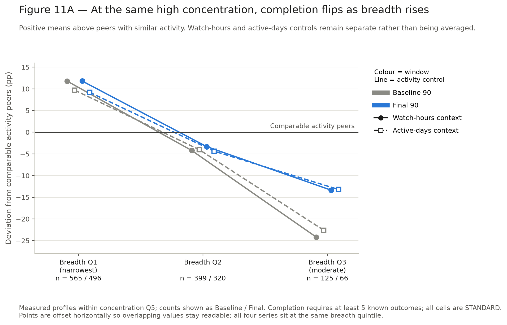

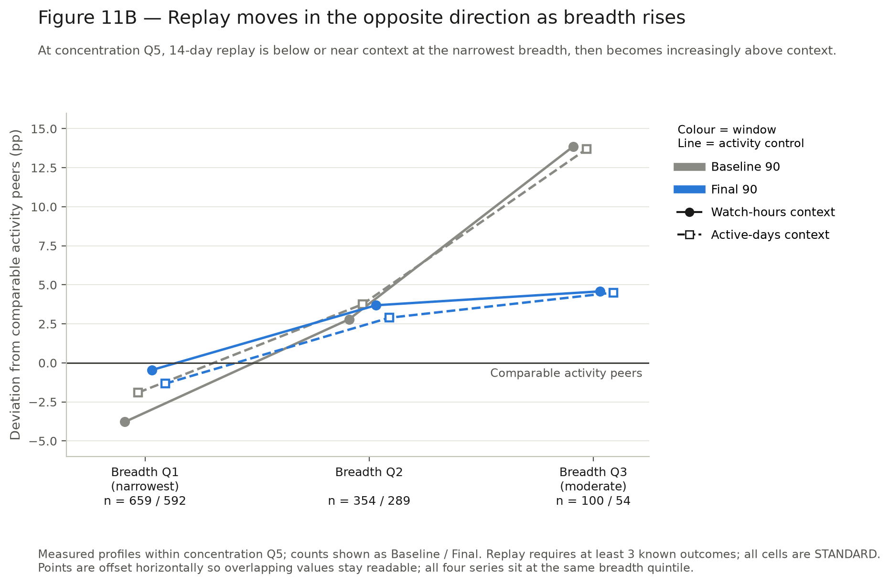

*How to read them:* both charts stay inside the highest concentration quintile and move left to right from the narrowest breadth (Q1) to moderate breadth (Q3). The y-axis is deviation from comparable activity peers in percentage points, so the black zero line means "behaves like peers with similar activity"; above it is more, below it is less. Colour is the window — grey baseline, blue final — and line style is the control: a solid line with filled circles benchmarks against profiles with similar watch hours, a dashed line with open squares against profiles with a similar number of active days. Points are nudged sideways only so overlapping series stay readable. The n labels count measured profiles, those meeting the evidence threshold behind each rate, which is why they are smaller than the cell counts in the table above. **11A** shows completion falling from well above peers at narrow breadth to well below as breadth widens; **11B** shows replay moving the opposite way.

Full cell-level results, including thin cells and the number of profiles meeting each evidence threshold, are in [`concentration_mechanism_controls.csv`](../evidence/viewer_diagnosis/concentration_mechanism_controls.csv).

**Interpretation:** four provisional, window-specific states stand out.

- **Focused successful consumption** — very narrow breadth and high concentration, with completion above context and replay neutral or below. Few meaningful choices are made, but they tend to work. That is evidence against treating narrow concentration automatically as poor catalogue engagement.
- **Selective-core attachment** — moderate breadth and high concentration, with completion below context and replay above it under both controls. Several meaningful choices occur, but attachment is uneven: many selections retain less well while a smaller successful set attracts disproportionate repeat attention.
- **Successful first-pass consumption** — low or moderate breadth and moderate concentration, with completion above context and replay below it. Chosen content holds attention without unusual dependence on replay.
- **Broad distributed consumption** — high breadth and low concentration, with strong absolute completion (raw averages of 0.834 and 0.821) that becomes ordinary, slightly below context, once activity is accounted for. Broad exploration can coexist with healthy retention; it should not be equated with shallow sampling, nor credited with exceptional retention.

**High concentration itself is not the mechanism.** What it means depends on the breadth and post-choice behaviour underneath it: very narrow high concentration where choices work unusually well is a different state from meaningful breadth where completion weakens and replay strengthens. Concentration describes allocation; mechanism explains it; only afterwards can opportunity be assessed.

**What Test 4 does not establish:** final segments; headroom; causality; recommendation failure; that replay necessarily occurred on the dominant title; durable viewer identity; or that entitlement, language or catalogue opportunity have been ruled out as explanations.

**Caveat:** these are cross-sectional states within each 90-day window. Cells under 30 profiles are flagged as thin, and within each cell only profiles meeting the evidence threshold contribute a rate — in the narrowest cells that can be well under half the profiles, because a viewer with few choices generates few known outcomes.

**What it made us ask next:** Test 4 answers *what did the viewer choose, and what happened after selection?* Test 5 asks *what could the viewer realistically have chosen?* A profile may look narrowly concentrated because it preferred a small set of titles — or because its plan exposed a smaller catalogue, its entitled days were limited, regional or language availability narrowed the reachable set, or it had too little consumption opportunity to encounter alternatives. Only once entitlement, catalogue opportunity, tenure and related constraints are added can the analysis begin separating healthy preference, constrained concentration, insufficient consumption opportunity and credible unrealised viewing opportunity.

Later, within-profile analysis from the baseline to the final window will ask whether these states recur. The same state in both windows would read as a persistent mechanism; a new state in the final window as an emerging one; a state that disappears as transient. A persistent mechanism deserves a different business reading from a temporary one.

---

## 15. A large catalogue is not the same thing as a large choice set

**Date:** 2026-10-04

**Question:** once the Test 4 behavioural states are placed back inside the catalogue each profile could realistically reach, do they still describe different mechanisms, or were some of those differences simply unequal opportunity wearing a behavioural disguise?

**Why it matters:** Test 4 deliberately stopped short of answering that. It showed that similar concentration could sit above very different post-choice behaviour, but those profiles were not necessarily choosing under comparable conditions. A viewer on broad access and a viewer on a regional pack can both end a window with five meaningful titles. The number is the same; the choice set behind it may be nothing alike.

That distinction is central to the business question. Narrow viewing is only interesting as unrealised opportunity if there was meaningful opportunity to begin with. Otherwise the analysis risks treating a constraint as a preference, or worse, manufacturing headroom out of catalogue a viewer could never have reached.

**Evidence — opportunity had to be measured at the same grain as the behaviour:** the viewer mart already carried `mean_daily_eligible_parent_titles`, `eligible_parent_title_days` and entitled days. Those fields were necessary, but the first attempt to compare them with breadth exposed a grain problem.

| Field | Grain |
| --- | --- |
| `distinct_meaningful_titles` | Window-level count |
| `mean_daily_eligible_parent_titles` | Daily average |

Dividing one by the other would produce a convenient ratio and an awkward meaning. What the comparison actually needed was the number of distinct parent titles that were reachable at least once during that profile's entitled portion of the same 90-day window: `reachable_parent_titles_in_window`.

That required reconstructing opportunity day by day from profile existence, historical entitlement and catalogue availability. The existing opportunity logic was reused rather than replaced with a second interpretation of access. Entitled days, eligible title-days and mean daily opportunity were then reconciled back to the mart before the new window-level reach measure was trusted.

The reconstruction passed. That matters less because another check turned green than because the denominator now answers the same question as the numerator: how much of the catalogue a profile meaningfully reached, relative to the distinct catalogue it could actually have encountered during that window.

Even then, the derived `meaningful_titles_per_100_reachable` measure stayed diagnostic. It is not a utilisation score. A profile does not owe the platform consumption of every reachable title, and a title being technically reachable does not mean it was shown, noticed or considered.

**Evidence — access changed the size of the field much more than the amount of play on it:** the natural opportunity structure was not subtle. Regional opportunity also differed materially by language pack, so reducing the whole problem to broad versus regional would have thrown away useful structure.

| Opportunity family | Share of eligible profile-windows |
| --- | ---: |
| Broad access | ~70% |
| Regional access | ~27% |
| Mixed access | Small remainder |

Once distinct window reach was reconstructed, the gap between what was available and what was watched became the story:

| Broad versus regional access | Difference |
| --- | --- |
| Distinct reachable parent titles (average) | ~3× larger |
| Meaningful titles actually watched | Only ~24–26% more |

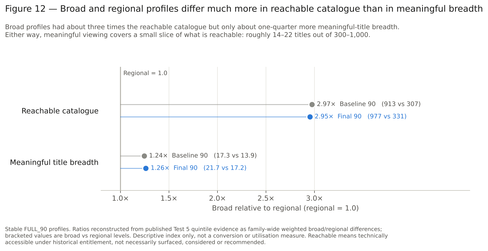

*How to read it:* the x-axis is an index, not a title count. Regional access is fixed at 1.0, and each point says how large the broad-access group is relative to it on that quantity; the bracketed values are the underlying broad and regional averages. Grey is `BASELINE_90`, blue is `FINAL_90`. Reachable catalogue runs at about 2.97× (913 against 307 titles) in the baseline window and 2.95× (977 against 331) in the final one, while meaningful-title breadth differs by only about 1.24× (17.3 against 13.9) and 1.26× (21.7 against 17.2). The figure is a descriptive index, not a conversion or utilisation measure: meaningful titles over reachable titles stays a diagnostic ratio, because reachable marks the boundary of what access permitted, not a funnel the viewer was expected to move through, and nothing here shows that those titles were surfaced, noticed or considered.

That gap is important, but not because regional viewers are somehow more "efficient" catalogue users. It shows that access creates the boundary of possible choice without mechanically determining how far viewing spreads inside it. A much larger menu did not produce a proportionally larger meal. That was the first strong reason not to equate catalogue availability with exploration.

**Evidence — opportunity explained breadth better than concentration:** the next question was whether access was also driving the concentration states from Test 4. Profiles were therefore compared inside the same window and the same opportunity family, with consumption opportunity handled separately through qualified watch hours and active days. Those two controls remained separate for the same reason they did in Test 4: they describe different ways of having enough behavioural opportunity to accumulate viewing, and combining them would create a score the analysis never defined.

The result was asymmetric. Opportunity materially structured breadth: profiles with broader access generally reached more meaningful titles. It did not produce a consistent equivalent shift in concentration.

Profiles with large reachable catalogues could still devote most of their viewing to a small core. Profiles with much narrower regional opportunity could distribute viewing comparatively widely within what they had. Access therefore helped explain how far viewing could spread more reliably than how attention was allocated after selection.

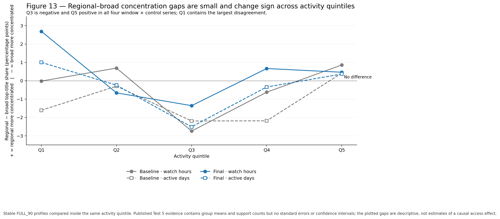

*How to read it:* each point is regional minus broad top-title share in percentage points inside the same activity quintile, so zero means no difference, positive means regional profiles were more concentrated and negative means broad profiles were. Grey is `BASELINE_90` and blue `FINAL_90`; solid lines with filled circles use the watch-hours control, dashed lines with open squares the active-days control, and the two are never averaged. No series holds one sign: Q3 is negative in all four window × control combinations and Q5 positive in all four, with Q1 showing the largest disagreement between them. That is structured descriptive variation rather than noise — but the published evidence carries group means and support counts and no standard errors, so the figure cannot and does not claim a null effect, statistical equivalence or a causal access effect.

Opportunity is not another behavioural dimension. It is the context needed to decide what a behavioural dimension is allowed to mean.

**Evidence — genre helped, but it did not replace the title-level story:** genre structure was tested next because title breadth can hide two different kinds of range. A profile might watch many titles because it moves across several genres, or watch many titles inside a narrow genre space.

Genre added information, but not enough to overturn the title-level mechanism. Profiles with relatively narrow genre structure could still distribute their viewing across many parent titles inside those genres. Conversely, broader genre reach did not guarantee broadly distributed title attention.

Genre therefore remained useful context for how breadth is composed, rather than becoming a substitute for title breadth or title concentration. The original warning from Test 3 survived: title and genre concentration overlap, but they are not the same construct.

**Evidence — then the Test 4 candidates had to face opportunity:** at this point there was no value in inventing new states. The useful test was harsher: take the candidates already earned in Test 4 and ask whether their interpretation survives when profiles are read against comparable realistic opportunity. Several did.

| Candidate | State | Verdict under opportunity |
| --- | --- | --- |
| Focused successful consumption | C5_B1 | Survived — strongest case. Kept the post-choice pattern that made it distinctive. |
| | C4_B1 | Supports the same family where evidence was sufficient. Regional support in the final window too thin for a confident comparison. |
| Selective-core attachment | C4_B3 | Survived — cleanest anchor. Meaningful breadth, high concentration, weaker completion against activity context, stronger replay. |
| | C5_B2 | Conditional. Useful neighbour under broad access; regional evidence weaker and less consistent. |
| Successful first-pass consumption | — | Remained a separate response pattern. |
| Broad distributed consumption | — | Remained. Broad viewing still does not imply shallow viewing. |

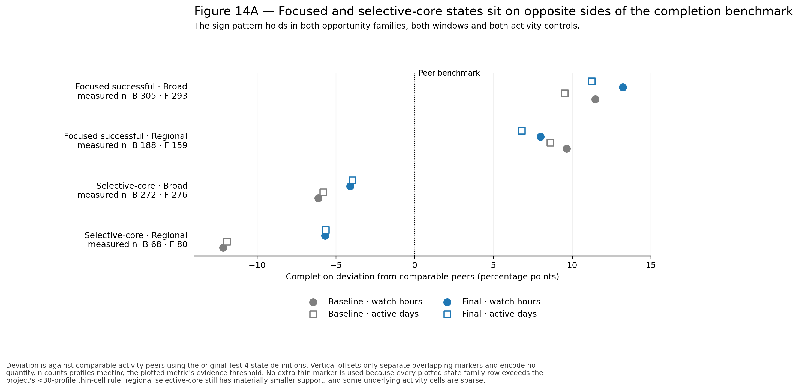

*How to read it:* the x-axis is completion deviation from comparable activity peers in percentage points, so zero means completing at the benchmark, right of it means above comparable peers and left means below. The four rows are the focused-successful and selective-core states inside broad and regional opportunity. Grey is `BASELINE_90` and blue `FINAL_90`; filled circles use the watch-hours benchmark and open squares the active-days benchmark. The vertical offsets within a row only stop markers overlapping and encode nothing. Every focused-successful point sits above the benchmark and every selective-core point below it, across both opportunity families, both windows and both controls — which is why the two keep describing different post-choice mechanisms once opportunity is held comparable. The `measured n` beside each row is the profiles meeting the completion evidence threshold. None of this shows that opportunity family causes the difference, and the relative position of broad against regional points is not a separate finding.

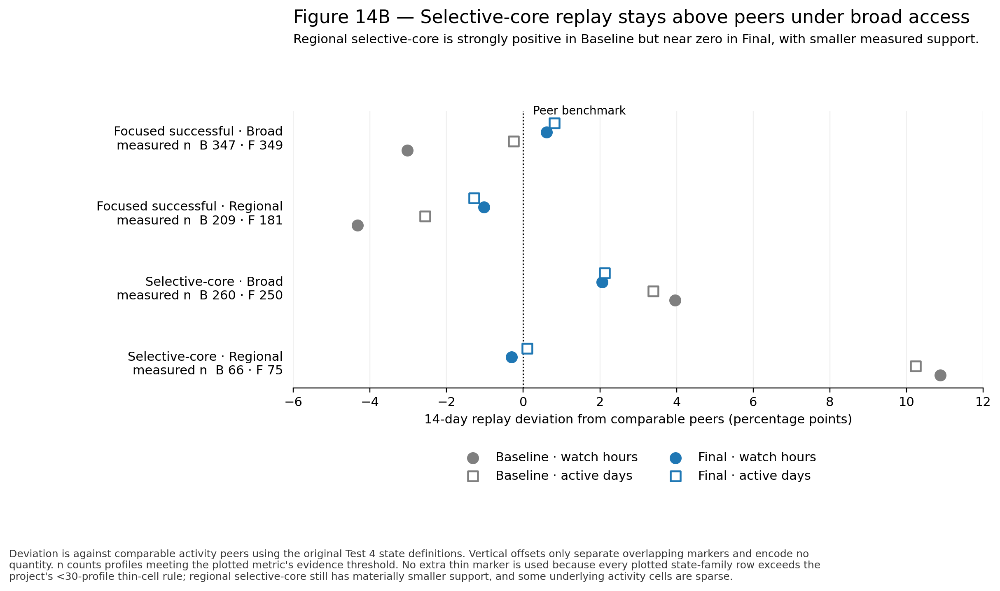

*How to read it:* the same rows, windows, controls and offset convention as Figure 14A, now showing 14-day replay deviation from comparable activity peers in percentage points. Selective-core under broad access stays above its peer context in both windows and under both controls, so that replay signature remains visible once opportunity is held comparable. Regional selective-core is not as steady: roughly +10 to +11 points in the baseline window but close to zero in the final one, on a measured population materially smaller than its broad counterpart. No new thin-support marker was invented for it — the project's `<30` profile rule does not classify these rows as thin — so the caveat is carried by the printed `n` and by this note rather than by redefining the rule. The large baseline regional deviation is not treated as durable.

Regional support for C4_B1 in the final window being too thin is insufficient evidence, not evidence of failure. Access did not erase the selective-core pattern, but it changed how confidently the C5_B2 neighbour could be carried.

Sparse states were not deleted to make the picture cleaner. Where support was inadequate, the result stayed inadequate. That sounds obvious. Analytical workflows have nevertheless found more creative ways to turn "not enough evidence" into whichever answer is most convenient.

**What this changed:** Test 5 did not turn the candidate states into segments. It did something more necessary first: it tested whether unequal access was doing the explanatory work we had been assigning to behaviour. It was not, at least not by itself. The resulting distinction is sharper:

| Quantity | What it determines |
| --- | --- |
| Access opportunity | What could realistically have been chosen |
| Consumption opportunity | How much behavioural evidence a profile had time and activity to generate |
| Breadth | How far meaningful viewing spread |
| Concentration | How attention was allocated across that spread |
| Post-choice response | What happened once content was selected |

Those quantities interact, but collapsing them would put us back where the project started.

The strongest Test 4 mechanism candidates survived opportunity conditioning, although some neighbouring states became access-sensitive or support-limited. That is enough to carry them forward as opportunity-aware candidate mechanisms. It is not enough to call them durable identities, segments or headroom populations.

Unused reachable catalogue is still not headroom. A profile can have hundreds of unwatched reachable titles and no reason whatsoever to want them. Opportunity is necessary for headroom; it is not evidence that the opportunity would convert.

**What it made us ask next:** one part of opportunity was still hiding too much structure inside a single count: language.

Regional entitlement itself is defined through language availability, many titles offer several audio tracks, and the language actually consumed is recorded separately from both original language and offered audio. A raw count of languages watched could therefore reflect supply, entitlement, dubbing structure, programme mix or genuine movement across catalogue ecosystems.

Test 5 established the reachable catalogue. The next question became whether language behaviour adds anything beyond that opportunity structure, and whether it can do so without pretending that home region, regional plan or title origin tells us a viewer's native language. That is Test 6.

**Evidence tables:** the opportunity structure itself is published as [`opportunity_regime_summary.csv`](../evidence/mart_audit/opportunity_regime_summary.csv); the conditioning results as [`opportunity_family_activity_contrasts.csv`](../evidence/viewer_diagnosis/opportunity_family_activity_contrasts.csv), [`genre_structure_incremental_models.csv`](../evidence/viewer_diagnosis/genre_structure_incremental_models.csv) with its [support summary](../evidence/viewer_diagnosis/genre_structure_support_summary.csv), and [`opportunity_conditioned_candidate_mechanisms.csv`](../evidence/viewer_diagnosis/opportunity_conditioned_candidate_mechanisms.csv). [`viewer_diagnosis/README.md`](../evidence/viewer_diagnosis/README.md#opportunity-conditioning-test-5) records their populations, denominators and support rules, including why the candidate-mechanism quintiles are the original Test 4 ones.

## 16. A multilingual catalogue is not the same thing as multilingual behaviour

**Date:** 2026-10-04

**Question:** once title-level opportunity had been reconstructed, could language simply be added as another breadth measure, or did language itself need a separate opportunity audit before any viewer behaviour could mean anything?

**Why it matters:** Test 5 ended with a problem hiding inside the regional entitlement rule. A regional pack reaches a title because its pack language appears among that title's offered audio tracks — but once the title is reachable, the viewer may select any listed track. The language that admits a title into the catalogue, the language the title originated in, and the language actually played are therefore three different observations. Treating them as one field would have made the next analysis pleasantly simple and analytically useless.

**Evidence — multilingual supply was large, and very uneven:** Test 6A deliberately contained no viewer behaviour. It asked what multilingual choice existed before asking what anyone did with it. The 8,628 playable assets collapse to 1,000 parent titles and 1,904 parent-title × audio-language rows.

| Audio-language structure | Result |
| --- | ---: |
| Monolingual titles | 445 |
| Multilingual titles | 555 |
| Mean audio languages per title | 1.904 |
| Maximum audio languages | 6 |
| Titles with three or more languages | 244 |

Those 244 titles hold 65.6% of all additional-language tracks. Supply exists at scale, but it is not spread evenly — and programme type produces the sharper asymmetry: 78.17% of movies are multilingual against 61.11% of web series, 19.83% of reality titles and 9.83% of catch-up. The documentary figure (6 of 9 titles) is arithmetically correct and analytically tiny.

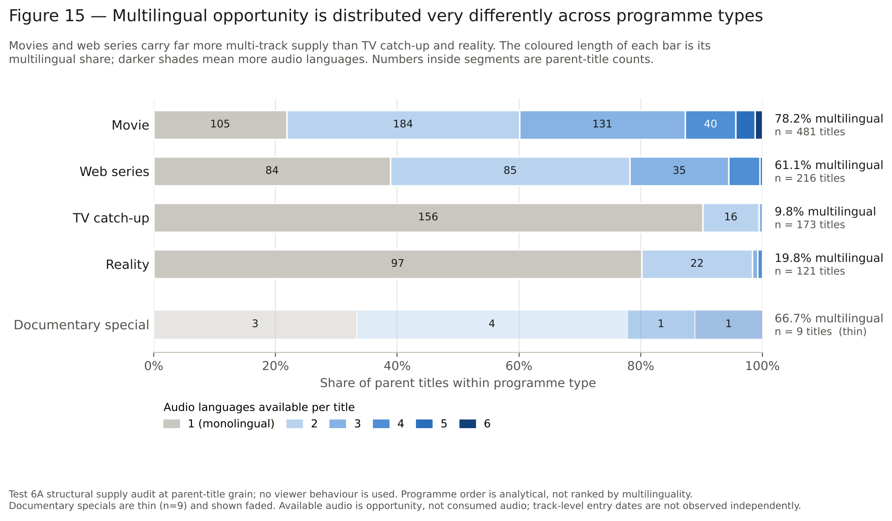

*How to read it:* each bar is one programme type and totals 100% of its parent titles, so the coloured length is that programme's multilingual share and the darker shades show how deep the audio supply goes. Documentary specials are faded at nine titles. This is supply, not viewing. The [visual decision log](../figures/visual_decision_log.md#test-6--language-supply-consumed-language-and-cross-origin-movement--2026-10) carries the full reading contract.

That ruled out a tempting shortcut immediately. A profile watching mostly movies and one watching mostly catch-up do not face the same multilingual environment, so raw consumed-language breadth would inherit programme structure before it reflected anything like exploratory behaviour.

**Evidence — original language and available audio were not interchangeable either:** Hindi originates 428 titles but is offered as audio on 486; Tamil 158 against 271; Telugu 107 against 245; Kannada 44 against 216, nearly five times as many by audio as by origin. Counting original languages as if they were available audio would understate dubbing opportunity; counting every offered track as consumed behaviour would do the opposite.

The regional rule was then checked rather than assumed: a regional language admits a parent title when that language exists in its audio bridge, entitlement applies at title level, and after admission every listed track on that title remains selectable. "Tamil regional opportunity" does not mean "Tamil-only audio opportunity". The pack decides which titles enter the field, not which track must be played once a title is inside it.

Regional packs reached much smaller pools — 186 to 449 reachable parent titles in the baseline window against 913 under broad access — but those smaller pools were multilingual-enriched, because a dub is itself one route by which a title becomes eligible for a pack. A higher multilingual *percentage* inside a regional catalogue therefore does not mean more multilingual opportunity than broad access. Percentages and absolute choice sets were doing different jobs again. Apparently the dataset had not finished objecting to convenient denominators.

**Caveat — track timing is not observed independently:** the audio bridge records which tracks a title offers, not a separate entry and exit date for each dub. Listed tracks therefore inherit the parent title's availability dates. That does not break the structural comparison, but it prevents any claim about exactly when an individual dub appeared if its real timing differed from the title's. Test 6A closed as **pass with caveat**: it established the supply layer and no multilingual viewer, preference, propensity, segment or headroom population.

**Evidence — consumed language was much narrower than opportunity:** only once the supply semantics were stable did Test 6B bring in qualified viewing.

| Measure | BASELINE_90 | FINAL_90 |
| --- | ---: | ---: |
| Mean reachable audio languages | 9.978 | 9.867 |
| Mean consumed audio languages | 4.444 | 4.434 |
| Mean top consumed-language share | 0.624 | 0.646 |
| Mean top opportunity-language share | 0.310 | 0.303 |
| Mean consumed-language HHI | 0.503 | 0.527 |
| Mean opportunity-language HHI | 0.180 | 0.178 |

In 99.43% of baseline and 99.47% of final eligible profiles, consumed-language HHI exceeded opportunity-language HHI. That sounds like a language-preference result until the denominator is inspected: reachable-language count was almost saturated at nine or ten languages. It could say that alternatives technically existed; it could not say how opportunity was distributed among them. The analysis therefore kept opportunity shares and opportunity HHI rather than promoting reachable-language count into a complete denominator.

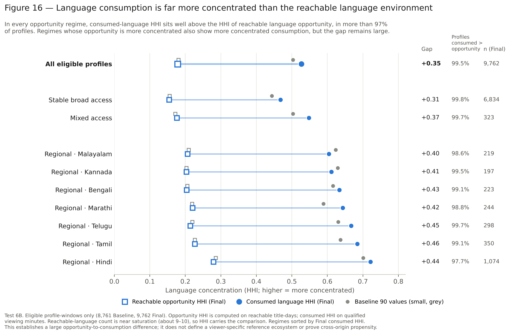

*How to read it:* within each row, the hollow square is the concentration of reachable language opportunity and the filled circle the concentration of consumed language; the distance between them is the gap, with Baseline shown as small grey context. Read the separation rather than either marker alone, and not as a calibrated selectivity effect — consumption volume is finite and no same-volume null was estimated.

Broad-access profiles consumed more distinct audio languages and showed lower consumed-language concentration than every regional family, and the pattern held when qualified watch hours and active days were used separately as activity context. Regional-pack profiles also gave their pack language materially more consumed share than it held in their reachable opportunity. Those are real descriptive patterns, and they still do not establish that plan family causes language concentration: access, catalogue composition, programme mix and behavioural selection are entangled observationally. The project stopped short of manufacturing a "language openness" score from them.

**What this changed:** language kept a provisional place in the behavioural picture — there was observable signal here, and it was not reducible to access alone. But what Test 6B had earned was narrower than it first looked. Raw consumed-language breadth was heavily opportunity-dependent. Reachable-language count had failed outright as a denominator, saturating at nine or ten for almost everyone. Activity materially structured how many languages a profile accumulated. Broad and regional differences survived coarse activity conditioning descriptively, and programme structure remained an unresolved confound behind all of it. No language-openness score had been earned, and raw language breadth was not a finished behavioural construct.

The branch that suggested itself was to sharpen the behaviour rather than the denominator: separate **title selection from within-title audio-track selection**. A multilingual title lets a viewer choose a track after choosing the title, so a consumed-language count mixes two decisions. Did a profile pick a title because of its language ecosystem, or pick it for entirely different reasons and then land on one of its tracks? Resolving that would make any later language measure cleaner.

**Evidence tables:** [`catalogue_multilinguality_by_program_type.csv`](../evidence/mart_audit/catalogue_multilinguality_by_program_type.csv), [`title_origin_vs_available_audio.csv`](../evidence/mart_audit/title_origin_vs_available_audio.csv), [`language_opportunity_by_access_regime.csv`](../evidence/mart_audit/language_opportunity_by_access_regime.csv) and [`consumed_vs_opportunity_language.csv`](../evidence/viewer_diagnosis/consumed_vs_opportunity_language.csv).

## 17. From track choice to movement across title-origin ecosystems

**Date:** 2026-10-04

**Question:** the title-selection-versus-track-selection confound was real, and it was large. Was resolving it actually necessary for the diagnosis this project exists to make?

**The tension:** pursued properly, that branch stops being a language question and becomes a theory of individual title choice. Why was this title selected at all — language, genre, familiarity, cast, programme type, where it happened to appear on a row? Was the track that played a deliberate choice or whatever the player defaulted to? Each of those is answerable only with evidence the dataset does not carry, and none of them is the question the project set out to answer: what explains concentrated catalogue consumption, and which patterns represent genuine unrealised viewing opportunity.

**Decision:** the branch was documented and not pursued. A confound earns its own line of analysis when resolving it would change the diagnosis, the interpretation or the decision that follows; otherwise it stays a stated limitation. Track choice inside a multilingual title failed that test — it would have absorbed the rest of Test 6 without changing what concentration, opportunity or post-choice response mean. Programme-type context and the distinction between title origin and consumed audio both remained important; what was set aside was the attempt to explain why any individual title was chosen.

**The alternative hypothesis:** the useful question was not why a particular title was selected but whether viewing *moved*. If a profile's earlier viewing sits firmly inside one title-origin ecosystem, then later qualified viewing on titles originating outside it is movement away from an established behavioural centre — and movement is observable in a way that title-level causation is not. It also composes with everything already built: once that movement exists, it can be conditioned on whether the alternatives were realistically reachable at all, which is exactly the opportunity machinery Test 5 produced.

That reframing changes the analytical object from *the reason a title or track was selected* to *displacement from an earlier centre*, and it is what the rest of Test 6 is built on.

**What it required:** a stable reference ecosystem, fixed independently of the behaviour being measured. The intuitive version of that reference is a viewer's own language — establish where viewing is centred, hold it still, and watch whether later viewing crosses out of it. The project cannot have that version. Native language is not observed, and `home_region`, regional pack language and `original_language` are account context, entitlement context and title metadata respectively. Using any of them as a stand-in would convert an absent variable into a confident-looking column.

So the reference had to come from the profile's own observed behaviour, which is where Test 6C begins.

**What it made us ask next:** can a profile's earlier viewing define that reference honestly, and does later viewing move beyond it when realistic alternatives exist?

## 18. Native language was not observed, so the reference came from the profile's own viewing

**Date:** 2026-10-04

**Question:** the cross-ecosystem movement hypothesis needs a reference that stays still while behaviour moves. What can define that reference without claiming to know something about the viewer that was never observed?

**Why it matters:** a reference built from metadata would be borrowed authority. `home_region` is account context, regional pack language is entitlement context, and `original_language` is title metadata; none of them tells us a profile's mother tongue, and a reference that moves with the behaviour it measures is worse than useless. The reference therefore had to be behavioural, taken from the earlier window and then held fixed.

**Analyst choice:** for profiles eligible in both analytical windows, the Baseline title-origin ecosystem receiving the largest share of qualified viewing became the fixed reference — the Baseline title-origin anchor. The paired population contains 8,199 profiles, about 93.6% of baseline eligible profiles and 84.0% of final eligible ones. The distribution is concentrated: Hindi anchors 4,956 profiles (60.45%), Bengali 1,502 (18.32%) and Telugu 1,316 (16.05%), with Tamil 237 and Marathi 119 behind them. Those first three account for 94.82% of anchors.

That imbalance matters for support and for later matching. It is not a reason to rename the anchor as identity. The anchor means one thing only: this was the title-origin ecosystem receiving the largest share of this profile's qualified Baseline viewing.

**Evidence — the anchor had no natural threshold:** the next temptation was to require some minimum Baseline dominance before the reference counted as real. The anchor-share distribution declines smoothly across its 5-percentage-point bands, with no elbow to justify a cutoff, and activity itself structures origin breadth, which makes a universal threshold even less attractive. No anchor-strength cutoff became a behavioural rule. A ≥70% slice was retained as a strong-anchor diagnostic subset and the 95–100% slice as an even cleaner sensitivity case. Neither is a segment definition.

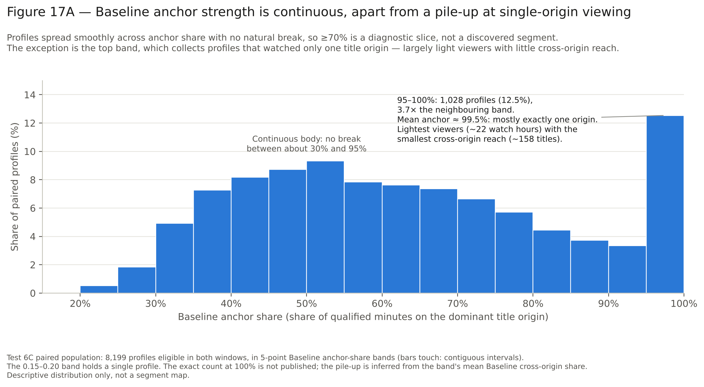

*How to read it:* the bars are contiguous intervals, so this is a distribution rather than ranked categories. The smooth body is the reason no cutoff was adopted; the top band is the exception, collecting near single-origin viewing by the lightest viewers with the least cross-origin reach.

**Evidence — movement appeared even from strong starting anchors:** for the 2,985 profiles with Baseline anchor share at or above 70%, cross-origin viewing rose materially in the final window.

| Movement into Final | 70–95% anchors | 95–100% anchors |
| --- | ---: | ---: |
| Profiles | 1,957 | 1,028 |
| Cross-origin minute share, Baseline → Final | 19.3% → 37.3% | 0.5% → 10.5% |
| Entered a new origin ecosystem | 71.4% | 42.1% |
| Increased cross-origin share | 70.2% | 42.5% |
| Remained anchor-only | — | 55.7% |

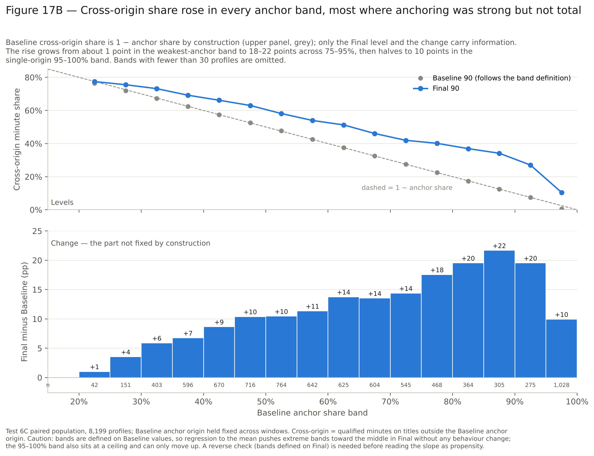

*How to read it:* Baseline in the upper panel tracks the dashed `1 − anchor share` line because the bands are defined from it, so the lower panel carries the information — Final minus Baseline per band, with profile counts underneath. Compare the change across bands, not the Baseline slope, and keep the regression-to-the-mean caution in view.

The 95–100% group is the harder test, because its Baseline viewing was almost entirely anchor-centred. The combination mattered more than either side alone: movement was clearly possible even from extremely concentrated Baseline origin behaviour, and it was not universal. That is roughly what a useful behavioural dimension should look like before anyone gets overexcited and turns it into a personality test.

**Caveat — the anchor is selected from Baseline by construction:** the Baseline winner is mechanically the largest Baseline origin share, so profiles chosen for very strong Baseline concentration have more room to move away from that winner later, and some regression toward a less extreme Final distribution is expected. The Baseline-to-Final rise could not by itself establish a stable cross-origin tendency.

**What it made us ask next:** whether the opportunity to move beyond the anchor had also changed enough to explain the behavioural shift.

**Evidence table:** [`cross_origin_anchor_and_opportunity.csv`](../evidence/viewer_diagnosis/cross_origin_anchor_and_opportunity.csv), whose `ANCHOR_SHARE_BAND` and `ANCHOR_ORIGIN_LANGUAGE` rows carry the distribution and the band movement above.

## 19. Cross-origin movement survived the opportunity test, and programme structure did not explain it away

**Date:** 2026-10-04

**Question:** did profiles move beyond their Baseline title-origin ecosystem because the final window simply offered them much more cross-origin catalogue, or did behavioural heterogeneity remain once that opportunity was reconstructed?

**Evidence — opportunity had to be relative to the fixed anchor:** the title-level opportunity logic from Test 5 was reused rather than replaced. For each profile and day: did the profile exist, what entitlement was historically valid, which parent titles were available, what was each title's original language, and was that language the anchor or not. Cross-origin opportunity was then measured in title-days rather than from a final plan label or a static full-window catalogue, so a later upgrade could not enlarge earlier regional opportunity. The reconstructed profile-level opportunity passed 117 checks with zero failures across the 8,199 paired profiles.

**Evidence — opportunity moved little relative to behaviour:**

| Population | Cross-origin opportunity, B → F | Cross-origin viewing, B → F |
| --- | ---: | ---: |
| All paired profiles (8,199) | 63.7% → 64.7% (+1.0) | 36.6% → 48.5% (+11.9) |
| Strong anchors ≥70% (2,985) | 52.3% → 53.7% (+1.5) | 12.8% → 28.0% (+15.2) |
| Near-total anchors 95–100% (1,028) | 26.2% → 28.5% (+2.3) | 0.5% → 10.5% (+10.0) |

Within the strong-anchor group, the 70–95% band showed roughly an 18-point behavioural increase against about one point of opportunity movement. No profile reached the final window with zero opportunity outside its Baseline anchor.

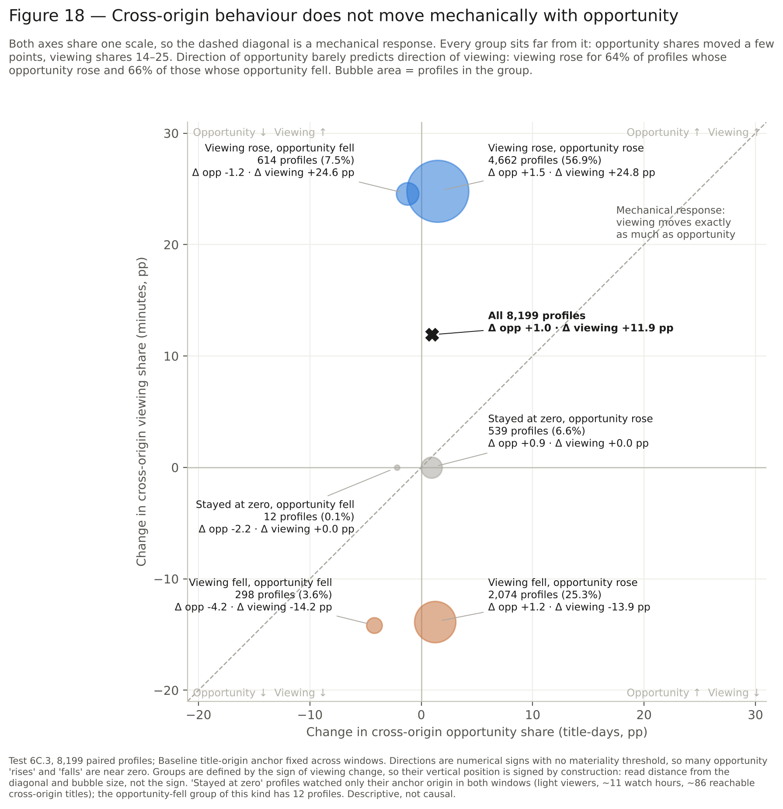

*How to read it:* both axes are percentage-point changes on one scale, so the dashed diagonal is what a mechanical response would look like; bubble area is profile count. The distance from that diagonal is the finding. Groups are defined by the sign of their viewing change, so read distance and size rather than quadrant membership.

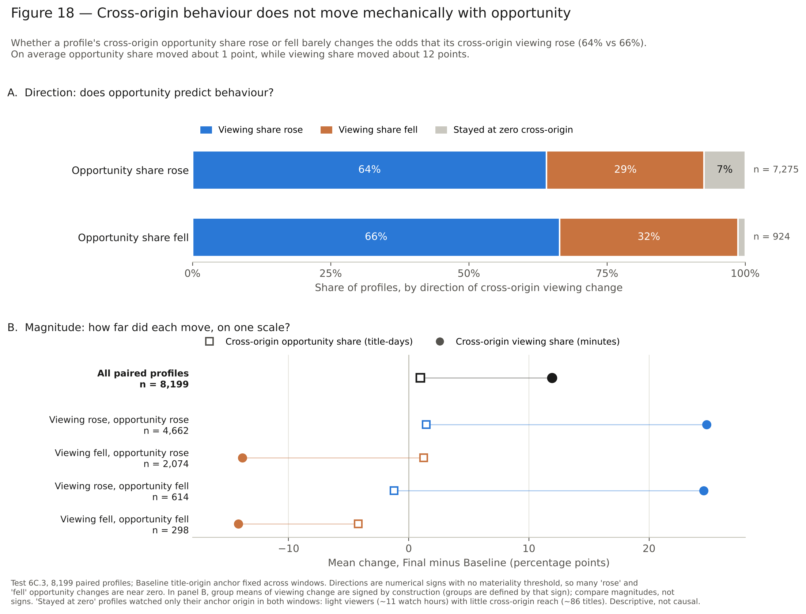

*How to read it:* the upper panel asks whether the direction of opportunity change predicts the direction of behaviour — 64% against 66% is the answer, with every cell behind both figures published in [`cross_origin_direction_cross_tab.csv`](../evidence/viewer_diagnosis/cross_origin_direction_cross_tab.csv). The lower panel puts both quantities on one percentage-point scale, where the connector length is the discrepancy between how far opportunity moved and how far viewing did.

The result is not that opportunity was irrelevant — without cross-origin opportunity, cross-origin viewing cannot happen at all. It is that the direction and magnitude of the behavioural movement were not mechanically determined by the change in opportunity.

One access case shows why the correction mattered. Baseline `FULL_90` Hindi regional access reached roughly 449 parent titles, but only about 54 of them were cross-origin relative to a Hindi anchor, giving cross-origin title-day opportunity of only about 11.5%. Profiles in that context could show Baseline anchor shares near 98% partly because the access structure offered little cross-origin room. That does not invalidate the anchor; it explains why the anchor cannot be read without opportunity beside it.

**Evidence — programme type was the next plausible alternative explanation:** Test 6A had already shown enormous differences in multilingual supply by programme type, so Test 6C.4A asked whether programme composition accounted for the remaining pattern. It controlled for Baseline anchor structure and activity, and the resulting programme deviations were modest — but it still lacked direct matching on each profile's historical cross-origin opportunity. Useful evidence, not yet the answer.

Test 6C.4B tightened the comparison. Peer cells matched profiles on exact Baseline dominant origin, Baseline anchor share in 5-percentage-point bands, Final cross-origin title-day opportunity share in 5-percentage-point bands, and activity quintile — with active days and watch hours used in separate versions rather than crossed. The primary interpretation used peer cells of at least 20 profiles. All 8,199 profiles entered the matching, and the Final programme reconstruction reconciled 175,673 meaningful title rows without failure.

| Dominant programme | vs active-days peers | vs watch-hours peers | Support |
| --- | ---: | ---: | --- |
| MOVIE | −1.75 pp | −1.68 pp | Well supported |
| WEB_SERIES | +2.35 pp | +2.10 pp | Well supported |
| TV_CATCHUP | +1.32 pp | +1.23 pp | Well supported |
| REALITY | — | — | Support-sensitive (~41–42 profiles) |
| DOCUMENTARY_SPECIAL | — | — | Too thin (3 overall, 1 supported) |

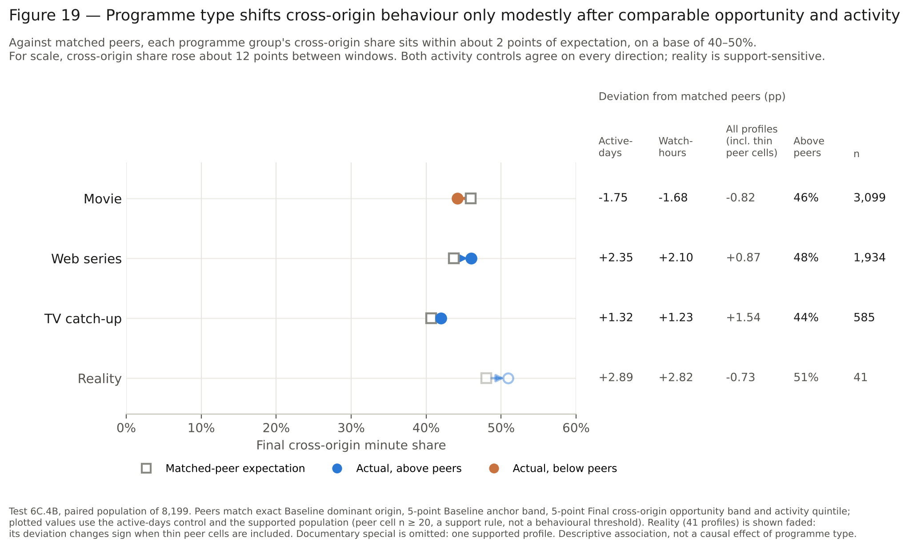

*How to read it:* the x-axis is the Final cross-origin share on its real scale, so the gap between the hollow expectation marker and the filled observed marker can be judged against the level it sits on. The table repeats each deviation under both activity controls with its support. Reality is faded because its sign flips once thin peer cells are included; documentary special is omitted at one supported profile.

That did not justify deleting the thin categories. It justified refusing to let them carry the conclusion. The full peer-matched comparison, including the `ALL` population beside the supported one and the peer-cell support columns behind each row, is published as [`test6c4b_programme_multilingual_sensitivity.csv`](../evidence/viewer_diagnosis/test6c4b_programme_multilingual_sensitivity.csv).

The same check looked at the share of final minutes spent on multilingual titles — a consumption-composition measure, not multilingual supply. Split into quintiles, peer-adjusted cross-origin deviations were small and non-monotonic: the middle quintiles sat modestly above peer expectation while the lowest and highest sat below it. The fifth quintile consisted entirely of profiles at 100% multilingual-title minutes, with tied values spilling into the fourth, so that boundary is a rank artefact rather than a behavioural cliff. The data did not support "more multilingual-title viewing, therefore progressively more cross-origin behaviour".

**What this changed:** by the end of Test 6C.4B several simpler explanations had been narrowed. Raw audio supply, regional access, activity, Baseline anchor strength and historical cross-origin opportunity were each insufficient alone; programme composition did not explain the heterogeneity away; and multilingual-title intensity offered no monotonic substitute. The defensible carry-forward phrase is **cross-origin catalogue propensity under realistic opportunity** — deliberately bounded, describing an observed tendency across two windows of evidence rather than a psychological trait, a causal parameter, a native-language preference, a stable identity, a segment or a headroom score.

**What it made us ask next:** Test 6C had established that cross-origin viewing could move substantially even when the historically reachable catalogue outside a profile's Baseline anchor changed very little. It had also narrowed several alternative explanations. But finding behaviour that survives an opportunity test is not the same as finding behaviour that deserves its own place in the diagnosis.

Tests 4 and 5 had already given us opportunity-aware candidate mechanisms. We knew something about how concentrated viewing was structured, what happened after meaningful content choices, and what alternatives were realistically available. The unresolved question was whether cross-origin behaviour could sharpen that picture or merely repeat it in a different vocabulary.

Why insist on the distinction? Because the eventual business decision concerns **realistic additional viewing opportunity**, not the number of interesting ways we can describe a profile. If cross-origin behaviour simply reproduced breadth, concentration or the existing post-choice mechanism, adding it as another dimension would make the diagnosis more elaborate without making it more informative. Worse, we might count the same underlying behaviour twice and mistake that repetition for stronger evidence of viewing headroom.

If, however, two profiles occupying the same opportunity-aware candidate mechanism still differed in how they used titles originating outside the language ecosystem that dominated their earlier viewing, the implication would be different.

A profile whose Baseline viewing centred on Hindi-origin titles, for example, might later devote meaningful time to Bengali-, Tamil- or Telugu-origin productions, even when watching those titles through Hindi-dubbed audio. Another profile with similar access and the same concentration mechanism might continue drawing almost entirely from Hindi-origin content.

That is what movement beyond the Baseline title-origin anchor actually represents: not necessarily changing the spoken language in which a viewer watches, but extending consumption beyond the original-language catalogue around which earlier viewing was organised.

Realistic access would tell us that those alternatives could be chosen. The existing mechanism would tell us how viewing was concentrated and whether meaningful choices tended to work. Cross-origin behaviour might then reveal something additional about the profile's demonstrated tendency to engage with content originating outside its earlier centre of consumption.

That extra information would not establish headroom. Watching productions from another catalogue ecosystem could replace existing viewing rather than increase total viewing. But it could strengthen or weaken the **behavioural plausibility** of additional catalogue use when considered alongside engagement, adequate opportunity and, eventually, longitudinal persistence.

That was the reason to test non-redundancy. The question was not simply whether cross-origin behaviour differed between candidates. It was whether that difference contributed independent evidence to the path from **available choice to credible viewing opportunity**.

Test 6D would make that distinction, beginning with the candidate mechanisms already earned and refusing to promote cross-origin propensity merely because Test 6C had found a compelling pattern. No answer from that later test is carried backward into this checkpoint.

## 20. The same viewing mechanism, a different use of available choice

**Date:** 2026-10-08

**Question:** after understanding concentration through candidate mechanisms and reconstructing the opportunity behind them, does cross-origin behaviour add information that matters to the eventual viewing-headroom diagnosis — or does it merely rename behaviour we already understand?

**Why it matters:** the business concern sounds simpler than it is. Viewing can stay healthy while attention concentrates on a small part of the catalogue, and the question is where that concentration is preference-driven and where more viewing might genuinely be possible. By this point several shortcuts to answering it had already been rejected:

| Shortcut | Why it fails |
| --- | --- |
| Large catalogue = large choice set | A large catalogue is not necessarily a large *reachable* choice set |
| Reachable = considered | A large reachable choice set is not automatically a field of choices a viewer will seriously consider |
| Concentrated = weak engagement | Concentrated viewing is not necessarily weak engagement |
| Returning to a core = a problem | A profile repeatedly returning to a successful core may be doing exactly what it wants |

Tests 4 and 5 had brought us closer to telling those situations apart, and Test 6C added an observation: some profiles moved substantially beyond their earlier catalogue-origin ecosystem while others stayed anchored, even where opportunity existed. In practical terms we were following whether viewers stayed inside the original-language catalogue that had received most of their qualified Baseline viewing, or spent meaningful time on productions originating in other languages — for a Hindi-anchored profile, more Tamil- or Bengali-origin films and series. The audio track played is a separate matter: a Hindi dub of a Tamil-origin title is still viewing outside the Hindi-origin catalogue.

The distinction was never about celebrating language diversity for its own sake. It concerned how far actual content choices extended beyond an established area of consumption, once the realistically accessible catalogue was taken into account. But why should that matter to the business?

Consider two profiles that share a mechanism and a choice set. Both are Focused Successful in the Final window: both concentrate qualified viewing on relatively few titles, and those choices generally work. Both have substantial reachable catalogue beyond their established origin ecosystem. One uses almost none of it and stays inside its familiar content environment; the other repeatedly consumes titles originally produced outside it.

Their concentration mechanisms may be the same, and their accessible choice may be similar. What differs is the record of what they actually do with that choice. That difference could eventually matter when judging the plausibility of additional catalogue consumption: someone who has demonstrated movement beyond a familiar environment gives us a different kind of evidence from someone who repeatedly remains inside it. Neither behaviour is inherently better, and neither establishes incremental viewing — but ignoring the distinction would treat unlike opportunities as interchangeable.

The danger was the opposite possibility. If cross-origin behaviour were already implicit in the mechanisms, carrying it forward would not strengthen the headroom diagnosis; it would only make it more complicated. **A second measure of the same underlying behaviour is not a second piece of evidence.** Test 6D therefore had to earn one specific conclusion: that cross-origin behaviour tells us something genuinely additional about how viewers use available choice.

**Evidence — keep the mechanism fixed rather than rebuilding it:** the starting population was the 8,199 profiles eligible in both windows, and their Final candidate mechanisms came from the original Test 4 breadth × concentration construction. Those quintiles were ranked over the full Final-eligible population of 9,762 *before* the paired profiles were selected. Filtering first and reranking would have silently changed what the states mean.

| Final candidate mechanism | Profiles | Share of paired |
| --- | ---: | ---: |
| Focused Successful (C5_B1 + C4_B1) | 1,255 | 15.3% |
| Selective Core (C4_B3) | 364 | 4.4% |
| Access-Sensitive Neighbour (C5_B2) | 377 | 4.6% |
| Successful First-Pass (C3_B2) | 447 | 5.5% |
| Broad Distributed (C1_B5) | 1,413 | 17.2% |
| Residual states | 4,343 | 53.0% |

These are latest observed candidate states, not new cross-origin categories. The distinction matters for the longitudinal stage to come: a profile's Final state is its observed endpoint in this dataset, and its Baseline history will eventually explain how it arrived there without being allowed to rewrite the endpoint retrospectively.

The reconstruction immediately exposed a problem with naive comparison. Broad Distributed profiles had far more viewing activity than the narrow families, and different Baseline anchor strength and anchor-origin composition. More activity means more chances to encounter additional titles; a weaker anchor means a different starting point for measuring movement away from it.

**Evidence — the field of available choice was not evenly distributed:** mean Final cross-origin title-day opportunity ran from about 57.5% for Broad Distributed to 72.5% for Focused Successful and 73.3% for the Access-Sensitive Neighbour. The distributions were not smooth: large parts of the population sat at opportunity shares of about 57.6%, 89.4% and 92.3%. Those are structural mass points, reflecting which origin ecosystem formed the anchor, the entitlement historically held and the composition of the reachable catalogue — not discovered behavioural thresholds.

Broad Distributed was instructive. Around 80% of those profiles were Hindi-anchored, and Hindi is the largest title-origin ecosystem in the catalogue, so a Hindi anchor leaves proportionally less of the reachable catalogue outside it. Broad access does not erase that arithmetic. The opportunity measure was not telling us who was adventurous; it was telling us what proportion of accessible catalogue lay outside the profile's reference ecosystem.

Focused Successful and the Access-Sensitive Neighbour, however, had strikingly similar opportunity distributions — essentially identical medians and quartile mass points — and comparatively similar anchor structures. That made them the useful pair to follow: if their cross-origin behaviour differed, the explanation could not simply be that one had a much larger outside-anchor catalogue.

**Evidence — the same average concealed different shapes:** the first raw comparison almost made the two families look interchangeable. Focused Successful averaged 41.3% Final cross-origin viewing; the Access-Sensitive Neighbour averaged 41.9%. Roughly two-fifths of qualified viewing in each family went to titles originally made outside the ecosystem that had dominated Baseline viewing.

Underneath, 26.9% of Focused Successful profiles spent *all* their qualified Final viewing inside their anchor origin, against 9.8% of the neighbour. The same average level of cross-origin consumption did not imply the same behavioural distribution — and that difference could still have been unequal opportunity rather than behaviour.

**Evidence — comparing behaviour inside common opportunity bands:** Test 6D.3B placed profiles into five-percentage-point bands of observed Final cross-origin opportunity and compared candidates within them. A profile in the 55–60% band had roughly 55–60% of its historically reachable parent-title-days associated with productions originating outside its Baseline anchor language. **That is not what it watched** — the band classifies the available choice environment, not the viewing outcome, and certainly not what was surfaced, noticed or considered.

The bands exist because different candidate mechanisms do not necessarily operate within the same field of available choice. A profile with 90% of its reachable opportunity outside its anchor is not situated like one with 30%, and comparing their cross-origin viewing directly would mistake the size of the available field for a difference in how they behave inside it.

The bands served a second purpose. Candidate families occupy opportunity levels unevenly, so even their within-band comparisons could roll up into averages that mostly reflect how many members sit in high- or low-opportunity bands. The standardised comparison was therefore restricted to the bands shared across candidates, and one common set of band weights — taken from the pooled paired population in those bands — was applied to every family. Four shared bands covered 7,092 profiles, about 86.5% of the paired population.

| Shared opportunity band | Paired profiles | Common weight |
| --- | ---: | ---: |
| 10 – <15% | 883 | 0.125 |
| 55 – <60% | 3,743 | 0.528 |
| 85 – <90% | 1,049 | 0.148 |
| 90 – <95% | 1,417 | 0.200 |

Standardisation changes the basis on which group averages are compared; it changes nobody's viewing or opportunity, creates no matched pairs and estimates no causal effect. Raw averages describe what actually happened in each population; standardised averages answer the narrower question of behaviour under a common opportunity distribution. Neither replaces the other.

Within the 55–60% band, Focused Successful and the neighbour averaged about 37.0% and 36.6% cross-origin viewing — yet roughly 33% of the first group was anchor-only against about 8% of the second. In the 85–90% band Focused Successful ran about 13 points lower; in 90–95% the comparison reversed and it ran about 8 points higher. Standardised to the common distribution, the two families landed at 35.7% and 35.8%: virtually identical means.

There was no clean hierarchy in which one candidate was always more cross-origin than another, and the standardisation was informative precisely because it did not settle the question. Equalised opportunity still left different shapes of behaviour underneath the means.

Banding is also not matching. Sharing a band does not make two profiles equivalent on anchor origin, activity or programme composition, so this was an intermediate test rather than a completed conditioning exercise — which is exactly why the peer adjustment still had to follow.

**Evidence — what remained after context:** Test 6D.4 changed the benchmark. Instead of asking how much cross-origin content a candidate consumed in absolute terms, it asked how far that consumption sat above or below the level observed among peers with similar starting and opportunity conditions: same Baseline anchor origin, same 5-point anchor-strength band, same 5-point Final opportunity band, same Final activity quintile — with active days and watch hours run as separate specifications. Candidate membership was deliberately *not* part of the peer key, since a candidate-specific benchmark would have been built from the very distinction under evaluation.

| Final candidate | Active-days residual | Watch-hours residual |
| --- | ---: | ---: |
| Focused Successful | −1.91 pp | −1.76 pp |
| Selective Core | +2.62 pp | +2.25 pp |
| Access-Sensitive Neighbour | −6.06 pp | −4.26 pp |
| Successful First-Pass | +4.31 pp | +5.01 pp |
| Broad Distributed | −1.27 pp | −1.01 pp |
| Residual states | +0.90 pp | +0.54 pp |

The result complicated some earlier impressions and sharpened others. Broad Distributed had looked naturally cross-origin in the raw data, with almost no profiles staying entirely inside their anchor — yet after accounting for anchor structure, opportunity and activity its average sat close to peer expectation. Broad distribution was real, but much of its cross-origin level was consistent with the context already surrounding the family. Successful First-Pass stayed four to five points above expectation, Selective Core modestly positive, and Focused Successful only slightly below: its large anchor-only mass did not translate into an equally large negative average. The Access-Sensitive Neighbour, despite nearly the same raw average as Focused Successful, sat about 4.1 points further below peer expectation under active-days matching and 2.5 points under watch-hours. Adding dominant programme type narrowed that gap and substantially reduced the supported population, so programme composition explained some of the difference without reversing it.

One correction belongs in the record. The first implementation of this step reused activity quintiles ranked across the full eligible population, and it failed to reproduce the established Test 6C.4B programme results. The candidate states correctly keep their full-population rankings, but the peer-matching activity quintiles had historically been ranked over exactly the 8,199 paired profiles. Once that was restored, the earlier 6C.4B deviations reproduced, and only the corrected result was carried forward. A comparison method cannot quietly change its reference population halfway through and still claim continuity with the evidence already established.

**Evidence — dispersion inside the mechanism:** the candidate averages were modest, which left the sharper question: what if the most meaningful information was hidden *inside* each candidate rather than between candidate means? The logic of the check was simple in both directions. If everyone inside a mechanism behaves alike, knowing the mechanism already tells us most of what cross-origin behaviour could, and the new dimension adds little. If the same mechanism hides markedly different movement, robust to alternative activity benchmarks, then mechanism membership is leaving important behavioural information unexplained.

Focused Successful gave the clearest test, on 856 profiles with support under both controls.

| Check | Result |
| --- | ---: |
| Middle half (IQR) of peer residuals | ≈ 46 pp |
| Spearman correlation, active-days against watch-hours ranks | 0.985 |
| Profiles keeping the same residual sign | 97.8% |
| Bottom-quartile overlap across controls | 91.1% |
| Top-quartile overlap across controls | 94.4% |

That is not small variation around one typical viewer, and the same profiles kept appearing near the extremes when the benchmark changed. Those quartiles were positional checks, not new propensity categories.


*How to read it:* each row is one fixed Test 4 family, ordered from the most concentrated (C5) to the least (C1); zero is the candidate-blind peer expectation. The thick bar is the middle half of profile residuals (p25–p75), the thin line p10–p90 and the marker the median — observed distributions, not confidence intervals. Filled circles and solid lines are the watch-hours control; open squares and dashed lines the active-days control. Read the width of each row, not its centre: a near-zero median can sit inside a 46-point middle half. The table repeats both IQRs, the cross-control Spearman correlation and the common-supported n. Spread narrows steadily as family concentration falls; part of that may reflect how few titles set a concentrated profile's cross-origin share, and no null benchmark for that has been published yet.

Translating the tails back into actual viewing is where the result became consequential. Within Focused Successful, 195 profiles sat in the lowest residual quartile under both controls and 202 in the highest. The low tail averaged **11.7%** actual Final cross-origin viewing; the high tail averaged **92.7%** — roughly 81 percentage points apart, inside the same candidate mechanism. Their average Final outside-anchor opportunity was 77.0% against 76.8%, and their Baseline anchor strength 67.4% against 66.4%. These are group-level comparisons rather than exact matched pairs, but alongside the peer adjustment they substantially weaken the idea that the difference is merely unequal availability. The residuals reinforce it: about 40 points below peer expectation at one extreme and 39 above at the other.


*How to read it:* the top panel compares the two diagnostic tails on one 0–100% scale — orange is the low tail (below peers), blue the high tail (above peers). Read the two context rows first: opportunity and anchor strength barely differ. The viewing row differs by about 81 points, but that gap is large by construction, because the tails were selected on the residual; it translates the residual into actual viewing rather than proving anything on its own. The lower panel applies the same tail definition to every family and shows high-tail minus low-tail opportunity. Focused Successful is the best-balanced family; in the Access-Sensitive Neighbour and Selective Core the high tail had *less* opportunity, while in Successful First-Pass it had about 11 points more. All values are group means, not matched pairs.

Both groups still showed the concentrated, generally successful pattern that put them in Focused Successful, and both had substantial outside-anchor catalogue available. What separated them was how differently they allocated attention across the original-language boundaries of the catalogue. For a Hindi-anchored viewer that might mean a Final window still dominated by Hindi-origin titles in one case and by Bengali-, Tamil- or Telugu-origin productions in the other — productions that could still be watched in Hindi audio, since the distinction concerns the origins of the titles consumed rather than the language heard.

The heterogeneity was not manufactured by pooling two states. Focused Successful combines C5_B1 and C4_B1, and both constituent states contained profiles at the low and high extremes: residual IQRs of about 49 and 39 percentage points with cross-control Spearman correlations of 0.989 and 0.964.

Nor was the signal equally strong everywhere. Selective Core and the Access-Sensitive Neighbour showed considerable residual variation, Successful First-Pass a more moderate spread, and Broad Distributed highly consistent ordering across controls but much less separation in magnitude. A high correlation does not make a dimension equally important everywhere; it only says the ordering is robust to the two controls tested.

**Caveat — robust across comparisons is not persistent across time:** the two specifications are alternative benchmarks for the *same* Final viewing outcome, sharing most structural matching variables. Their agreement establishes robustness to the activity benchmark, not independent replication, and certainly not that these behaviours persisted through the 180 days or would continue after February 2026. The primary common-supported population was 5,510 of the 8,199 paired profiles, and none of these distributional claims extends automatically to profiles whose peer comparisons lacked support.

**What this changed:** cross-origin catalogue propensity under realistic opportunity is not merely another description of the breadth × concentration mechanisms. After accounting for anchor origin, anchor strength, historical outside-anchor opportunity and activity, profiles in the same Final candidate mechanism still showed substantial differences in cross-origin viewing, robust across both activity specifications and not explained away by programme context where support remained. The strongest evidence was not a ranking of candidate means but the coexistence of very different uses of accessible catalogue inside one mechanism.

**Decision: pass for provisional carry-forward as a non-redundant, cross-cutting behavioural dimension.** The retained construct is *cross-origin catalogue propensity under realistic opportunity*: an observed tendency to allocate qualified viewing beyond the fixed Baseline title-origin anchor, understood alongside the historical opportunity to do so. In practical terms it describes how readily a profile's observed viewing extends into productions originally made outside the language catalogue that previously dominated its consumption.

| ✓ May now say | ✗ May not yet say |
| --- | --- |
| An observed, opportunity-conditioned tendency | Native-language preference or psychological openness |
| Non-redundant with the Test 4 and 5 mechanisms | A permanent identity |
| Cross-cutting: informative inside several mechanisms, unevenly | A score, or a set of high/low segments — the residual quartiles were diagnostic only |
| Robust to the choice of activity benchmark within Final | Proof that the viewer wants more content |
| One layer of a larger evidentiary argument | An estimate of viewing headroom |

**Why this matters to the business question:** the project is moving from a broad commercial concern to a defensible diagnosis of why catalogue consumption concentrates and where that concentration leaves credible room for additional meaningful viewing. The evidence accumulates in layers, and each has to resolve a different uncertainty rather than count the same behaviour twice.

| Evidence layer | Contribution |
| --- | --- |
| Concentration | Establishes how narrowly attention was allocated |
| Candidate mechanism and post-choice response | Explain whether chosen content worked, failed to hold attention, or attracted repeat consumption |
| Realistic opportunity | Establishes which alternatives could legitimately have been consumed |
| Cross-origin propensity, where relevant | Adds whether the profile actually consumed productions originating beyond its established centre |
| Longitudinal history | Will establish whether the relevant behaviour looks persistent, emerging or transitional |

A platform's catalogue is not a collection of interchangeable titles: productions in different original languages bring different stories, performers, settings and creative traditions, while dubbing can make some of that content accessible without the viewer changing the language they watch in. The original-language boundary is an imperfect but observable way to examine movement beyond an established content environment.

Where access is adequate, a meaningful post-choice mechanism is present *and* the profile has demonstrated movement into alternatives, the case that additional compatible viewing is behaviourally plausible becomes stronger than access alone would make it. Where access is ample but viewing repeatedly returns to a narrow, successful core, the case for treating that unused catalogue as an engagement problem may be weaker. Neither inference is automatic.

None of this establishes that additional viewing time would result. Watching a Tamil-origin title instead of a Hindi-origin one may simply redistribute the same hours. The absence of cross-origin viewing does not prove unwillingness, because those titles might never have been surfaced or considered. And cross-origin evidence does not establish that a particular title would satisfy a viewer, or that an intervention would create incremental viewing. **Demonstrated cross-origin movement ≠ incremental viewing headroom**, exactly as reachable but unwatched catalogue is not headroom.

Those limitations are not reasons to discard the dimension. They explain why it must remain one part of a larger evidentiary argument rather than becoming the argument itself. Its value is that it helps distinguish catalogue that is merely accessible from catalogue beyond an established viewing centre that the profile has demonstrated some capacity to engage with — a distinction that becomes more informative combined with mechanism, realistic opportunity and, later, evidence of persistence. Every independent behavioural layer that survives scrutiny sharpens that separation, provided the evidence accumulates without being counted twice. Test 6D has established that for cross-origin behaviour. It has not established headroom.

**What it made us ask next:** time. The Final 90 days are the latest observed endpoint in a 180-day dataset, and the Baseline window holds the history of how profiles reached it. Two profiles can finish in Focused Successful with one arriving from Focused Successful and the other from Broad Distributed — the same endpoint, different trajectories, and potentially different confidence about what the concentration means.

The longitudinal stage should therefore not treat the two windows as competing identities. It should ask whether the Final state represents continuity, emergence or transition, and whether cross-origin behaviour alongside it has a corresponding history. One caution belongs with it from the start: because the Baseline anchor is selected as the largest Baseline origin share, movement away from it partly reflects the construction of the reference and regression toward less extreme values, so a Baseline-to-Final rise in cross-origin viewing is not by itself proof of growing exploratory behaviour.

Only after that can mechanism, realistic opportunity, cross-origin propensity where relevant, and historical persistence be brought together to examine realisable viewing headroom. Test 6 closes here, with a provisional dimension that has earned its place and a next stage that must determine how much historical weight it can carry.

**Evidence tables:** the thirteen Test 6D tables under [`evidence/viewer_diagnosis`](../evidence/viewer_diagnosis/README.md#test-6d--does-cross-origin-behaviour-add-information-inside-the-mechanisms), covering candidate population integration, opportunity structure, raw and opportunity-standardised behaviour, peer-adjusted residuals with their programme sensitivity, within-candidate dispersion, cross-control robustness and the diagnostic tail context.
