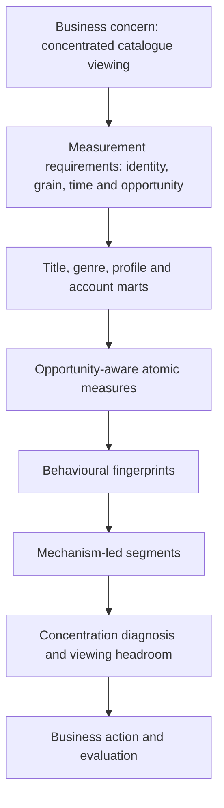

# Analytical framework

**Concentration → mechanism → opportunity** is a sequence of questions, not a composite score.

- **Concentration** describes how attention is allocated.
- **Mechanism** asks which behavioural and access conditions could explain that allocation.
- **Opportunity** asks whether, once those conditions are accounted for, there is credible and observable scope for more viewing.

Answering them in order matters. Asking about opportunity before understanding mechanism is how a platform ends up "fixing" viewers who were perfectly happy.

## The measurement bridge

Playback records describe a session, an event and a playable asset. The business diagnosis concerns a viewer, the parent titles they chose, and recurring behaviour under the access they actually had. Those are different units of analysis, and the marts exist to translate between them.



All six marts have been built, and human semantic validation is still underway: the title-level mart audit is complete, and the viewer-level measurement base has passed its grain, coverage, activity and session reviews, with breadth and concentration next. Everything from atomic measures onward remains downstream work.

## The segmentation pathway

```text
CONSTRAINTS / OPPORTUNITY
        ↓
FAIR ATOMIC MEASUREMENT
        ↓
BEHAVIOURAL DIMENSIONS
        ↓
FINGERPRINTS
        ↓
MECHANISM-LED SEGMENTS
        ↓
HEADROOM DIAGNOSIS
```

### Constraints decide what can be read fairly — they are not behaviour

**Question:** if one profile watched eight titles and another watched two, is the first more exploratory?

**Why it matters:** not if the second profile existed for only ten days of the window, or held a regional plan with a materially narrower reachable catalogue.

**Interpretation:** the conditions below shape how far a behavioural signal can be trusted. They must never become part of a viewer's behavioural identity.

| Context | What it limits |
| --- | --- |
| Profile tenure | How much behaviour there was time to observe |
| Entitlement | Which days carried access at all |
| Catalogue availability | Which titles could be chosen on each day |
| Language opportunity | Which language-compatible titles and audio options were reachable under entitlement and availability |
| Follow-up observability | Whether an outcome such as continuation could be seen in full |

### Fair atomic measurement

A measure is only comparable across viewers if it uses a denominator that fits its construct. There is no universal normalisation. Completion needs qualified starts; forward-looking outcomes such as abandonment and continuation require explicit follow-up observability and treatment of unknown outcomes; concentration needs enough qualified viewing to describe an allocation; breadth needs the viewer's reachable choice.

The first figures from the marts make these requirements concrete. [Depth within a parent title](mart_architecture.md#profile_title_window) ranges from one asset for a film to close to four for a web series, so breadth has to be counted in titles, not assets. [Title availability](measurement_methodology.md#opportunity) differs materially inside the same 90-day window, so opportunity has to be measured rather than assumed. And [continuation follow-up](measurement_methodology.md#continuation) cannot always be observed in full, so unknown outcomes stay separate from non-continuation. None of these is a behavioural finding. Each is a measurement condition that fingerprints and segments would silently inherit if it were ignored.

### Candidate behavioural dimensions

| Dimension | Observable evidence | What it must respect |
| --- | --- | --- |
| Activity | Sessions, viewing time, active days | A declared window and realistic opportunity |
| Breadth | Meaningful parent titles, genres, languages | Parent-title grain and reachable choice |
| Concentration | Top-title share and HHI | Sufficient qualified viewing |
| Stickiness | Completion, continuation, resumed engagement | Legitimate starts and valid outcome observability |
| Exploration | Movement across genres, languages or content origins | Alternatives that were actually available |
| Persistence | Recurrence across days and weeks | Comparable tenure and enough longitudinal evidence |
| Language openness | Consumed audio relative to offered languages | Consumption kept separate from supply |
| Responsiveness to prominent titles | Defensible observable proxies, if any hold up | No exposure data, so no causal claim and no use of later information |

These are candidates. Some may prove unstable, redundant with another dimension, or unsupported by enough evidence, and stay descriptive rather than defining segments.

### Fingerprints are configurations, not labels

A behavioural fingerprint is the recurring configuration of relevant dimensions for a profile under realistic opportunity. It describes *how* someone watches. It is not an opportunity label and not a verdict.

### Mechanism-led segments

Segments are meant to explain *why* consumption concentrates — not to reproduce acquisition cohorts or produce an elaborate taxonomy. Explanations worth testing include healthy preference depth, low engagement, sampling without stickiness, reliance on prominent titles and persistent exploration. Constrained access may explain apparent concentration, but it remains contextual evidence rather than becoming a viewer's behavioural segment identity.

None of these is yet an established mechanism, a final label or a prevalence estimate. Whichever dimensions end up defining segments must be interpretable, relevant to mechanism, stable, well evidenced and non-redundant.

Every segment has to stay traceable:

**Segment → fingerprint → atomic measures → analytical marts → observed playback**

### Headroom diagnosis

The pathway ends back at the original sequence. For each pattern: was there adequate opportunity? Was engagement deep or shallow? Did exploration last? Is there realistic room for more?

Healthy preference may call for nothing. Constrained access points to a context problem rather than a viewer problem. Adequate opportunity with weak conversion from sampling to sustained viewing may justify a closer look. These are possible destinations, not current findings and not demonstrated intervention effects.
