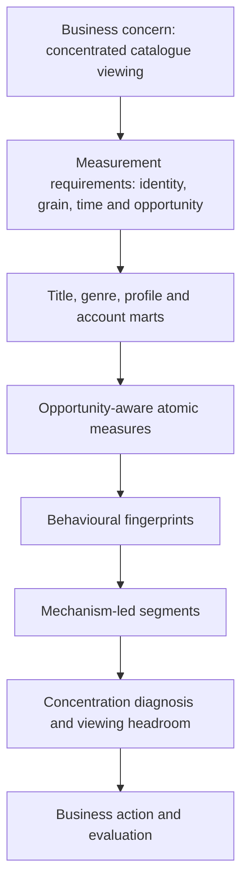

# Analytical framework

**Concentration → mechanism → opportunity** is a sequence of questions, not a composite score.

- **Concentration** describes how attention is allocated.
- **Mechanism** asks which behavioural and access conditions could explain that allocation.
- **Opportunity** asks whether, once those conditions are accounted for, there is credible and observable scope for more viewing.

Answering them in order matters. Asking about opportunity before understanding mechanism is how a platform ends up "fixing" viewers who were perfectly happy.

## The measurement bridge

Playback records describe a session, an event and a playable asset. The business diagnosis concerns a viewer, the parent titles they chose, and recurring behaviour under the access they actually had. Those are different units of analysis, and the marts exist to translate between them.


```mermaid
flowchart TD
    A[Business concern: concentrated catalogue viewing] --> B[Measurement requirements: identity, grain, time and opportunity]
    B --> C[Title, genre, profile and account marts]
    C --> D[Opportunity-aware atomic measures]
    D --> E[Behavioural fingerprints]
    E --> F[Mechanism-led segments]
    F --> G[Concentration diagnosis and viewing headroom]
    G --> H[Business action and evaluation]
```

All six marts have been built, and human semantic validation is still underway: the title-level mart audit is complete, and the viewer-level measurement base has passed its grain, coverage, activity, session, breadth, concentration and post-choice response reviews. Realistic opportunity has since been brought into the diagnosis as a conditioning layer. Everything from atomic measures onward remains downstream work.

## The segmentation pathway

```text
CONTEXT / CONSTRAINTS / OPPORTUNITY
        ↓
FAIR ATOMIC MEASUREMENT
        ↓
WINDOW-SPECIFIC BEHAVIOURAL STATES
        ↓
MECHANISM VALIDATION
        ↓
OPPORTUNITY CONDITIONING
        ↓
BEHAVIOURAL FINGERPRINTS
        ↓
WITHIN-PROFILE LONGITUDINAL STABILITY
        ↓
MECHANISM-LED SEGMENTS
        ↓
CONCENTRATION × MECHANISM × OPPORTUNITY
        ↓
REALISABLE VIEWING HEADROOM
```

Opportunity conditioning asks whether a behavioural mechanism still looks like the same mechanism once the realistic choice set behind it is visible. It changes how the pathway is read, not the order in which it runs.

### Constraints decide what can be read fairly — they are not behaviour

**Question:** if one profile watched eight titles and another watched two, is the first more exploratory?

**Why it matters:** not if the second profile existed for only ten days of the window, or held a regional plan with a materially narrower reachable catalogue.

**Interpretation:** the conditions below shape how far a behavioural signal can be trusted. They must never become part of a viewer's behavioural identity.

| Context | What it limits |
| --- | --- |
| Profile tenure | How much behaviour there was time to observe |
| Entitlement | Which days carried access at all |
| Catalogue availability | Which titles could be chosen on each day |
| Language opportunity | Which language-compatible titles and audio options were reachable under entitlement and availability |
| Follow-up observability | Whether an outcome such as continuation could be seen in full |

### Fair atomic measurement

A measure is only comparable across viewers if it uses a denominator that fits its construct. There is no universal normalisation. Completion needs qualified starts; forward-looking outcomes such as abandonment and continuation require explicit follow-up observability and treatment of unknown outcomes; concentration needs enough qualified viewing to describe an allocation; breadth needs the viewer's reachable choice.

The first figures from the marts make these requirements concrete. [Depth within a parent title](mart_architecture.md#profile_title_window) ranges from one asset for a film to close to four for a web series, so breadth has to be counted in titles, not assets. [Title availability](measurement_methodology.md#opportunity) differs materially inside the same 90-day window, so opportunity has to be measured rather than assumed. And [continuation follow-up](measurement_methodology.md#continuation) cannot always be observed in full, so unknown outcomes stay separate from non-continuation. None of these is a behavioural finding. Each is a measurement condition that fingerprints and segments would silently inherit if it were ignored.

### Candidate behavioural dimensions

| Dimension | Observable evidence | What it must respect |
| --- | --- | --- |
| Activity | Sessions, viewing time, active days | A declared window and realistic opportunity |
| Breadth | Meaningful parent titles, genres, languages | Parent-title grain and reachable choice |
| Concentration | Top-title share and HHI | Sufficient qualified viewing, and HHI's breadth-dependent floor of 1/n |
| General retention | Completion | Known outcomes only |
| Episodic persistence | Continuation | A legitimate, observable next-episode opportunity |
| Unfinished-content persistence | Validated pre-completion resume | Supporting pathway evidence, not a terminal outcome |
| Completed-content repeat value | 14-day replay | A fixed follow-up horizon and at least three known outcomes |
| Exploration | Movement across genres, languages or content origins | Alternatives that were actually available |
| Persistence | Recurrence across days and weeks | Comparable tenure and enough longitudinal evidence |
| Language openness | Consumed audio relative to offered languages | Consumption kept separate from supply |
| Responsiveness to prominent titles | Defensible observable proxies, if any hold up | No exposure data, so no causal claim and no use of later information |

These are candidates. Some may prove unstable, redundant with another dimension, or unsupported by enough evidence, and stay descriptive rather than defining segments.

### Post-choice response is not one construct

Completion, abandonment, continuation, resume and replay are not collapsed into one "stickiness" score. On known outcomes, completion and abandonment are one axis, so completion is kept and abandonment serves as its diagnostic inverse. Continuation applies only where a next episode genuinely exists. Resume is a pathway through viewing, not an outcome. Replay needs a fixed follow-up horizon. The [methodology](measurement_methodology.md#post-choice-response-four-constructs-not-one-engagement-score) defines each.

### Activity context

A viewer with more qualified watch hours or active days has more chances to accumulate titles, completions and replays, so raw behavioural differences can simply reflect volume. Post-choice rates are therefore also read against **activity context**: the typical rate among profiles in the same window with similar qualified watch hours, and separately with a similar number of active days. A difference counts as robust only when it holds against both. Context is a fairness benchmark, not a behavioural score.

### Candidate behavioural states are window-specific

Breadth, concentration and post-choice response read under activity context give **behavioural states** — `state(profile, window)`. Current candidates are focused successful consumption, selective-core attachment, successful first-pass consumption and broad distributed consumption ([journal](analysis_journal.md#14-when-concentration-stops-meaning-the-same-thing)). They show that high concentration is not itself a mechanism. Each describes one profile in one 90-day window, so they are not segments or identities. Within-profile comparison across windows will later separate persistent, emerging and transient states.

### Opportunity remains separate from behavioural identity

Opportunity belongs around the behaviour, not inside the viewer's behavioural identity. A profile may display narrow breadth because it repeatedly chooses a small set from a large reachable catalogue, because its plan exposes a materially smaller catalogue, because it had limited time or activity in which to encounter alternatives, or because several of those conditions occurred together. The observed state alone cannot tell those explanations apart.

### Access opportunity and consumption opportunity answer different questions

Two forms of opportunity would otherwise blur into one vague idea of "exposure".

**Access opportunity** — *what could this profile legitimately have chosen?* It is determined historically, day by day, from profile existence, effective entitlement and catalogue availability. At window level, the relevant choice-set measure is the number of distinct parent titles that were reachable at least once during the profile's entitled portion of the window. That is not the same construct as `mean_daily_eligible_parent_titles`: a daily average describes the typical size of the reachable catalogue on an entitled day, while `reachable_parent_titles_in_window` describes the distinct catalogue that became reachable across the whole window. Meaningful-title breadth is itself a window-level count, so the latter provides the coherent comparison.

**Consumption opportunity** — *how much opportunity did the profile have to generate observable viewing behaviour?* Qualified watch hours and active days remain separate controls for this purpose. One measures viewing volume; the other measures recurrence across days. They are related, but not interchangeable, and combining them would create a synthetic activity score the analysis has not earned.

| Layer | Question |
| --- | --- |
| Access opportunity | What could realistically have been chosen? |
| Consumption opportunity | How much behavioural opportunity was available to generate choices and outcomes? |
| Behaviour | What was actually chosen, and what happened after selection? |

### Reachable catalogue is a boundary on choice, not proof of consideration

A reachable title is one the profile could legitimately access under the historical plan and catalogue state. It is not evidence that the title was shown, recommended, noticed or considered. The dataset contains no recommendation impressions, carousel positions, ranking exposure or search-result logs, so the reachable catalogue defines the boundary of possible choice, not the set of options known to have entered the viewer's consideration.

This also limits how breadth ratios can be interpreted. A diagnostic such as meaningful titles relative to distinct reachable titles may help compare behaviour under differently sized choice sets, but it is not a catalogue-utilisation target: a profile is not expected to consume some fixed proportion of everything technically available. **Unused reachable catalogue is therefore not, by itself, unrealised viewing opportunity.**

### Opportunity structures breadth more strongly than concentration

Broad-access profiles faced substantially larger distinct reachable catalogues than regional-access profiles. Their meaningful viewing was also broader, but nowhere near in proportion to the difference in catalogue reach. The implication is not that one access group "uses" its catalogue better; it is that a larger reachable catalogue creates more room for breadth without mechanically producing breadth. The contrasts behind this, inside matched activity quintiles, are published in [`opportunity_family_activity_contrasts.csv`](../evidence/viewer_diagnosis/opportunity_family_activity_contrasts.csv).

| Dimension | Interpretation after opportunity conditioning | Structured by access? |
| --- | --- | --- |
| Breadth | How far meaningful viewing spread, interpreted relative to realistic reachable choice | Materially |
| Concentration | How qualified attention was allocated across the meaningful titles actually consumed | Not consistently |

Profiles with broad opportunity can remain highly concentrated. Profiles facing much narrower opportunity can still distribute viewing across many titles within that smaller set. The size of the field and the way attention is allocated once play begins are related conditions, but they are not the same behaviour. That is why opportunity conditions the interpretation of concentration rather than replacing concentration with an access-normalised score.

### Genre structure remains context within the opportunity-aware reading

A profile can consume many titles while staying inside a relatively narrow genre space, or move across several genres while still concentrating heavily on a small number of parent titles. Genre structure adds explanatory information, but does not make title-level breadth and concentration redundant, so the framework keeps title breadth and title concentration **interpreted with** genre structure rather than substituting genre concentration for title concentration. Genre helps explain what kind of breadth occurred. It does not, on its own, establish narrow preference, broad exploration or unrealised opportunity.

### Candidate mechanisms are tested under opportunity, not rebuilt from it

The behavioural states remain behavioural. Opportunity conditioning does not redefine them using entitlement or catalogue size; it asks whether their interpretation survives once profiles are compared under more realistic conditions. The principal candidates largely do.

| Candidate mechanism | After opportunity conditioning |
| --- | --- |
| Focused successful consumption | Remains distinct. Very narrow breadth and high concentration, with completion above activity context and replay neutral or below. Where comparable opportunity evidence is sufficient, it still reads as a small number of choices that tend to work. |
| Selective-core attachment | Remains distinguishable. Meaningful breadth alongside high concentration, weaker completion relative to activity context and stronger replay. Some neighbouring high-concentration states become more access-dependent or too thinly supported to carry equally strongly. |
| Successful first-pass consumption | Remains a useful contrast rather than collapsing into an access group. |
| Broad distributed consumption | Remains a useful contrast rather than collapsing into an access group. |

Constrained access can explain an apparently narrow choice set without necessarily explaining the post-choice mechanism underneath it. Where evidence is sparse, the limitation is retained: insufficient support is not converted into either confirmation or rejection simply to complete the taxonomy.

### Opportunity-aware mechanism is still not a final segment

The project can now make a stronger distinction than behaviour alone allowed — **behavioural state** (what the profile did) plus **realistic opportunity** (the conditions under which it could do it) gives an opportunity-aware mechanism interpretation. That still stops before segmentation. The states are window-specific, opportunity can change between windows, and a mechanism observed once may be persistent, emerging or transient when the same profile is followed over time. Final fingerprints and segments therefore still require the later longitudinal stage.

### Fingerprints are configurations, not labels

A behavioural fingerprint is the recurring configuration of relevant dimensions for a profile under realistic opportunity. It describes *how* someone watches. It is not an opportunity label and not a verdict.

### Mechanism-led segments

Segments are meant to explain *why* consumption concentrates — not to reproduce acquisition cohorts or produce an elaborate taxonomy. Explanations worth testing include healthy preference depth, low engagement, sampling without retention, reliance on prominent titles and persistent exploration. Constrained access may explain apparent concentration, but it remains contextual evidence rather than becoming a viewer's behavioural segment identity.

None of these is yet an established mechanism, a final label or a prevalence estimate. Whichever dimensions end up defining segments must be interpretable, relevant to mechanism, stable, well evidenced and non-redundant.

Every segment has to stay traceable:

**Segment → fingerprint → atomic measures → analytical marts → observed playback**

### Headroom diagnosis

The pathway ends back at the original sequence. For each pattern: was there adequate opportunity? Was engagement deep or shallow? Did exploration last? Is there realistic room for more?

Healthy preference may call for nothing. Constrained access points to a context problem rather than a viewer problem. Adequate opportunity with weak conversion from sampling to sustained viewing may justify a closer look. These are possible destinations, not current findings and not demonstrated intervention effects.

Opportunity conditioning makes that diagnosis more defensible, and it also makes the boundary clearer. A large reachable catalogue with relatively narrow consumption establishes unused accessible choice. It does not establish that additional viewing is realistically achievable. Moving from unused choice toward realisable headroom still requires later evidence that:

- the profile has behavioural reason to engage with compatible alternatives;
- the relevant mechanism is not merely temporary;
- opportunity exists under conditions where expansion is plausible.

**Reachable but unwatched catalogue ≠ realisable headroom.** Opportunity is necessary to interpret headroom. It is not sufficient to create it.

### What remains unresolved

Opportunity has now been brought into the diagnosis at the title level, but one part of it cannot safely be treated as a simple count: language. Original language, available audio language and consumed audio language are different observations. Regional entitlement reaches titles through language availability, while actual language behaviour occurs only in the track the viewer chose to consume, and a multilingual title can make a catalogue reachable in ways a raw consumed-language count will not reveal.

Language therefore needs the same discipline that was applied to catalogue opportunity: supply, entitlement and behaviour must be separated before any interpretation of linguistic breadth or exploration is allowed. That is the next layer of the diagnosis.
