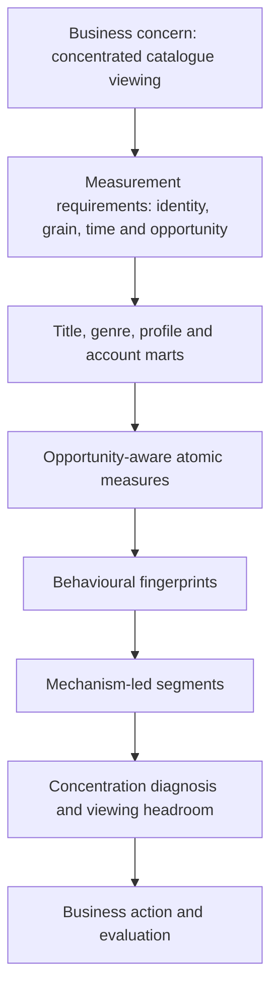

# Analytical framework

**Concentration → mechanism → opportunity** is a sequence of questions, not a composite score.

- **Concentration** describes how attention is allocated.
- **Mechanism** asks which behavioural and access conditions could explain that allocation.
- **Opportunity** asks whether, once those conditions are accounted for, there is credible and observable scope for more viewing.

Answering them in order matters. Asking about opportunity before understanding mechanism is how a platform ends up "fixing" viewers who were perfectly happy.

That sequence has since been extended rather than replaced. Realistic opportunity is now reconstructed before behaviour is interpreted (Test 5), and language work (Test 6) has added one stage after it: **concentration → mechanism → realistic opportunity → opportunity-conditioned propensity → persistence → realisable viewing headroom**. Test 6D established that cross-origin behaviour contains information the existing candidate mechanisms do not already capture, so that propensity stage is justified — but it is carried provisionally, because its persistence over time and its contribution to realisable headroom remain untested. Each layer should resolve a different uncertainty rather than count the same behavioural evidence twice, and the sequence is still a set of questions rather than a score.

## The measurement bridge

Playback records describe a session, an event and a playable asset. The business diagnosis concerns a viewer, the parent titles they chose, and recurring behaviour under the access they actually had. Those are different units of analysis, and the marts exist to translate between them.


```mermaid
flowchart TD
    A[Business concern: concentrated catalogue viewing] --> B[Measurement requirements: identity, grain, time and opportunity]
    B --> C[Title, genre, profile and account marts]
    C --> D[Opportunity-aware atomic measures]
    D --> E[Behavioural fingerprints]
    E --> F[Mechanism-led segments]
    F --> G[Concentration diagnosis and viewing headroom]
    G --> H[Business action and evaluation]
```

All six marts have been built, and human semantic validation is still underway: the title-level mart audit is complete, and the viewer-level measurement base has passed its grain, coverage, activity, session, breadth, concentration and post-choice response reviews. Realistic opportunity has since been reconstructed and brought into the behavioural diagnosis, and cross-origin catalogue propensity has passed its within-window non-redundancy tests. Final behavioural fingerprints, longitudinal validation, mechanism-led segments and headroom conclusions remain downstream work.

## The segmentation pathway

```text
CONTEXT / CONSTRAINTS / OPPORTUNITY
        ↓
FAIR ATOMIC MEASUREMENT
        ↓
WINDOW-SPECIFIC BEHAVIOURAL STATES
        ↓
MECHANISM VALIDATION
        ↓
OPPORTUNITY CONDITIONING
        ↓
OPPORTUNITY-CONDITIONED PROPENSITY
        ↓
BEHAVIOURAL FINGERPRINTS
        ↓
WITHIN-PROFILE LONGITUDINAL STABILITY
        ↓
MECHANISM-LED SEGMENTS
        ↓
CONCENTRATION × MECHANISM × OPPORTUNITY
        ↓
REALISABLE VIEWING HEADROOM
```

Opportunity conditioning asks whether a behavioural mechanism still looks like the same mechanism once the realistic choice set behind it is visible. It changes how the pathway is read, not the order in which it runs.

Opportunity conditioning asks whether an apparent mechanism survives once the realistic choice set behind it becomes visible. Opportunity-conditioned propensity asks something further: whether profiles facing comparable observable circumstances — including profiles occupying the *same* candidate mechanism — use the available alternatives differently.

Test 6D answered that second question for cross-origin behaviour. Within the same Final mechanism, some profiles allocate almost no viewing to productions originating outside their Baseline anchor language while others allocate most of it, and those differences survive peer conditioning on anchor structure, historical opportunity and activity, under both activity-control specifications tested. That is why the propensity stage now occupies a justified but provisional position. Its presence does not make it a mandatory segmentation axis: a dimension may carry genuine information yet contribute unevenly across mechanisms, or matter less once longitudinal behaviour and headroom relevance are examined. Everything below it — fingerprints, within-profile stability, segments and headroom — remains downstream.

### Constraints decide what can be read fairly — they are not behaviour

**Question:** if one profile watched eight titles and another watched two, is the first more exploratory?

**Why it matters:** not if the second profile existed for only ten days of the window, or held a regional plan with a materially narrower reachable catalogue.

**Interpretation:** the conditions below shape how far a behavioural signal can be trusted. They must never become part of a viewer's behavioural identity.

| Context | What it limits |
| --- | --- |
| Profile tenure | How much behaviour there was time to observe |
| Entitlement | Which days carried access at all |
| Catalogue availability | Which titles could be chosen on each day |
| Language opportunity | Which language-compatible titles and audio options were reachable under entitlement and availability |
| Follow-up observability | Whether an outcome such as continuation could be seen in full |

### Fair atomic measurement

A measure is only comparable across viewers if it uses a denominator that fits its construct. There is no universal normalisation. Completion needs qualified starts; forward-looking outcomes such as abandonment and continuation require explicit follow-up observability and treatment of unknown outcomes; concentration needs enough qualified viewing to describe an allocation; breadth needs the viewer's reachable choice.

The first figures from the marts make these requirements concrete. [Depth within a parent title](mart_architecture.md#profile_title_window) ranges from one asset for a film to close to four for a web series, so breadth has to be counted in titles, not assets. [Title availability](measurement_methodology.md#opportunity) differs materially inside the same 90-day window, so opportunity has to be measured rather than assumed. And [continuation follow-up](measurement_methodology.md#continuation) cannot always be observed in full, so unknown outcomes stay separate from non-continuation. None of these is a behavioural finding. Each is a measurement condition that fingerprints and segments would silently inherit if it were ignored.

### Candidate behavioural dimensions

| Dimension | Observable evidence | What it must respect |
| --- | --- | --- |
| Activity | Sessions, viewing time, active days | A declared window and realistic opportunity |
| Breadth | Meaningful parent titles, genres, languages | Parent-title grain and reachable choice |
| Concentration | Top-title share and HHI | Sufficient qualified viewing, and HHI's breadth-dependent floor of 1/n |
| General retention | Completion | Known outcomes only |
| Episodic persistence | Continuation | A legitimate, observable next-episode opportunity |
| Unfinished-content persistence | Validated pre-completion resume | Supporting pathway evidence, not a terminal outcome |
| Completed-content repeat value | 14-day replay | A fixed follow-up horizon and at least three known outcomes |
| Exploration | Movement across genres, languages or content origins | Alternatives that were actually available |
| Persistence | Recurrence across days and weeks | Comparable tenure and enough longitudinal evidence |
| Cross-origin catalogue propensity | Qualified viewing beyond a fixed Baseline title-origin anchor | Anchor-relative historical opportunity, and consumption kept separate from supply |
| Responsiveness to prominent titles | Defensible observable proxies, if any hold up | No exposure data, so no causal claim and no use of later information |

These are candidates, and they are not equally far along. Some may still prove unstable, redundant with another dimension, or unsupported by enough evidence, and remain descriptive rather than defining segments — consumed-language breadth is one of those, kept as a description of behaviour rather than promoted into a language-openness dimension. Cross-origin catalogue propensity has been tested further: Test 6D examined it for redundancy against the established mechanisms and found substantial differences remaining *within* candidate families after anchor, opportunity and activity conditioning, so it is provisionally retained as a cross-cutting dimension rather than a mechanism of its own. Provisional is the operative word — its longitudinal persistence, its relevance to final segmentation and its contribution to realisable headroom are all still unproven.

### Post-choice response is not one construct

Completion, abandonment, continuation, resume and replay are not collapsed into one "stickiness" score. On known outcomes, completion and abandonment are one axis, so completion is kept and abandonment serves as its diagnostic inverse. Continuation applies only where a next episode genuinely exists. Resume is a pathway through viewing, not an outcome. Replay needs a fixed follow-up horizon. The [methodology](measurement_methodology.md#post-choice-response-four-constructs-not-one-engagement-score) defines each.

### Activity context

A viewer with more qualified watch hours or active days has more chances to accumulate titles, completions and replays, so raw behavioural differences can simply reflect volume. Post-choice rates are therefore also read against **activity context**: the typical rate among profiles in the same window with similar qualified watch hours, and separately with a similar number of active days. A difference counts as robust only when it holds against both. Context is a fairness benchmark, not a behavioural score.

### Candidate behavioural states are window-specific

Breadth, concentration and post-choice response read under activity context give **behavioural states** — `state(profile, window)`. Current candidates are focused successful consumption, selective-core attachment, successful first-pass consumption and broad distributed consumption, alongside the relevant neighbouring and residual states ([journal](analysis_journal.md#14-when-concentration-stops-meaning-the-same-thing)). They show that high concentration is not itself a mechanism.

These states describe how profiles actually behaved within a specified 90-day window. They are not permanent psychological identities — but neither should their window-specific character be mistaken for analytical irrelevance.

The Final 90-day state is the **latest observed behavioural classification** available in this dataset. It describes consumption across the final window, which ends on 27 February 2026. It does not necessarily describe what a profile was doing on that particular day, and it does not predict behaviour beyond the dataset.

That endpoint matters because the project ultimately seeks a diagnosis of the population as it stood at the end of observation, informed by the available history. The Baseline window provides that history: it can show whether the Final state was already present, emerged from another state, or replaced an earlier pattern. Two profiles may both finish in Focused Successful — one having been Focused Successful during Baseline, the other arriving from Broad Distributed.

| | Baseline state | Final state |
| --- | --- | --- |
| Profile A | Focused Successful | Focused Successful |
| Profile B | Broad Distributed | Focused Successful |

Their latest observed mechanism is the same; their trajectories are not. The longitudinal stage must preserve both facts: what the profile ended up exhibiting, and how it arrived there. That distinction will inform final analytical segmentation without treating the endpoint as an eternal viewer identity, and without treating the two observational windows as competing final classifications.

### Opportunity remains separate from behavioural identity

Opportunity belongs around the behaviour, not inside the viewer's behavioural identity. A profile may display narrow breadth because it repeatedly chooses a small set from a large reachable catalogue, because its plan exposes a materially smaller catalogue, because it had limited time or activity in which to encounter alternatives, or because several of those conditions occurred together. The observed state alone cannot tell those explanations apart.

### Access opportunity and consumption opportunity answer different questions

Two forms of opportunity would otherwise blur into one vague idea of "exposure".

**Access opportunity** — *what could this profile legitimately have chosen?* It is determined historically, day by day, from profile existence, effective entitlement and catalogue availability. At window level, the relevant choice-set measure is the number of distinct parent titles that were reachable at least once during the profile's entitled portion of the window. That is not the same construct as `mean_daily_eligible_parent_titles`: a daily average describes the typical size of the reachable catalogue on an entitled day, while `reachable_parent_titles_in_window` describes the distinct catalogue that became reachable across the whole window. Meaningful-title breadth is itself a window-level count, so the latter provides the coherent comparison.

**Consumption opportunity** — *how much opportunity did the profile have to generate observable viewing behaviour?* Qualified watch hours and active days remain separate controls for this purpose. One measures viewing volume; the other measures recurrence across days. They are related, but not interchangeable, and combining them would create a synthetic activity score the analysis has not earned.

| Layer | Question |
| --- | --- |
| Access opportunity | What could realistically have been chosen? |
| Consumption opportunity | How much behavioural opportunity was available to generate choices and outcomes? |
| Behaviour | What was actually chosen, and what happened after selection? |

### Reachable catalogue is a boundary on choice, not proof of consideration

A reachable title is one the profile could legitimately access under the historical plan and catalogue state. It is not evidence that the title was shown, recommended, noticed or considered. The dataset contains no recommendation impressions, carousel positions, ranking exposure or search-result logs, so the reachable catalogue defines the boundary of possible choice, not the set of options known to have entered the viewer's consideration.

This also limits how breadth ratios can be interpreted. A diagnostic such as meaningful titles relative to distinct reachable titles may help compare behaviour under differently sized choice sets, but it is not a catalogue-utilisation target: a profile is not expected to consume some fixed proportion of everything technically available. **Unused reachable catalogue is therefore not, by itself, unrealised viewing opportunity.**

### Opportunity structures breadth more strongly than concentration

Broad-access profiles faced substantially larger distinct reachable catalogues than regional-access profiles. Their meaningful viewing was also broader, but nowhere near in proportion to the difference in catalogue reach. The implication is not that one access group "uses" its catalogue better; it is that a larger reachable catalogue creates more room for breadth without mechanically producing breadth. The contrasts behind this, inside matched activity quintiles, are published in [`opportunity_family_activity_contrasts.csv`](../evidence/viewer_diagnosis/opportunity_family_activity_contrasts.csv).

| Dimension | Interpretation after opportunity conditioning | Structured by access? |
| --- | --- | --- |
| Breadth | How far meaningful viewing spread, interpreted relative to realistic reachable choice | Materially |
| Concentration | How qualified attention was allocated across the meaningful titles actually consumed | Not consistently |

Profiles with broad opportunity can remain highly concentrated. Profiles facing much narrower opportunity can still distribute viewing across many titles within that smaller set. The size of the field and the way attention is allocated once play begins are related conditions, but they are not the same behaviour. That is why opportunity conditions the interpretation of concentration rather than replacing concentration with an access-normalised score.

### Genre structure remains context within the opportunity-aware reading

A profile can consume many titles while staying inside a relatively narrow genre space, or move across several genres while still concentrating heavily on a small number of parent titles. Genre structure adds explanatory information, but does not make title-level breadth and concentration redundant, so the framework keeps title breadth and title concentration **interpreted with** genre structure rather than substituting genre concentration for title concentration. Genre helps explain what kind of breadth occurred. It does not, on its own, establish narrow preference, broad exploration or unrealised opportunity.

### Candidate mechanisms are tested under opportunity, not rebuilt from it

The behavioural states remain behavioural. Opportunity conditioning does not redefine them using entitlement or catalogue size; it asks whether their interpretation survives once profiles are compared under more realistic conditions. The principal candidates largely do.

| Candidate mechanism | After opportunity conditioning |
| --- | --- |
| Focused successful consumption | Remains distinct. Very narrow breadth and high concentration, with completion above activity context and replay neutral or below. Where comparable opportunity evidence is sufficient, it still reads as a small number of choices that tend to work. |
| Selective-core attachment | Remains distinguishable. Meaningful breadth alongside high concentration, weaker completion relative to activity context and stronger replay. Some neighbouring high-concentration states become more access-dependent or too thinly supported to carry equally strongly. |
| Successful first-pass consumption | Remains a useful contrast rather than collapsing into an access group. |
| Broad distributed consumption | Remains a useful contrast rather than collapsing into an access group. |

Constrained access can explain an apparently narrow choice set without necessarily explaining the post-choice mechanism underneath it. Where evidence is sparse, the limitation is retained: insufficient support is not converted into either confirmation or rejection simply to complete the taxonomy.

### Opportunity-aware mechanism is still not a final segment

The project can now make a stronger distinction than behaviour alone allowed — **behavioural state** (what the profile did) plus **realistic opportunity** (the conditions under which it could do it) gives an opportunity-aware mechanism interpretation. That still stops before segmentation. The states are window-specific, opportunity can change between windows, and a mechanism observed once may be persistent, emerging or transient when the same profile is followed over time. Final fingerprints and segments therefore still require the later longitudinal stage.

### Fingerprints are configurations, not labels

A behavioural fingerprint is the recurring configuration of relevant dimensions for a profile under realistic opportunity. It describes *how* someone watches. It is not an opportunity label and not a verdict.

Cross-origin catalogue propensity is now eligible to contribute to that configuration, because Test 6D found substantial within-mechanism information the candidate states did not capture. Eligibility is not automatic inclusion: its contribution must still be judged against longitudinal evidence, support and the eventual headroom question. A fingerprint should explain how a profile consumes, not merely carry a longer list of features.

### From opportunity-aware mechanism to final observed segment

A behavioural state tells us what a profile did; realistic opportunity establishes the conditions under which it could make those choices. Together they support a more credible interpretation of the mechanism behind concentrated consumption — but that interpretation stays incomplete without the profile's historical trajectory.

The Final window provides the latest observed endpoint. Longitudinal analysis will establish whether that endpoint reflects continuity, a recent transition or an emerging configuration, and the distinction matters commercially: a profile narrowly concentrated around a successful core across both windows presents different evidence from one that became concentrated only recently after distributing its viewing broadly. The same Final mechanism can therefore carry different degrees of historical support, and potentially different implications for unrealised opportunity.

| Trajectory | Reading |
| --- | --- |
| Persistent pattern | May provide stronger evidence of an established mechanism |
| Newly emerging pattern | May still be commercially important, but should not be described as an established habit |
| Transition | May reveal changes in engagement, opportunity or content selection that the endpoint classification alone cannot explain |

The Final state anchors the endpoint interpretation; the longitudinal trajectory qualifies it. The purpose of that analysis is not to erase or retrospectively redefine what occurred during the Final window, but to determine what the endpoint means when read against the available history. The candidate states have not yet been promoted into final analytical segments: that promotion requires their history, the supporting behavioural dimensions and relevance to the business objective.

### Mechanism-led segments

Segments are meant to explain *why* consumption concentrates — not to reproduce acquisition cohorts or produce an elaborate taxonomy. Explanations worth testing include healthy preference depth, low engagement, sampling without retention, reliance on prominent titles and persistent exploration. Constrained access may explain apparent concentration, but it remains contextual evidence rather than becoming a viewer's behavioural segment identity.

None of these is yet an established mechanism, a final label or a prevalence estimate. Whichever dimensions end up defining segments must be interpretable, relevant to mechanism, stable, well evidenced and non-redundant.

Every segment has to stay traceable:

**Segment → fingerprint → atomic measures → analytical marts → observed playback**

### Headroom diagnosis

The pathway ends back at the original sequence. For each pattern: was there adequate opportunity? Was engagement deep or shallow? Did exploration last? Is there realistic room for more?

Healthy preference may call for nothing. Constrained access points to a context problem rather than a viewer problem. Adequate opportunity with weak conversion from sampling to sustained viewing may justify a closer look. These are possible destinations, not current findings and not demonstrated intervention effects.

Opportunity conditioning makes that diagnosis more defensible, and it also makes the boundary clearer. A large reachable catalogue with relatively narrow consumption establishes unused accessible choice. It does not establish that additional viewing is realistically achievable. Moving from unused choice toward realisable headroom still requires later evidence that:

- the profile has behavioural reason to engage with compatible alternatives;
- the relevant mechanism is not merely temporary;
- opportunity exists under conditions where expansion is plausible.

**Reachable but unwatched catalogue ≠ realisable headroom.** Opportunity is necessary to interpret headroom. It is not sufficient to create it.

Cross-origin evidence adds a layer to that argument without replacing it. A profile that has demonstrated meaningful consumption beyond its earlier origin centre offers a different behavioural basis for considering compatible alternatives than one whose viewing stays almost entirely inside it — which can strengthen the plausibility of further engagement where access and engagement signals agree, and weaken the case for treating a narrow but successful core as an engagement problem. Neither inference is automatic, and the same caution applies in its own right: **demonstrated cross-origin movement ≠ incremental viewing headroom.** Watching a Tamil-origin title instead of a Hindi-origin one may redistribute the same hours, and the absence of cross-origin viewing does not prove unwillingness when those titles may never have been surfaced. The business question must also separate additional catalogue breadth from additional viewing volume: a wider range of productions is not necessarily more minutes watched.

### Language is three observations, not one dimension

Opportunity was brought into the diagnosis at the title level first. Language then had to be added, and it is the one part of opportunity that cannot be treated as a simple count, because three different fields are involved and each answers a different question.

| Observation | Field | What it is |
| --- | --- | --- |
| Title origin | `content_catalogue.original_language` | The language ecosystem a title comes from. A Hindi-origin title stays Hindi-origin whichever track is played. |
| Available audio | `content_audio_languages.language` | The audio opportunity attached to a reachable parent title. Tamil audio can admit a Hindi-origin title into a Tamil pack. |
| Consumed audio | `view_events.audio_language` | The track actually played during qualified viewing. |

None of the three substitutes for another. A viewer consuming Tamil audio on a Hindi-origin title has both consumed Tamil audio and watched inside a Hindi-origin ecosystem; those statements are simultaneously true and analytically different.

Regional entitlement adds a structural asymmetry that follows directly from this. A regional pack reaches a title because the pack language appears among that title's offered tracks — but once the title is entitled, every listed track on it remains selectable. Regional opportunity is a title filter, not a rule that consumption inside the title must happen in the pack language. The order the framework keeps is therefore catalogue supply → historical entitlement → reachable multilingual opportunity → observed language behaviour.

### Multilingual supply conditions behaviour before behaviour begins

Multilingual opportunity is not spread evenly through the catalogue. More than half of parent titles carry several audio languages, but that supply is strongly structured by programme type: movies and web series are far more multilingual than catch-up and reality content. A viewer whose consumption is dominated by movies therefore meets a different multilingual environment from one whose consumption is dominated by recurring catch-up, before either has made a single language choice.

That makes programme composition a contextual variable in any language analysis. It does not make programme type a language behaviour.

### Reachable-language count is not a sufficient denominator

A count of reachable languages sounds like the natural denominator for consumed-language breadth. In this catalogue it saturates: most eligible profiles can reach nearly the whole observed set of audio languages, especially under broad access. The count can say that alternatives existed; it cannot say how opportunity was distributed among them, and ten reachable languages can describe an opportunity set dominated by one or two of them just as easily as a balanced one.

Language opportunity therefore needs breadth *and* allocation: which languages were reachable, how much title-day opportunity each represented, and how concentrated that opportunity was. Consumed-language concentration is then read against the second and third of those, not against the first alone.

Profiles consume a much narrower language mix than their reachable audio environment. That establishes behavioural concentration relative to supply. It does not establish why the concentration exists — content origin, dubbing structure, programme mix, access regime and habit are all still entangled — so consumed-language breadth stays a descriptor and is never promoted into a "language openness" score.

### Title origin asks a different question from audio language

| Construct | Question it answers |
| --- | --- |
| Audio language | Which track was consumed? |
| Title origin | Did viewing stay inside, or move beyond, a catalogue ecosystem? |

These can diverge: a viewer can consume a dubbed track while moving into a different origin ecosystem, or consume one language across titles from several ecosystems. The framework keeps track choice and catalogue-origin movement separate rather than forcing both into a single language-exploration measure.

Of the two, the project pursues origin movement. Explaining why a particular title or track was selected would require a theory of individual choice the data cannot support, and would not change what concentration, opportunity or post-choice response mean; movement away from an established centre is directly observable and composes with the opportunity layer already built. Track-level selection inside a multilingual title therefore stays a documented limitation rather than an analytical branch. That movement question needs a reference ecosystem that holds still while behaviour changes — and because native language is unobserved, the reference is the profile's own earlier viewing rather than any demographic or entitlement field.

### The Baseline title-origin anchor is behavioural, not demographic

Native language is not observed. `home_region`, regional plan language and title origin are contextual fields; none of them proves a viewer's mother tongue. To study movement across ecosystems without inventing identity, the analysis uses an observed reference: the **Baseline title-origin anchor**, the origin ecosystem receiving the largest share of a profile's qualified Baseline viewing.

The anchor says where observed Baseline viewing was centred. It does not say what language the viewer speaks, what they prefer in general, or what their later behaviour must be. It is held fixed while Final behaviour and opportunity are evaluated — otherwise the reference would move with the outcome it is meant to measure. Anchor-strength slices such as ≥70% or 95–100% are sensitivity lenses, chosen because movement is easier to read from a clear starting centre; the observed distribution offered no natural breakpoint, so they are not segment boundaries.

### Opportunity enables cross-origin movement; it does not determine it

Cross-origin viewing is qualified viewing on titles whose origin differs from the fixed anchor, and it needs its own anchor-relative denominator: reachable title-days belonging to origins other than the anchor, reconstructed from the access and catalogue state valid on each day. A later broad plan cannot enlarge an earlier regional window, a title that was not yet available contributes nothing earlier, and a profile does not inherit opportunity from before it existed.

This matters because Final cross-origin behaviour can rise substantially while the cross-origin opportunity behind it moves only slightly. Without cross-origin opportunity the behaviour cannot occur at all — but the direction and size of the movement are not mechanically set by the change in opportunity. That is an argument against treating availability as the explanation, not evidence of an intrinsic preference.

The ratio of cross-origin viewing to cross-origin opportunity is not a conversion rate, and no utilisation or openness score is built from the two.

### Cross-origin catalogue propensity under realistic opportunity

After anchor structure, historical cross-origin opportunity and activity context are accounted for, profiles still differ materially in how far viewing moves beyond their Baseline ecosystem. The defensible term for that is **cross-origin catalogue propensity under realistic opportunity**: the first half describes what the profile actually did, the second half keeps it attached to what was legitimately reachable.

"Propensity" here means an observed behavioural tendency in two windows of evidence. It is not a latent psychological trait, a native-language measure, a causal parameter, a permanent identity, a segment axis or a headroom score.

Test 6D's verdict on it was **pass for provisional carry-forward as a non-redundant, cross-cutting behavioural dimension**: the dimension has earned its conceptual place because it describes observable use of available catalogue beyond an earlier viewing centre that the candidate mechanism alone does not capture. It has not earned a permanent identity, a high/low propensity rule, a calibrated score or a headroom estimate. Its prospective value is in helping distinguish merely accessible catalogue from alternatives a profile has demonstrated some capacity to engage with, alongside mechanism, engagement and eventually persistence.

### Programme composition remains context, not explanation

Programme type changes the environment in which cross-origin behaviour happens, so it had to be tested as an alternative explanation rather than assumed away. After profiles were matched on Baseline origin structure, Final historical cross-origin opportunity and activity, the remaining programme deviations were modest for the well-supported groups, and multilingual-title viewing intensity was non-monotonic rather than rising steadily with cross-origin behaviour.

Programme structure therefore shapes the environment without reducing cross-origin behaviour to programme composition. The small residual differences stay descriptive context.

One naming rule follows from this. A profile's multilingual-title minute share is the share of consumed minutes spent on titles that happen to offer several audio tracks. It is a consumption-composition measure and must never be described as multilingual supply, as the multilingual share of reachable catalogue, or as the number of alternatives the viewer considered. Supply belongs to the opportunity layer; minutes belong to behaviour.

### What remains unresolved

Test 6 is closed. Cross-origin behaviour does add observable information beyond the candidate mechanisms, within the supported Final-window analysis — but that conclusion is deliberately bounded. The project has established neither the persistence of cross-origin propensity across time nor its contribution to final segments and realisable headroom.

The next stage is within-profile longitudinal analysis across the Baseline and Final windows, around three questions: which profiles remain in the same candidate mechanism and which transition, and what that history changes about interpreting their Final state; which mechanism signatures and cross-origin behaviours have enough historical consistency to strengthen a fingerprint rather than being window-specific observations; and which combinations of mechanism, opportunity, demonstrated use of alternatives and temporal evidence can distinguish healthy concentration from credible unrealised viewing opportunity.

The Baseline anchor needs particular care in that stage. Because it is selected as the largest origin share within Baseline, later movement away from it partly reflects the construction of the reference and regression toward less extreme values, so a Baseline-to-Final rise in cross-origin viewing is not by itself proof of growing exploratory behaviour. The longitudinal methodology has to address that before any temporal interpretation is promoted.

No final segments, persistence verdicts or headroom estimates exist at this checkpoint.
