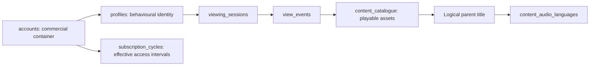

# Data model and measurement guardrails

The model keeps behavioural identity, commercial access and playable content at separate grains. Joining them is an analytical decision, not a formality: a query can run successfully and still multiply viewing or hand a viewer access they never had.

The parent title is a logical entity — repeated `parent_title_id` values across the asset catalogue — rather than a separate physical table.

| Table | Grain | Analytical consequence |
| --- | --- | --- |
| `accounts` | Account | Commercial and access context |
| `profiles` | Profile within one account | The observable behavioural identity; not proof of a unique person |
| `subscription_cycles` | Account access interval | Any join to access needs the account **and the date** |
| `content_catalogue` | Playable movie or episode | Title counts need distinct parent identifiers |
| `content_audio_languages` | Parent title × offered audio language | Joining every language row to events multiplies watch time |
| `viewing_sessions` | Profile session | One session can hold several events |
| `view_events` | Playback touching one asset | Event counts are not meaningful title engagement |

## Who is watching?

**Question:** when an account has viewing, who watched it?

**Why it matters:** one subscription can support several profiles with very different habits. Summing them into a single "viewer" would invent a person with everyone's tastes.

**Evidence:** [`account_profile_grain.sql`](../sql/schema_understanding/account_profile_grain.sql) confirms every profile belongs to one account and shows how often accounts hold several.

**Interpretation:** the profile is the unit of behaviour; the account is context. Account-level breadth has to be a distinct union across the account's events — adding up each profile's distinct titles counts a shared title twice. Pooled rates are rebuilt from their numerators and denominators, never averaged across profiles.

**What this changed:** behavioural marts are profile-grain, and account marts carry account-level context without replacing it. A profile is still observable identity, not a guaranteed individual — shared devices and shared profiles limit how personal any reading can be.

## What is a title?

**Question:** is a playable asset the same thing as a catalogue title?

**Why it matters:** an episodic programme contributes many assets but one parent title. Count assets and ten episodes of one series look like ten explored titles.

**Evidence:** [`asset_vs_parent_title.sql`](../sql/schema_understanding/asset_vs_parent_title.sql) shows parent identifiers repeating across assets, and where that repetition concentrates by programme type.

**Interpretation:** depth within a title and breadth across titles are different behaviours that should never compete for the same count.

**What this changed:** title attention is measured at parent-title grain, with asset and episode depth kept alongside it rather than folded in.

## What was the viewer actually listening to?

A title's **original language** is a content attribute. Its **offered audio languages** describe choices that were reachable. The **consumed audio language** is recorded on each playback event. These answer different questions and stay separate in joins, denominators and interpretation — a title offered in Tamil tells us nothing about whether anyone watched it in Tamil.

## What access existed on the day?

**Question:** what could this account watch on the date an event happened?

**Why it matters:** accounts hold a sequence of access intervals — upgrades, downgrades, lapses. Joining events to subscriptions on account alone duplicates every event across every interval and lets a later plan explain earlier viewing.

**Evidence:** [`subscription_timeline.sql`](../sql/schema_understanding/subscription_timeline.sql) checks that intervals never overlap and that a date-aware join resolves each event to exactly one interval. [`raw_lineage_trace.sql`](../sql/mart_audit/raw_lineage_trace.sql) traces a single event through both paths.

**Interpretation:** access is a property of an account *on a day*, not of an account.

**What this changed:** every opportunity measure evaluates access day by day. Gaps contribute no access. A later upgrade cannot widen an earlier choice set.

## Time windows

Subscription boundaries are inclusive calendar dates. Event filters use half-open timestamp intervals, so a window includes the whole of its last day without overlapping the next. Timestamps are local wall-clock values; MySQL `DATETIME(6)` keeps microsecond precision without any implicit time-zone conversion.

| Window | Inclusive dates | Role |
| --- | --- | --- |
| `BASELINE_90` | 2025-09-01 – 2025-11-29 | Earlier viewing context |
| `FINAL_90` | 2025-11-30 – 2026-02-27 | Main measurement window |
| `FULL_180` | 2025-09-01 – 2026-02-27 | Full subscription and commercial context |

A profile's opportunity needs the profile to exist and its account to hold valid access on the day. A profile-title opportunity additionally needs a released, available, plan-eligible playable title. Access an account held before a profile was created belongs to the account's history, not the profile's.

Language-specific availability over time is not recorded, so audio eligibility uses the offered-language inventory as it stands and does not infer a history that is not in the data.

## Inspectable schema

[`raw_schema.sql`](../sql/schema_understanding/raw_schema.sql) preserves the operational keys, foreign keys, nullability and precision. It is reference DDL for an empty schema, not a load script. [`session_event_relationship.sql`](../sql/schema_understanding/session_event_relationship.sql) checks that every event resolves to one session and one asset.
