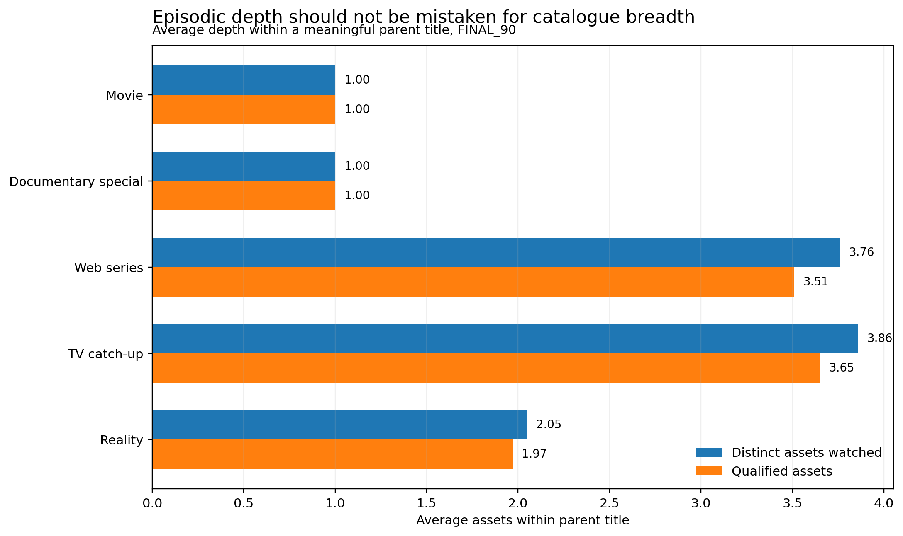

# Analytical mart architecture

## Why marts at all?

**Question:** why not diagnose concentration straight from playback events?

**Why it matters:** raw playback is recorded at **session → event → asset** grain, but the business question is about **viewer → parent title → behavioural pattern → realistic opportunity**. Every translation between those units is a chance to measure the wrong thing.

**Evidence:** working from events alone would

- confuse events with meaningful engagement — a few seconds of autoplay is not interest;
- confuse episodes with catalogue breadth — ten episodes of one series are not ten explored titles;
- treat asset depth as title breadth — inventory depth would masquerade as exploration;
- ignore entitlement and availability — narrow viewing would look like disengagement when the choice set was small;
- mix account commercial state with profile behavioural identity — account-level context would be collapsed into one behavioural identity;
- build segments from unfair raw counts — a profile present for ten days would be compared with one present for ninety.

**Interpretation:** these errors do not all push in the same direction. Some inflate breadth, some distort opportunity, some collapse identity or misstate engagement — but each can distort whether concentration appears healthy, weak, constrained or recoverable, and so misidentify the mechanism.

**What this changed:** six marts form a measurement bridge. They fix the unit of analysis, keep behaviour and opportunity as separate quantities, carry outcomes with their follow-up conditions, and keep every later segment traceable to observed playback. Validity is the point; speed is incidental.

## The six marts

### `profile_title_window`

| | |
| --- | --- |
| **Grain** | Profile × parent title × window |
| **Purpose** | Record how each viewer's attention falls across parent titles |
| **Analytical role** | Attention, qualified engagement, sessions and days per title, asset and episode depth, completion and continuation outcomes, and title-level opportunity |
| **Mistake prevented** | Counting each episode as a newly explored title |
| **Downstream use** | The foundation for breadth, concentration, depth and post-choice response measures |

Rows cover every title a profile either watched or had a continuation opportunity on. A row that records opportunity but no qualified viewing never counts as a meaningful title. This is not a full grid of every profile against every catalogue title, so the absence of a profile-title row is not evidence that the title was either reachable or unreachable. A profile's complete reachable choice is measured through its profile-level opportunity and exposure measures, not inferred from missing title rows.



In the final window, a meaningful movie or documentary special title holds exactly one asset, while a meaningful web series or TV catch-up title averages close to four and a reality title about two. Qualified assets sit slightly below distinct assets watched because not every episode touched within a title was watched long enough to qualify. That spread is why this mart keeps the parent title as its grain and records asset and episode depth beside it: depth describes how far a viewer went into one title, breadth how many titles they chose among, and the two must not be confused.

### `profile_genre_window`

| | |
| --- | --- |
| **Grain** | Profile × primary genre × window |
| **Purpose** | Record how attention is allocated across genres |
| **Analytical role** | Genre attention, meaningful breadth within genre and allocation share |
| **Mistake prevented** | Reading how much a genre is *stocked* as how much it is *preferred* |
| **Downstream use** | Genre breadth, concentration and exploration across genres |

Genre is each title's primary genre. No genre-level opportunity denominator is implied.

### `profile_viewership_window`

| | |
| --- | --- |
| **Grain** | Profile × window |
| **Purpose** | The central measurement base for each viewer |
| **Analytical role** | Activity, qualified viewing, breadth, concentration, outcome components, opportunity and analytical eligibility |
| **Mistake prevented** | Comparing profiles that had very different evidence or access as if they were equivalent |
| **Downstream use** | The primary input to atomic measures and, later, fingerprints |

Profiles that do not meet eligibility stay in the mart. Eligibility is a flag for comparability, not a segment and not a deletion. Profiles with no playback in a window stay too, with zero activity alongside their opportunity measures.

`first_event_ts` and `last_event_ts` are the earliest and latest event *start* timestamps in the window, not the end of the last playback. `session_minutes` and its summaries measure elapsed session time, which is a different construct from `watch_minutes` summed over events.

Two stored post-choice fields need care downstream. `abandonment_rate` divides by all qualified starts, including starts whose follow-up is still censored, so behavioural completion and abandonment use `abandonment_known_denominator` instead. `resumed_assets` counts assets seen in more than one session, which mixes unfinished-content resume with post-completion replay, so it is not used as a behavioural measure. See [resume](measurement_methodology.md#resume-a-pathway-not-an-outcome) and [replay](measurement_methodology.md#replay-completed-content-repeat-value-over-a-fixed-horizon).

### `account_viewership_window`

| | |
| --- | --- |
| **Grain** | Account × window |
| **Purpose** | Account-level viewing context |
| **Analytical role** | Pooled viewing, account-level distinct unions, allocation across profiles and eligible-profile counts |
| **Mistake prevented** | Adding up distinct breadth across profiles, or averaging rates with incompatible denominators |
| **Downstream use** | Context for interpreting profile behaviour inside a shared subscription |

Additive volumes are summed across profiles. Distinct titles, genres and languages are rebuilt as unions from events. Completion is pooled from numerators and denominators.

### `account_subscription_window`

| | |
| --- | --- |
| **Grain** | Account × context window (`FULL_180`, `FINAL_90`) |
| **Purpose** | The account's access history |
| **Analytical role** | Coverage, gaps, continuity, day-weighted plan exposure and plan state at the window boundaries |
| **Mistake prevented** | Treating the plan an account ended on as its plan throughout |
| **Downstream use** | Commercial context and the access conditions behind opportunity |

It uses different windows from the viewership marts because subscription continuity needs the full span.

### `account_plan_transition_features`

| | |
| --- | --- |
| **Grain** | Account × plan transition date |
| **Purpose** | Viewing context around upgrades and downgrades |
| **Analytical role** | Observable viewing in dated windows strictly before and after each transition |
| **Mistake prevented** | Letting viewing after a plan change explain the change itself |
| **Downstream use** | Commercial interpretation of viewing patterns |

These rows describe what happened around a transition. They are not a causal estimate of what a plan change does to viewing, and how much of each window was observable matters.

## Opportunity and evidence are separate quantities

For profile *p*, title *t* and day *d*:

```text
Profile opportunity        = profile exists  AND  account holds valid access
Profile-title opportunity  = profile opportunity  AND  title is released, available and plan-eligible
```

Both are evaluated day by day inside the declared window using the access actually held on each day. No shortcut based on calendar length replaces that intersection.

`available_days_in_window` on the title mart is genuine profile-title opportunity. The profile mart's entitled-day fields count access the profile could observably use. `eligible_parent_title_days` sums reachable parent titles over those days, and its daily mean divides by entitled days, keeping zero where there was no opportunity. These are exposure quantities — they are not recommendation impressions.

The current eligibility rule requires at least 30 entitled days, 3 active days and 120 qualified watch minutes. It supports fair comparison; it is not a segmentation threshold, and it deliberately imposes no minimum title breadth — highly concentrated viewers are part of the question, not noise.

## Continuation: did the viewer go on to the next episode?

Continuation follows the next asset in season and episode order within the same parent title. The opportunity opens at the earliest moment all of these hold together: the current episode reached 90% progress on a qualified start, the next episode was released and in the catalogue, the profile existed, and its plan and audio entitlement reached the title. A later revisit does not move that moment, and each parent title uses its own availability dates.

Each profile / current episode / next episode pair is one opportunity with exactly one outcome:

- **Known positive** — a qualified start on the next episode within seven days, before any interruption to access or availability.
- **Known negative** — no positive, with the full seven days observed without interruption.
- **Unknown** — no positive, and the follow-up was cut short. Unknown outcomes are excluded from the rate, never counted as failures.

A known positive is never also unknown, and access returning later does not reopen the same pair. The opportunity belongs to the window in which it opened, even if its outcome lands in the next. A viewer's continuation rate pools known positives over known positives plus known negatives.

## Evidence

Automated contract checks on grain, opportunity and continuation all pass — see [mart audit evidence](../evidence/mart_audit/README.md). The SQL behind the checks is in [`sql/mart_audit`](../sql/mart_audit).

Passing checks provide structural, grain, reconciliation and measurement-contract evidence. They do not by themselves establish that every field is analytically suitable for downstream behavioural use — that judgment belongs to human semantic review. `profile_title_window` has completed that review; `profile_viewership_window` has passed its grain, coverage, activity, session, breadth, concentration and post-choice response blocks, with realistic opportunity next.
