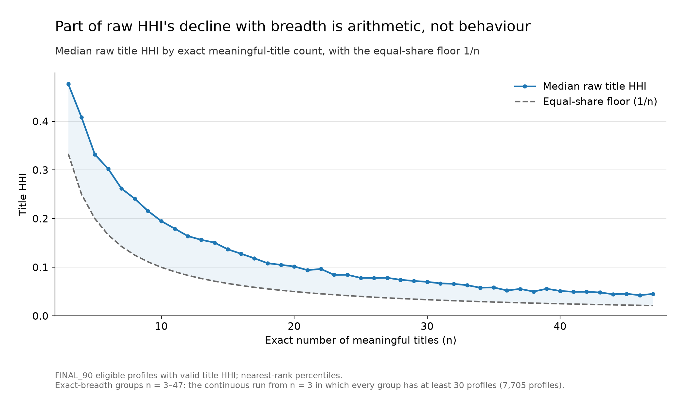
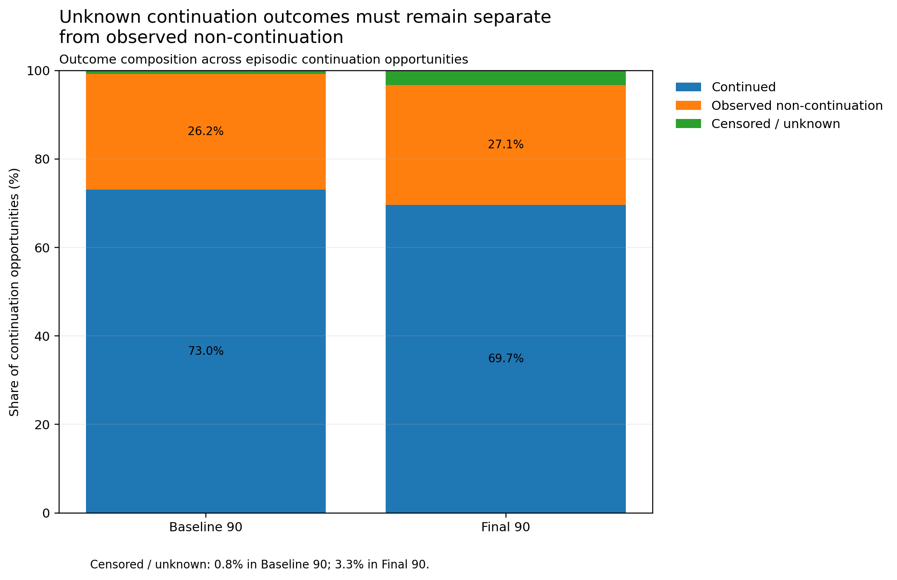
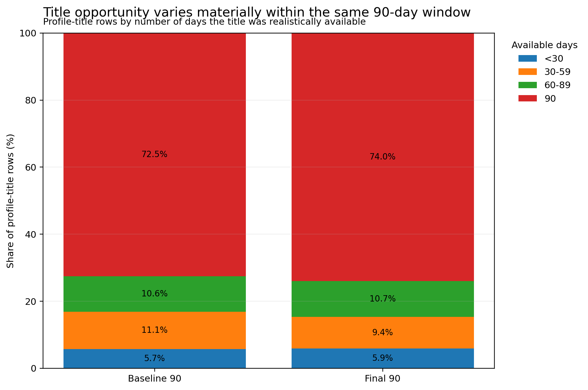

# Measurement methodology

The marts are only useful if each measure means one thing and uses a denominator that fits it. This document defines the rules the current marts rely on, why each exists, and where it is implemented.

## Qualified start: when does playback count as engagement?

**Question:** a viewer pressed play. Did they engage?

**Why it matters:** autoplay can start an episode nobody chose, and a manual start stopped after a few seconds is insufficient evidence of meaningful engagement. Counting both as engagement inflates breadth and distorts every rate built on starts.

**Rule:** a start qualifies when watch time reaches

| Playback | Threshold |
| --- | --- |
| Manual | `min(5 minutes, 10% of runtime)` |
| Autoplay | `min(8 minutes, 20% of runtime)` |

Autoplay carries the stricter bar because it requires no choice at all.

**What this changed:** qualification is a property of an event, not a new event type. Start-based outcome measures use qualified starts as their analytical starting population.

**Implemented in:** [`qualification.py`](../src/analytical_transforms/qualification.py).

## Meaningful title: what counts toward breadth?

A parent title counts toward a viewer's breadth only when it has **at least one qualified start**. A title that was merely available — or appears only because a continuation opportunity opened on it — is not meaningful, however many days it was reachable.

**Checked by:** [`meaningful_title_validation.sql`](../sql/mart_audit/meaningful_title_validation.sql).

## Concentration: top-title share and HHI

**Definition:** a viewer's qualified watch minutes are divided across their meaningful titles into shares s₁, …, sₙ that sum to 1. Top-title share is the largest share. The Herfindahl-Hirschman Index is:

```text
HHI = Σ sᵢ²
```

**Why both:** top-title share only sees the largest title, so two viewers with the same top share can spread the rest of their viewing very differently. HHI uses the whole distribution, and squaring gives progressively more weight to large allocations. Title HHI is valid only for profiles with at least three meaningful titles; genre HHI is built the same way across meaningful genres.

**What kind of measure it is:** a descriptive concentration index. It summarises how concentrated an allocation is. It is not an inferential test, does not estimate causality, and does not say whether concentration is healthy, constrained or recoverable — HHI measures concentration, not mechanism or headroom.

**The breadth-dependent floor:** equal shares across `n` titles give the lowest possible HHI, `1/n`. Raw HHI therefore falls with breadth partly for arithmetic reasons, and is not a breadth-independent viewer trait.



**Exploratory adjustment:** the breadth audit rescaled HHI to remove that floor:

```text
adjusted HHI = (HHI − 1/n) / (1 − 1/n)
```

0 means equal shares across the viewer's meaningful titles; values approach 1 as allocation concentrates. This adjustment is a diagnostic used in the audit. It is not yet an approved measure in the behavioural measurement layer.

**Caveat:** `genre_hhi` is populated for a small number of profiles with no meaningful genre, where genre concentration is undefined; those rows are excluded from genre-concentration interpretation.

**Checked by:** [`profile_viewership_title_concentration.sql`](../sql/mart_audit/profile_viewership_title_concentration.sql) and [`profile_viewership_genre_concentration.sql`](../sql/mart_audit/profile_viewership_genre_concentration.sql).

## Completion

An asset is complete when furthest progress reaches **90%** of runtime. Only qualified starts can become completions or non-completions, so an accidental autoplay start cannot count as an incomplete viewing.

The mart stores `completion_rate` over all qualified starts. For behavioural comparison, completion uses the same known-outcome denominator as abandonment (below). On that denominator every known start either completes or is abandoned, so the two are exact complements and form **one outcome axis**: completion is the primary general-retention measure, and abandonment is its diagnostic inverse rather than a second fingerprint dimension.

## Abandonment: an observable no-resume horizon is required

**Question:** a viewer stopped halfway. Did they abandon it?

**Why it matters:** if they stopped two days before the data ends, nobody knows yet. Counting that as abandonment would make the most recent viewing look worst simply because less time had passed.

**Rule:** an unfinished qualified start is abandoned only after 14 days with no resume. Where fewer than 14 days of follow-up exist, the outcome is **unknown** and is never counted as abandonment.

**Behavioural denominator:** the stored `abandonment_rate` divides abandoned starts by all qualified starts, so unknown outcomes sit in its denominator and late-window viewing looks less abandoned than it is. Behavioural abandonment uses known outcomes only:

```text
abandonment_known_denominator = qualified_asset_starts − censored_abandonment_starts
```

The stored rate stays documented but is not the downstream behavioural measure. No mart rebuild is needed: the mart carries every component.

## Continuation

**Question:** after finishing an episode, did the viewer go on to the next?

**Rule:** see the full definition in [mart architecture](mart_architecture.md#continuation-did-the-viewer-go-on-to-the-next-episode). In short, an opportunity exists only when the next episode was released, available, and within the profile's plan and audio entitlement. Each opportunity has exactly one outcome — known positive, known negative or unknown — and a viewer's rate pools known positives over known outcomes only.

**Why the precision matters:** a next episode that had not yet been released is not a missed opportunity, and a follow-up period cut short by a lapse in access is not a refusal.

**Scope:** continuation is an episodic-specific persistence measure. A profile with no legitimate next-episode opportunity has no continuation value, not a low one, and only known outcomes enter the rate.



**What the marts show:** unknown outcomes are 0.8% of continuation opportunities in the baseline window and 3.3% in the final window, which runs up to the end of the observable period. Keeping them as a separate state is a measurement control, not a cosmetic detail. Counted as non-continuation, they would push the measured rate down wherever follow-up is shortest — for reasons of observation, not behaviour.

**Implemented in:** [`continuation.py`](../src/analytical_transforms/continuation.py) · **Checked by:** [`continuation_state_integrity.sql`](../sql/mart_audit/continuation_state_integrity.sql) and [`continuation_checks.py`](../src/validation/continuation_checks.py), which tests each opportunity against the source tables and confirms both marts reproduce them.

## Resume: a pathway, not an outcome

The mart field `resumed_assets` counts qualified assets seen in more than one session. That mixes two behaviours: returning to an asset **before** completion, and returning **after** completion, which is replay.

**Rule:** resume means a pre-completion cross-session return. These returns were validated against playback position — later sessions typically restart just before the previous endpoint, with modest backtracking and almost never from the beginning — so they represent genuine unfinished-content persistence.

**Downstream treatment:** a resumed asset may still go on to complete, be abandoned or remain censored, so resume is an intermediate viewing pathway, not a terminal outcome, and it is never paired with abandonment as an alternative result. Validated resume is supporting evidence of unfinished-content persistence. The broad `resumed_assets` field is not a canonical fingerprint measure.

## Replay: completed-content repeat value over a fixed horizon

A rewatch is a qualified start at least 12 hours after the asset's first completion. Raw rewatch cannot be compared across windows, because earlier completions have more of the observation period left to produce one.

**Rule:** replay is measured over a fixed 14-day horizon after first completion. A rewatch inside the horizon is a known positive at once; a non-rewatch is known only when all 14 days were observable; otherwise the outcome is censored.

```text
14-day replay rate = completed assets rewatched within 14 days ÷ known 14-day outcomes
```

**Evidence threshold:** at profile grain the rate is used for behavioural comparison only when there are at least three known outcomes, and the known denominator is carried beside the rate so that three outcomes are never read as precisely as thirty.

## Post-choice response: four constructs, not one engagement score

| Construct | Measure | Condition |
| --- | --- | --- |
| General retention | Completion | Known outcomes only |
| Episodic persistence | Continuation | A legitimate, observable next-episode opportunity |
| Unfinished-content persistence | Validated pre-completion resume | Supporting pathway evidence |
| Completed-content repeat value | 14-day replay | At least three known outcomes, denominator retained |

These answer different questions and are not collapsed into a single score. A profile-average rate weights every viewer equally; a pooled rate weights outcomes. Neither is automatically more reliable, and later analysis keeps the evidence denominator alongside the rate. None of these measures establishes viewing opportunity or headroom: they describe what happened after content was chosen.

**Reproduced by:** [`post_choice_outcome_semantics.sql`](../sql/diagnostics/post_choice_outcome_semantics.sql) (censoring and the completion–abandonment axis), [`return_behavior_semantics.py`](../scripts/diagnostics/return_behavior_semantics.py) (resume versus replay) and [`rewatch_observability.py`](../scripts/diagnostics/rewatch_observability.py) (the replay horizon and profile coverage). The scripts need full-resolution exports of the playback tables and write compact evidence files.

## Opportunity

**Question:** what could this profile have watched?

**Rule:**

```text
Profile opportunity        = profile exists  AND  account holds valid access           (per day)
Profile-title opportunity  = profile opportunity  AND  title released, available, eligible   (per day)
```

A regional plan reaches a title only when the title offers that plan's language, original or dubbed. Days before the profile was created, days in an access gap, and days before release or after catalogue exit contribute nothing.

**Why it matters:** this is the denominator that separates *chose not to watch* from *could not watch*.



**What the marts show:** within the same 90-day window, roughly a quarter of profile-title rows had fewer than the full 90 days of opportunity, and around 6% had fewer than 30. These rows cover titles a profile watched or had a continuation opportunity on, not the whole catalogue. Opportunity is a measurement control, not a cosmetic detail: without it, a title's shorter reach would be read as a viewer's lower interest.

**Implemented in:** [`access.py`](../src/analytical_transforms/access.py) and [`opportunity.py`](../src/analytical_transforms/opportunity.py) · **Checked by:** [`opportunity_integrity.sql`](../sql/mart_audit/opportunity_integrity.sql) and, independently, [`opportunity_checks.py`](../src/validation/opportunity_checks.py), which rebuilds the same quantities day by day from the source tables without reusing the implementation's own logic.

## Analytical eligibility

A profile is eligible for the main comparison when it has **at least 30 entitled days, 3 active days and 120 qualified watch minutes** in the window. All three components stay visible beside the flag. No row is removed and no minimum breadth is imposed.

Eligibility answers *is there enough evidence and access to compare this profile fairly?* It is not a business outcome and not a segment.

**Implemented in:** [`eligibility.py`](../src/analytical_transforms/eligibility.py).

## Account-level aggregation

Account-level marts sum additive volumes across an account's profiles, rebuild distinct titles, genres and languages as unions from events, and reconstruct pooled rates from their underlying numerators and denominators. They never add up per-profile distinct counts or average per-profile rates.

The full account aggregation builder remains outside the current public code checkpoint.

## Code contracts

| Module | Logic | Inputs |
| --- | --- | --- |
| `access.py` | Account-day access; profile existence; plan and audio membership | `cycles` with inclusive `date` start/end; `profiles` with unique IDs, account IDs and creation dates |
| `opportunity.py` | Released, available parent titles; historical plan eligibility; account and profile exposure | Catalogue release/entry/exit as pandas timestamps (`NaT` for no exit); audio with `parent_title_id` and `language`; inclusive window bounds |
| `qualification.py` | Qualified start and the 90% progression threshold | Events with `watch_seconds`, `is_autoplay`; runtime in seconds |
| `continuation.py` | Episode ordering, continuation opportunity, outcome state and attribution | Prepared episode events plus `profiles`, `accounts`, `catalogue`, `cycles` and `audio` frames |
| `eligibility.py` | The eligibility rule | A frame that already carries entitled days, active days and qualified minutes |

Opportunity and continuation functions take a calendar object exposing `n_days` and `day_index(date)`; continuation additionally needs `start`, `end` and `analytical_start`. The fixture tests show a minimal example. `profile_opportunity` returns `(profile_ids, parent_ids, exposure_matrix)` indexed by profile, alongside a profile-level opportunity frame.

The published code exposes these transformations and their checks. It does not include a single command that rebuilds every mart from full-resolution tables.

## Running the checks

```bash
python -m pip install -r requirements.txt
python -B -m unittest discover -s src/validation -p "test_*.py" -v
```

The fixtures need no database and no full tables. They exercise the rules at their boundaries: profiles created mid-window, access gaps, regional entitlement, historical upgrades, catalogue release and exit, episode ordering across seasons, interrupted and resumed access, and the exact seven-day continuation horizon.

The SQL in [`sql/`](../sql) is SELECT-only apart from the reference schema file [`raw_schema.sql`](../sql/schema_understanding/raw_schema.sql), which is DDL for an empty schema and should not be run against existing tables. Select the intended database before running any of it.
